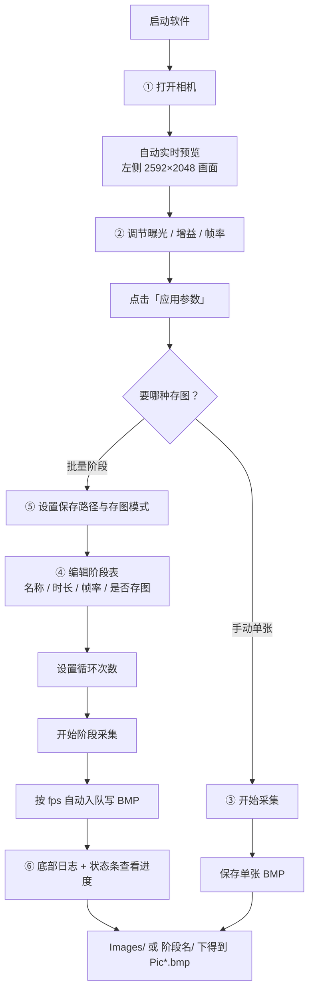
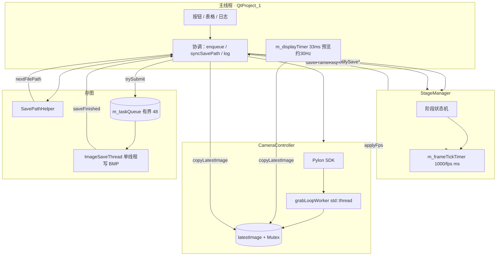

# Basler 相机采集测试软件（QtProject_1）

基于 **VS2019 + Qt 5.15.2 + Basler Pylon 5** 的工业相机采集程序。  
分辨率 **2592×2048**，**Mono8 灰度**采集，存图 **8 位灰度 BMP**（设备不支持时回退 24 位 RGB），架构为 **分层模块 + 信号槽协调**。

---

## 操作流程（从启动到出图）

界面按**工作流顺序**自上而下排列，跟着做即可：



| 步骤 | 界面位置 | 做什么 | 结果 |
|------|----------|--------|------|
| 1 | ① 连接相机 | 选设备 → **打开相机** | 左侧预览常开（约 30 Hz） |
| 2 | ② 调节参数 | 改曝光/增益/帧率 → **应用参数** | 相机按新参数采集 |
| 3 | ③ 采集与存图 | **开始采集** → **保存单张 BMP** | 手动存 1 张到设定路径 |
| 4 | ④ 阶段采集 | 填阶段表（时长×fps=目标张数）→ 设循环 → **开始阶段采集** | 按表顺序自动采多阶段、多轮 |
| 5 | ⑤ 存图设置 | 路径、分文件夹模式、总上限 | 决定 BMP 落在哪、怎么分目录 |
| 6 | 日志 + 状态条 | 下半日志栏 + 最底四段摘要 | 看入队/写盘/队列/总保存数 |

**阶段张数**：`round(时长(s) × 帧率(fps))`。例：1.0s × 20fps → **20 张**。  
**阶段存图路径**：`{保存路径}/阶段名/Pic001.bmp` …（多轮循环时同阶段 Pic 连续编号）  
**关相机前**：先停阶段或停采集，等队列写完（状态条「队列: 0/48」）。

---

## 操作流程（从启动到出图）

界面按**工作流顺序**自上而下排列，跟着做即可：


| 步骤 | 界面位置 | 做什么 | 结果 |
|------|----------|--------|------|
| 1 | ① 连接相机 | 选设备 → **打开相机** | 左侧预览常开（约 30 Hz） |
| 2 | ② 调节参数 | 改曝光/增益/帧率 → **应用参数** | 相机按新参数采集 |
| 3 | ③ 采集与存图 | **开始采集** → **保存单张 BMP** | 手动存 1 张到设定路径 |
| 4 | ④ 阶段采集 | 填阶段表（时长×fps=目标张数）→ 设循环 → **开始阶段采集** | 按表顺序自动采多阶段、多轮 |
| 5 | ⑤ 存图设置 | 路径、分文件夹模式、总上限 | 决定 BMP 落在哪、怎么分目录 |
| 6 | 日志 + 状态条 | 下半日志栏 + 最底四段摘要 | 看入队/写盘/队列/总保存数 |

**阶段张数**：`round(时长(s) × 帧率(fps))`。例：1.0s × 20fps → **20 张**。  
**阶段存图路径**：`{保存路径}/阶段名/Pic001.bmp` …（多轮循环时同阶段 Pic 连续编号）  
**关相机前**：先停阶段或停采集，等队列写完（状态条「队列: 0/48」）。

---

## 一分钟了解

| 项目 | 说明 |
|------|------|
| **主窗口** | `QtProject_1` — 单一工作流 UI：上半左预览 + 右工作流栏（连接/参数/采集/阶段/存图），下半横贯日志，底部状态条；`PreviewWidget` 支持缩放/平移/像素读数 |
| **相机** | `CameraController` — Mono8 采集、`Grayscale8` QImage；不支持时回退 RGB888 |
| **阶段** | `StageManager` — 目标帧数驱动：`round(时长×fps)` 张 |
| **存图** | `SavePathHelper` 定路径；`ImageSaveThread` 有界队列 + `trySubmit`；`writeBmpFile` 写入 8 位灰度或 24 位 RGB BMP |
| **远程遥控** | `RemoteKit` + `RemoteControlGuard`（命令互斥）；扫码见 `remote-qr/`；说明见 [docs/REMOTE_CONTROL_GUIDE.md](docs/REMOTE_CONTROL_GUIDE.md) |
| **屏幕录制** | `RecorderController` + `ScreenRecorderDialog`；核心见 `recorder/`；说明见 [recorder/README.md](recorder/README.md) |
| **新手引导** | 复制 `guide/` + `#include "guide/GuideKit.h"`；说明见 [docs/GUIDEKIT_DEVELOPMENT_GUIDE.md](docs/GUIDEKIT_DEVELOPMENT_GUIDE.md) |
| **日志** | `AppLogger` — `Log/run_*.log` 落盘；主窗口 `log()` 同步写文件与界面 |
| **遥控配置** | 项目根 `config/netconfig.ini`（见 [remote/README.md](remote/README.md)） |

---

## 架构一览



---


---

## 微信小程序遥控（WiFi 推荐）

1. 启动 `QtProject_1`，日志出现 `HTTP 遥控已启动，手机可连接 局域网IP:18765`。
2. 口令改项目根 `config/netconfig.ini` 的 `[remote] token`（HTTP/BLE 共用）。
3. 微信开发者工具打开 `miniprogram/`，勾选 **不校验合法域名**。
4. 小程序选 **WiFi 模式**，填 `IP:18765`，token 与 ini 一致，点 **连接 PC**。
5. BLE 可选：真机预览 → 刷新设备列表 → 点选电脑。

移植与排错：**[docs/REMOTE_CONTROL_GUIDE.md](docs/REMOTE_CONTROL_GUIDE.md)**（统一说明：小程序 §4 · 扫码网页 §5）· [remote/README.md](remote/README.md)（PC 套件速查）

## 扫码网页遥控

1. 主界面「打开远程控制」→ **开启** → 切至 **扫码网页** 页签。
2. 选择本机 WiFi IP，用手机浏览器扫二维码或打开 URL。
3. 配置见 `config/mobile.ini`（默认端口 8080）。

详见 **[docs/REMOTE_CONTROL_GUIDE.md](docs/REMOTE_CONTROL_GUIDE.md)** §5。

## 屏幕录制

1. 主界面日志区上方点 **「打开屏幕录制」**。
2. 选择全屏或区域（区域需 **选择区域** 拖拽确认）。
3. 设置帧率、分辨率（0=自动）、码率、格式（首版 **AVI**）、保存路径。
4. **开始录制** → **暂停/继续/停止**；停止后可打开保存目录。

移植与 API 说明 → **[recorder/README.md](recorder/README.md)**

## 详细文档

| 文档 | 内容 |
|------|------|
| [docs/DEVELOPER_GUIDE.md](docs/DEVELOPER_GUIDE.md) | 相机采集、阶段、存图（主手册） |
| [docs/GUIDEKIT_DEVELOPMENT_GUIDE.md](docs/GUIDEKIT_DEVELOPMENT_GUIDE.md) | 新手引导 GuideKit |
| [docs/REMOTE_CONTROL_GUIDE.md](docs/REMOTE_CONTROL_GUIDE.md) | 远程控制（小程序 §4 · 扫码网页 §5） |
| [recorder/README.md](recorder/README.md) | 屏幕录制套件（移植、API、集成） |
| [docs/README.md](docs/README.md) | 文档索引 |

---

## 快速操作 → 代码入口

| 用户操作 | 入口函数 | 文件 |
|----------|----------|------|
| 打开相机 | `onOpenCamera` | `QtProject_1.cpp` |
| 开始预览 | `onStartGrab` | `QtProject_1.cpp` |
| 手动存一张 | `onSaveOneBmp` → `enqueueCurrentFrame` → `trySubmit` | `QtProject_1.cpp` / `save/ImageSaveThread.cpp` |
| **开始阶段采集** | `onStartStageCapture` → `m_stageMgr.start()` | `QtProject_1.cpp` |
| 阶段存图节拍 | `StageManager::onFrameTickTimer` | `stage/StageManager.cpp` |
| 目标张数计算 | `enterCurrentStage` 内 `qRound(duration×fps)` | `stage/StageManager.cpp` |
| 阶段结束日志 | `onStageFinished` | `QtProject_1.cpp` |
| 非阻塞入队 | `ImageSaveThread::trySubmit` | `save/ImageSaveThread.cpp` |
| 写 BMP | `ImageSaveThread::run` → `writeBmpFile`（直写，非 `QImage::save`） | `save/ImageSaveThread.cpp` |
| **BLE 遥控命令** | `onRemoteCommand` ← `BleControlServer` | `QtProject_1.cpp` / `remote/ble/` |
| **打开屏幕录制** | `onScreenRecorder` → `ScreenRecorderDialog` | `QtProject_1.cpp` / `recorder/dialog/` |
| **录屏核心** | `RecorderController` → `recorder::ScreenRecorder` | `recorder/RecorderController.h` |
| **新手引导组件** | `GuideKit.h` → `GuideManager` + `GuideStep` | [docs/GUIDEKIT_DEVELOPMENT_GUIDE.md](docs/GUIDEKIT_DEVELOPMENT_GUIDE.md) |
| **微信小程序** | `miniprogram/` — WiFi/BLE 遥控 | [docs/REMOTE_CONTROL_GUIDE.md](docs/REMOTE_CONTROL_GUIDE.md) §4 |

---

## 阶段张数公式（最常用）

```text
本阶段目标张数 = round( 时长(s) × 帧率(fps) )
```

示例：1.0s × 20fps → **20 张**；2.0s × 10fps → **20 张**。

详细状态机与时序图 → [docs/DEVELOPER_GUIDE.md](docs/DEVELOPER_GUIDE.md)

---

## 编译与运行（摘要）

1. VS2019 打开 `QtProject_1.sln`，**Debug \| x64** 重新生成  
2. 安装 Qt 5.15.2 msvc2019_64 + pylon 5 Runtime x64  
3. 连接相机，运行 `x64\Debug\QtProject_1.exe`  
4. 单元测试：生成 `QtProject_1_tests`，运行 `x64\Debug\QtProject_1_tests.exe`  
5. 默认存图目录：项目根 **`Images/`**；运行日志：**`Log/run_yyyyMMdd_HHmmss.log`**

完整说明 → [docs/DEVELOPER_GUIDE.md](docs/DEVELOPER_GUIDE.md)

---

## 目录结构

```
QtProject_1/
├── README.md                 ← 你在这里（入口）
├── core/
│   ├── AppTypes.h
│   └── AppLogger.h / AppLogger.cpp   ← 运行日志（Log/run_*.log）
├── Log/                      ← 运行日志目录（启动时自动创建）
├── docs/
│   ├── README.md                     ← 文档索引
│   ├── DEVELOPER_GUIDE.md
│   ├── GUIDEKIT_DEVELOPMENT_GUIDE.md ← 新手引导开发说明
│   └── REMOTE_CONTROL_GUIDE.md       ← 远程控制（小程序 + 扫码网页）
├── guide/                    ← GuideKit（复制即用）
│   └── GuideKit.h          ← 对外入口
├── recorder/               ← 屏幕录制套件（复制即用，单目录）
│   ├── RecorderKit.h       ← 纯 C++ 入口
│   ├── RecorderQtKit.h     ← Qt 集成入口
│   ├── dialog/             ← 管理对话框（可选 UI）
│   └── README.md
├── main.cpp
├── QtProject_1.h/cpp/ui
├── camera/   CameraController
├── ui/       PreviewWidget（预览缩放、平移、灰度读数）
├── stage/    StageManager
├── save/     SavePathHelper, ImageSaveThread
└── tests/    Qt Test 单元测试（QtProject_1_tests）
```

---

## 版本

| 版本 | 说明 |
|------|------|
| **当前** | 新增可移植屏幕录制套件 `recorder/` + 主界面「打开屏幕录制」；详见 [recorder/README.md](recorder/README.md) |
| 上一版 | 统一开发文档：`docs/GUIDEKIT_DEVELOPMENT_GUIDE.md`（新手引导）、`docs/REMOTE_CONTROL_GUIDE.md`（远程控制，含小程序与扫码网页） |
| 上一版 | 新增 Qt Widgets 新手引导组件库 `guide/` |
| 上上版 | 微信小程序遥控；HTTP/BLE 双通道 |
| 更早 | 预览区滚轮缩放、拖拽平移、双击适应/1:1、悬停显示像素灰度值 |

---

**详细说明** → [docs/DEVELOPER_GUIDE.md](docs/DEVELOPER_GUIDE.md)
