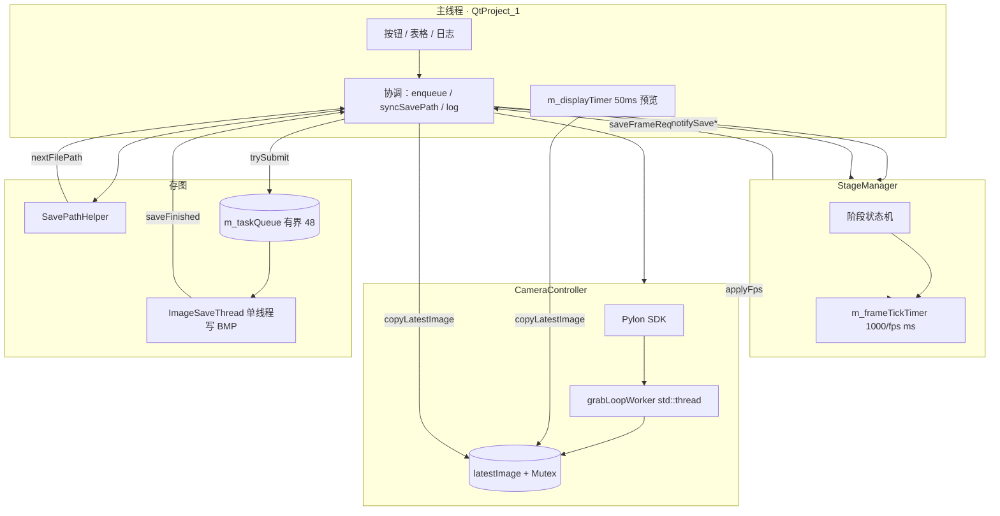

# Basler 相机采集测试软件（QtProject_1）

基于 **VS2019 + Qt 5.15.2 + Basler Pylon 5** 的工业相机采集程序。  
分辨率 **2592×2048**，存图 **BMP**，架构为 **分层模块 + 信号槽协调**。

---

## 一分钟了解

| 项目 | 说明 |
|------|------|
| **主窗口** | `QtProject_1` — 连接 UI 与各模块，不直接调用 Pylon |
| **相机** | `CameraController` — 唯一包含 Pylon 头的模块 |
| **阶段** | `StageManager` — 目标帧数驱动：`round(时长×fps)` 张 |
| **存图** | `SavePathHelper` 定路径；`ImageSaveThread` 有界队列 + `trySubmit` 入队；`writeBmpFile` 直写 24 位 BMP |
| **日志** | `AppLogger` — `Log/run_*.log` 落盘；主窗口 `log()` 同步写文件与界面 |
| **配置** | 主窗口 `loadDefaultUiValues` — 启动固定默认参数（不持久化 QSettings） |

---

## 架构一览



---

## 详细文档

完整实现说明（架构、阶段采集、存图、UI、编译排错等）见：

**[docs/DEVELOPER_GUIDE.md](docs/DEVELOPER_GUIDE.md)**

---

## 快速操作 → 代码入口

| 用户操作 | 入口函数 | 文件 |
|----------|----------|------|
| 打开相机 | `onOpenCamera` | `QtProject_1.cpp` |
| 开始预览 | `onStartGrab` | `QtProject_1.cpp` |
| 手动存一张 | `onSaveOneBmp` → `enqueueCurrentFrame` → `trySubmit` | `QtProject_1.cpp` / `save/ImageSaveThread.cpp` |
| **开始阶段采集** | `onStartStageCapture` → `m_stageMgr.start()` | `QtProject_1.cpp` |
| 阶段存图节拍 | `StageManager::onFrameTickTimer` | `stage/StageManager.cpp` |
| 目标张数计算 | `enterCurrentStage` 内 `qRound(duration×fps)` | `stage/StageManager.cpp` L61 |
| 阶段结束日志 | `onStageFinished` | `QtProject_1.cpp` L490 |
| 非阻塞入队 | `ImageSaveThread::trySubmit` | `save/ImageSaveThread.cpp` |
| 写 BMP | `ImageSaveThread::run` → `writeBmpFile`（直写，非 `QImage::save`） | `save/ImageSaveThread.cpp` |

---

## 阶段张数公式（最常用）

```text
本阶段目标张数 = round( 时长(s) × 帧率(fps) )
```

示例：1.0s × 20fps → **20 张**；2.0s × 10fps → **20 张**。

详细状态机与时序图 → [docs/DEVELOPER_GUIDE.md](docs/DEVELOPER_GUIDE.md)

---

## 编译与运行（摘要）

1. VS2019 打开 `QtProject_1.sln`，**Debug \| x64** 重新生成  
2. 安装 Qt 5.15.2 msvc2019_64 + pylon 5 Runtime x64  
3. 连接相机，运行 `x64\Debug\QtProject_1.exe`  
4. 默认存图目录：项目根 **`Images/`**；运行日志：**`Log/run_yyyyMMdd_HHmmss.log`**

完整说明 → [docs/DEVELOPER_GUIDE.md](docs/DEVELOPER_GUIDE.md)

---

## 目录结构

```
QtProject_1/
├── README.md                 ← 你在这里（入口）
├── core/
│   ├── AppTypes.h
│   └── AppLogger.h / AppLogger.cpp   ← 运行日志（Log/run_*.log）
├── Log/                      ← 运行日志目录（启动时自动创建）
├── docs/
│   └── DEVELOPER_GUIDE.md    ← 唯一详细开发者手册
├── main.cpp
├── QtProject_1.h/cpp/ui
├── camera/   CameraController
├── stage/    StageManager
└── save/     SavePathHelper, ImageSaveThread
```

---

## 版本

| 版本 | 说明 |
|------|------|
| **当前** | `AppLogger` 统一写 `Log/run_*.log`；阶段写盘回调对齐后切阶段 |
| 上一版 | 双定时器（时长+fps tick） |

---

**详细说明** → [docs/DEVELOPER_GUIDE.md](docs/DEVELOPER_GUIDE.md)
