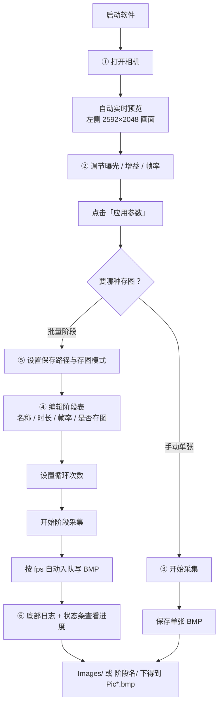
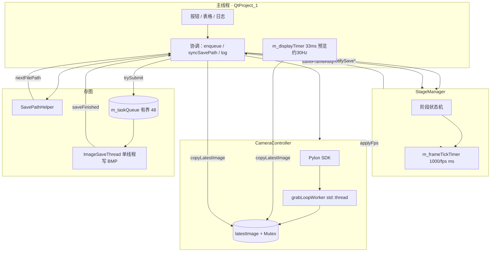

# Basler 相机采集测试软件（QtProject_1）

基于 **VS2019 + Qt 5.15.2 + Basler Pylon 5** 的工业相机采集程序。  
分辨率 **2592×2048**，**Mono8 灰度**采集，存图 **8 位灰度 BMP**（设备不支持时回退 24 位 RGB），架构为 **分层模块 + 信号槽协调**。

---

## 操作流程（从启动到出图）

界面按**工作流顺序**自上而下排列，跟着做即可：



| 步骤 | 界面位置 | 做什么 | 结果 |
|------|----------|--------|------|
| 1 | ① 连接相机 | 选设备 → **打开相机** | 左侧预览常开（约 30 Hz） |
| 2 | ② 调节参数 | 改曝光/增益/帧率 → **应用参数** | 相机按新参数采集 |
| 3 | ③ 采集与存图 | **开始采集** → **保存单张 BMP** | 手动存 1 张到设定路径 |
| 4 | ④ 阶段采集 | 填阶段表（时长×fps=目标张数）→ 设循环 → **开始阶段采集** | 按表顺序自动采多阶段、多轮 |
| 5 | ⑤ 存图设置 | 路径、分文件夹模式、总上限 | 决定 BMP 落在哪、怎么分目录 |
| 6 | 日志 + 状态条 | 下半日志栏 + 最底四段摘要 | 看入队/写盘/队列/总保存数 |

**阶段张数**：`round(时长(s) × 帧率(fps))`。例：1.0s × 20fps → **20 张**。  
**阶段存图路径**：`{保存路径}/阶段名/Pic001.bmp` …（多轮循环时同阶段 Pic 连续编号）  
**关相机前**：先停阶段或停采集，等队列写完（状态条「队列: 0/48」）。

---

## 操作流程（从启动到出图）

界面按**工作流顺序**自上而下排列，跟着做即可：


| 步骤 | 界面位置 | 做什么 | 结果 |
|------|----------|--------|------|
| 1 | ① 连接相机 | 选设备 → **打开相机** | 左侧预览常开（约 30 Hz） |
| 2 | ② 调节参数 | 改曝光/增益/帧率 → **应用参数** | 相机按新参数采集 |
| 3 | ③ 采集与存图 | **开始采集** → **保存单张 BMP** | 手动存 1 张到设定路径 |
| 4 | ④ 阶段采集 | 填阶段表（时长×fps=目标张数）→ 设循环 → **开始阶段采集** | 按表顺序自动采多阶段、多轮 |
| 5 | ⑤ 存图设置 | 路径、分文件夹模式、总上限 | 决定 BMP 落在哪、怎么分目录 |
| 6 | 日志 + 状态条 | 下半日志栏 + 最底四段摘要 | 看入队/写盘/队列/总保存数 |

**阶段张数**：`round(时长(s) × 帧率(fps))`。例：1.0s × 20fps → **20 张**。  
**阶段存图路径**：`{保存路径}/阶段名/Pic001.bmp` …（多轮循环时同阶段 Pic 连续编号）  
**关相机前**：先停阶段或停采集，等队列写完（状态条「队列: 0/48」）。

---

## 一分钟了解

| 项目 | 说明 |
|------|------|
| **主窗口** | `QtProject_1` — 单一工作流 UI：上半左预览 + 右工作流栏（连接/参数/采集/阶段/存图），下半横贯日志，底部状态条；`PreviewWidget` 支持缩放/平移/像素读数 |
| **相机** | `CameraController` — Mono8 采集、`Grayscale8` QImage；不支持时回退 RGB888 |
| **阶段** | `StageManager` — 目标帧数驱动：`round(时长×fps)` 张 |
| **存图** | `SavePathHelper` 定路径；`ImageSaveThread` 有界队列 + `trySubmit`；`writeBmpFile` 写入 8 位灰度或 24 位 RGB BMP |
| **日志** | `AppLogger` — `Log/run_*.log` 落盘；主窗口 `log()` 同步写文件与界面 |
| **配置** | 主窗口 `loadDefaultUiValues` — 启动固定默认参数（不持久化 QSettings） |

---

## 架构一览



---

## 详细文档

完整实现说明（架构、阶段采集、存图、UI、编译排错等）见：

**[docs/DEVELOPER_GUIDE.md](docs/DEVELOPER_GUIDE.md)**

---

## 快速操作 → 代码入口

| 用户操作 | 入口函数 | 文件 |
|----------|----------|------|
| 打开相机 | `onOpenCamera` | `QtProject_1.cpp` |
| 开始预览 | `onStartGrab` | `QtProject_1.cpp` |
| 手动存一张 | `onSaveOneBmp` → `enqueueCurrentFrame` → `trySubmit` | `QtProject_1.cpp` / `save/ImageSaveThread.cpp` |
| **开始阶段采集** | `onStartStageCapture` → `m_stageMgr.start()` | `QtProject_1.cpp` |
| 阶段存图节拍 | `StageManager::onFrameTickTimer` | `stage/StageManager.cpp` |
| 目标张数计算 | `enterCurrentStage` 内 `qRound(duration×fps)` | `stage/StageManager.cpp` |
| 阶段结束日志 | `onStageFinished` | `QtProject_1.cpp` |
| 非阻塞入队 | `ImageSaveThread::trySubmit` | `save/ImageSaveThread.cpp` |
| 写 BMP | `ImageSaveThread::run` → `writeBmpFile`（直写，非 `QImage::save`） | `save/ImageSaveThread.cpp` |

---

## 阶段张数公式（最常用）

```text
本阶段目标张数 = round( 时长(s) × 帧率(fps) )
```

示例：1.0s × 20fps → **20 张**；2.0s × 10fps → **20 张**。

详细状态机与时序图 → [docs/DEVELOPER_GUIDE.md](docs/DEVELOPER_GUIDE.md)

---

## 编译与运行（摘要）

1. VS2019 打开 `QtProject_1.sln`，**Debug \| x64** 重新生成  
2. 安装 Qt 5.15.2 msvc2019_64 + pylon 5 Runtime x64  
3. 连接相机，运行 `x64\Debug\QtProject_1.exe`  
4. 单元测试：生成 `QtProject_1_tests`，运行 `x64\Debug\QtProject_1_tests.exe`  
5. 默认存图目录：项目根 **`Images/`**；运行日志：**`Log/run_yyyyMMdd_HHmmss.log`**

完整说明 → [docs/DEVELOPER_GUIDE.md](docs/DEVELOPER_GUIDE.md)

---

## 目录结构

```
QtProject_1/
├── README.md                 ← 你在这里（入口）
├── core/
│   ├── AppTypes.h
│   └── AppLogger.h / AppLogger.cpp   ← 运行日志（Log/run_*.log）
├── Log/                      ← 运行日志目录（启动时自动创建）
├── docs/
│   └── DEVELOPER_GUIDE.md    ← 唯一详细开发者手册
├── main.cpp
├── QtProject_1.h/cpp/ui
├── camera/   CameraController
├── ui/       PreviewWidget（预览缩放、平移、灰度读数）
├── stage/    StageManager
├── save/     SavePathHelper, ImageSaveThread
└── tests/    Qt Test 单元测试（QtProject_1_tests）
```

---

## 版本

| 版本 | 说明 |
|------|------|
| **当前** | UI 改为单一工作流：上半左预览 + 右工作流栏（5 个 GroupBox 自顶向下），下半横贯日志栏，最底状态条常驻摘要（相机/阶段/队列/总保存）；移除三 Tab 容器 |
| 上一版 | 存图 Pic 序号改在写盘成功后递增；关相机时退出阶段存图路径模式 |
| 上上版 | 预览区滚轮缩放、拖拽平移、双击适应/1:1、悬停显示像素灰度值 |

---

**详细说明** → [docs/DEVELOPER_GUIDE.md](docs/DEVELOPER_GUIDE.md)
