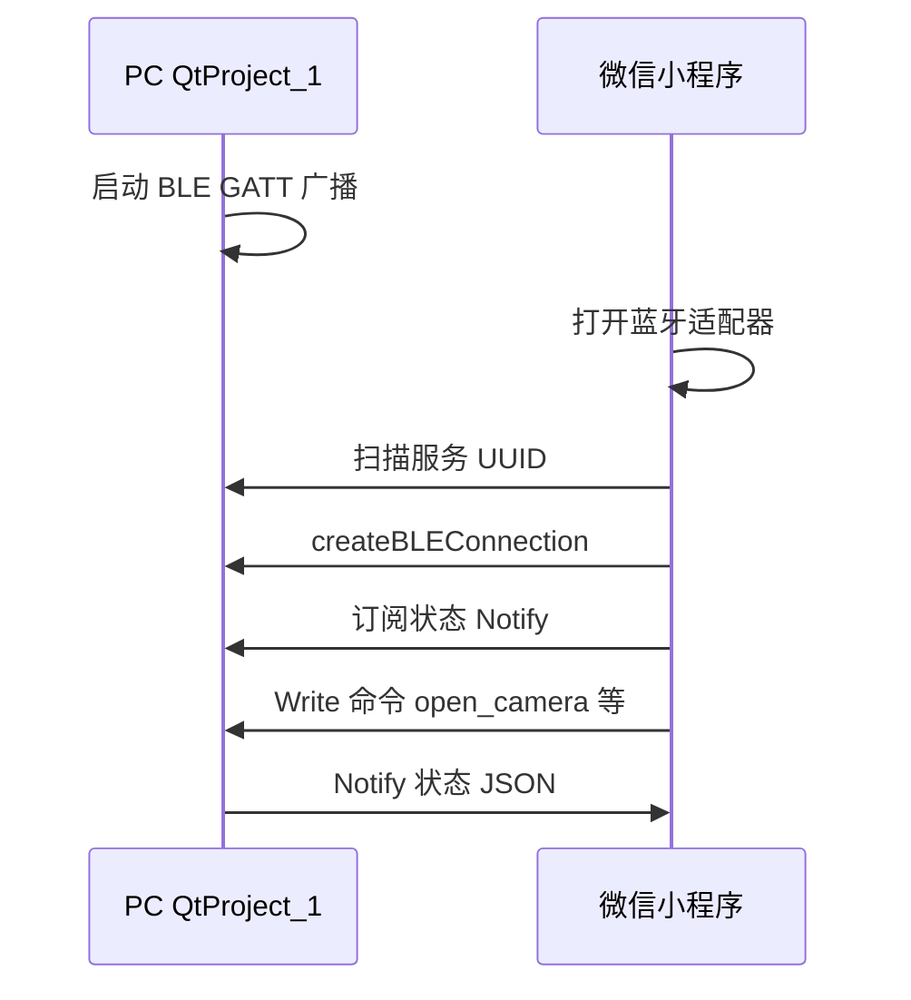

# BLE / WiFi 微信小程序遥控 — 使用手册

> **开发者**（协议、扩展命令、目录结构）→ [MINIPROGRAM_REMOTE_DEV.md](MINIPROGRAM_REMOTE_DEV.md)

用手机微信小程序，通过 **WiFi（推荐）** 或 **蓝牙（BLE）** 遥控 PC 上的 `QtProject_1` 相机软件：开关相机、开始/停止采集、保存单张、开始/停止阶段采集。

---

## 一、你需要准备什么

### 1.1 硬件

| 项目 | 要求 |
|------|------|
| PC | Windows 10/11，已安装蓝牙适配器 |
| 蓝牙适配器 | 支持 **BLE 低功耗蓝牙**，且支持 **外设（Peripheral）模式**（多数笔记本内置蓝牙可用） |
| 手机 | Android 或 iPhone，安装微信，与 PC 距离建议 **10 米以内** |
| 相机 | Basler 相机 + Pylon（与主程序要求相同） |

### 1.2 软件

| 项目 | 说明 |
|------|------|
| PC 端 | 已编译的 `QtProject_1.exe`（VS2019 + Qt 5.15.2） |
| 微信开发者工具 | [下载地址](https://developers.weixin.qq.com/miniprogram/dev/devtools/download.html) |
| 微信小程序 | 项目内 `miniprogram/` 目录；正式使用需注册小程序并填写 AppID |

### 1.3 不支持的情况

- 微信开发者工具 **模拟器不能连 BLE**，必须 **手机真机** 扫码预览或体验版。
- 微信小程序 **不支持经典蓝牙串口**，只支持 BLE。
- 阶段表内容（名称、时长、帧率等）须在 **PC 软件界面** 编辑；小程序只能「开始/停止」阶段采集，不能改表。

---

## 二、PC 端配置与启动

### 2.1 配置文件位置

BLE 与 HTTP 共用 **同一 `config\netconfig.ini`**（目录优先项目根 `config\`，发布时放 exe 旁 `config\`）：

```text
config\netconfig.ini    # [remote] token；[http] bind/port；[ble] device_name
```
日志会打印 `遥控配置目录：...`；改配置后 **重启 PC 软件** 生效。

### 2.2 配置项说明

`netconfig.ini`：

```ini
; HTTP + BLE 共用；改后重启软件
[remote]
token=1234          ; 遥控口令（HTTP/BLE/小程序共用）

[http]
bind=192.168.x.x     ; 本机 WiFi IP（与手机同网段）；日志与小程序均用此值
port=18765           ; WiFi 模式 IP:端口

[ble]
device_name=PhotoMech   ; 扫描名称提示
```

| 文件 | 键 | 说明 |
|------|-----|------|
| `netconfig.ini` | `[remote] token` | **HTTP 与 BLE 共用口令**（只改这里） |
| `netconfig.ini` | `[http] bind` | 本机 WiFi IPv4；日志与小程序填写与此一致 |
| `netconfig.ini` | `[http] port` | HTTP 监听端口，默认 `18765` |
| `netconfig.ini` | `[ble] device_name` | 扫描提示；主要仍按服务 UUID 过滤 |
### 2.3 WiFi 模式（推荐，无需蓝牙）

1. 启动 PC 软件，日志出现 `HTTP 遥控已启动，手机可连接 192.168.x.x:18765`（地址来自 `netconfig.ini` 的 `http/bind`）
2. 手机与 PC **同一 WiFi**（PC 可不插网线）
3. 微信小程序选 **WiFi（推荐）**，填 `IP:18765`，token 与 `[remote]` 一致
4. 开发者工具勾选 **不校验合法域名**；真机预览更稳
5. 连不上：确认填的是 **WiFi 网卡 IP**（非 `192.168.1.x` 以太网残留 IP），并检查 Windows 防火墙


### 2.3.1 PC 日志里的 IP 怎么填？

日志 `HTTP 遥控已启动：http://192.168.x.x:18765` 中的地址即为小程序应填写的 **IP:端口**。

- **优先使用** `192.168.x.x` 或 `10.x.x`（与手机 WiFi 同网段）
- **不要使用** `172.27.0.1`、`169.254.x.x` 等虚拟网卡 / 链路本地地址
- 多网卡时参考日志「可用网卡 IP」行，选与手机同网段的一项
- 常见笔误：`195.168` → 应为 `192.168`

### 2.4 启动 PC 软件

1. 打开 Windows **设置 → 蓝牙和其他设备**，确认蓝牙已 **开启**。
2. 运行 `QtProject_1.exe`。
3. 看界面 **日志区最上方**「BLE 遥控」一行：
   - **已广播，等待手机连接** → BLE 服务正常。
   - **未启动** → 启动失败，见下文「排错」。
4. 日志中应出现类似：
   - `遥控配置：...\config\netconfig.ini`
   - `BLE 遥控已启动，请用微信小程序扫描连接...`

若出现 `[警告] BLE 遥控启动失败：...`，根据提示处理（常见：适配器不支持 BLE 外设模式）。

### 2.5 PC 端无需额外配对

手机 **不需要** 在 Windows「添加蓝牙设备」里配对电脑。小程序通过 BLE GATT 协议直接连接软件广播的服务。

---

## 三、微信小程序安装与首次打开

### 3.1 导入项目

1. 安装并打开 **微信开发者工具**。
2. 选择 **小程序** → **导入项目**。
3. 目录选择本仓库下的 **`miniprogram`** 文件夹（不是整个 QtProject_1 根目录）。
4. **AppID**：
   - 有正式小程序：填你的 AppID；
   - 仅本地测试：选「测试号」或「游客模式」（部分 BLE 能力可能受限，建议注册测试号）。

### 3.2 权限（重要）

在 `app.json` 中已声明定位相关权限（Android 扫描 BLE 需要）：

- **Android**：手机设置里给微信开启 **附近设备 / 蓝牙 / 定位**（不同品牌名称略有差异）。
- **iPhone**：首次扫描时允许微信使用 **蓝牙**；若提示定位，建议允许「使用期间」。

### 3.3 真机调试（必须）

1. 开发者工具顶部点 **预览**，用手机微信 **扫二维码**。
2. 手机上打开小程序页面「PhotoMech 遥控」。
3. **不要用** 开发者工具左侧模拟器测 BLE。

---

## 四、连接步骤（每次使用）



### 4.1 操作顺序

| 步骤 | 在哪操作 | 做什么 |
|------|----------|--------|
| 1 | PC | 先启动 `QtProject_1`，确认 BLE 已广播 |
| 2 | 手机 | 打开微信 → 进入小程序 |
| 3 | 手机 | 底部 **token** 输入框填 `1234`（与 `[remote] token` 一致） |
| 4 | 手机 | 点 **「刷新设备列表」**，等待约 8 秒 |
| 5 | 手机 | 在列表中 **点选你的电脑**（名称可能是 Windows 电脑名） |
| 6 | 手机 | 顶部状态变为 **已连接** 后，按「遥控流程」操作 |

### 4.2 连接成功后的界面

| 区域 | 含义 |
|------|------|
| 连接 | 已连接 / 未连接 |
| 设备 | 扫描到的蓝牙设备名或 ID |
| 状态 | PC 回传：未连接 / 预览中 / 采集中 / 阶段采集中 等 |
| 队列 | 存图队列 `当前张数/容量`，如 `3/48` |

### 4.4 断开

- 手机点 **「断开」**。
- 或关闭 PC 软件：PC 会先推送 `ok=0`（「PC已关闭」），手机立即进入已断开；随后 GATT 停止广播。
- 或关闭手机蓝牙，连接会自动失效。

---

## 五、按钮说明与推荐流程

小程序按钮与 PC 主界面按钮 **等价**（走同一套 `onRemoteCommand` 逻辑）。

### 5.1 按钮对照表

| 小程序按钮 | 命令 | PC 对应操作 |
|------------|------|-------------|
| 打开相机 | `open_camera` | 「打开相机」 |
| 关闭相机 | `close_camera` | 「关闭相机」 |
| 开始采集 | `start_capture` | 「开始采集」 |
| 停止采集 | `stop_capture` | 「停止采集」；若正在阶段采集则先停阶段 |
| 保存单张 | `save_one` | 「保存单张 BMP」 |
| 开始阶段 | `start_stage` | 「开始阶段采集」 |
| 停止阶段 | `stop_stage` | 「停止阶段采集」 |
| 刷新状态 | `status` | 立即拉取 PC 状态 |

### 5.2 流程 A：手动拍一张图

适用于：打开相机 → 采一张 → 存一张。

1. **打开相机**（手机或 PC 均可）
2. **开始采集**
3. **保存单张**（须已处于「采集中」，否则 PC 日志会警告）
4. 到 PC 上设置的存图路径查看 `Pic*.bmp`
5. **停止采集**（可选）
6. **关闭相机**（结束）

### 5.3 流程 B：阶段批量采图

适用于：按 PC 上阶段表自动多阶段、多轮存图。

**准备（必须在 PC 上完成）：**

1. 设置 **保存路径**、存图模式、循环次数。
2. 编辑 **阶段表**（名称、时长、帧率、是否存图）。
3. 确认阶段表至少一行且参数合法。

**遥控（手机）：**

1. **打开相机**
2. **开始阶段**（不会自动先点「开始采集」；阶段模式独立）
3. 观察手机「状态」与 PC 日志、底部状态条
4. 完成后自动结束，或手机点 **停止阶段**
5. 图片在 `{保存路径}/{阶段名}/Pic001.bmp ...`

### 5.4 状态与按钮限制（与 PC 一致）

| 情况 | 远程行为 |
|------|----------|
| 相机未打开 | `start_capture` / `save_one` / `start_stage` 无效或警告 |
| 未开始采集 | `save_one` 失败，日志提示先开始采集 |
| 阶段运行中 | 不宜 `close_camera`；`stop_capture` 会停阶段 |
| 阶段表为空或非法 | `start_stage` 在 PC 弹窗或日志警告，不启动 |

---

## 六、安全与 token

- 改 `netconfig.ini` 的 `[remote] token` 为私有字符串。
- 小程序底部输入相同 token；命令格式为 `open_camera:你的token`（程序内部自动拼接）。
- token 留空则不做校验（不推荐在生产环境使用）。

---

## 七、常见问题排错

### 7.1 PC 日志：`BLE 遥控启动失败`

| 可能原因 | 处理 |
|----------|------|
| 未检测到蓝牙适配器 | 检查设备管理器、驱动；换 USB 蓝牙棒 |
| 不支持 BLE 外设模式 | 换支持 Peripheral 的适配器，或更新驱动 |
| 蓝牙被关闭 | Windows 设置里打开蓝牙 |

### 7.2 小程序：`未找到 PhotoMech 设备`

1. 确认 PC 软件 **正在运行** 且 BLE 行显示 **已广播**。
2. PC 与手机 **靠近**（1～3 米更稳）。
3. 手机蓝牙、微信权限已开。
4. 关闭其他占用蓝牙的设备后重试。
5. 点「刷新设备列表」后重新点选电脑；确认 PC 日志有适配器 MAC。

### 7.3 已连接但「状态」不更新

1. 点 **刷新状态**。
2. 看 PC 日志是否有 `[BLE]` 报错。
3. 断开重连。

### 7.4 `保存单张` 无反应

必须先 **开始采集**，且相机已打开、有预览帧。

### 7.5 `开始阶段` 无反应

在 PC 检查：阶段表是否为空、保存路径是否填写、是否已在采集/阶段中。

### 7.6 Android 扫不到设备

- 授予微信 **定位** 和 **附近设备** 权限。
- 部分机型需打开 **GPS 定位开关**（即使不用导航）。

### 7.7 发布正式版小程序

1. 在微信公众平台注册小程序，获取 AppID。
2. 修改 `miniprogram/project.config.json` 的 `appid`。
3. 配置小程序类目与隐私协议（含蓝牙说明）。
4. 开发者工具 **上传** → 公众平台 **提交审核** → 发布。
5. 用户在微信搜索小程序名称即可使用（无需开发者工具扫码）。

---

## 八、技术参考（可选）

### GATT UUID

| 项 | UUID |
|----|------|
| 服务 | `A1B2C3D4-E5F6-4A5B-8C9D-0E1F2A3B4C5D` |
| 命令特征（Write） | `A1B2C3D4-E5F6-4A5B-8C9D-0E1F2A3B4C5E` |
| 状态特征（Notify） | `A1B2C3D4-E5F6-4A5B-8C9D-0E1F2A3B4C5F` |

### 命令格式

纯文本 UTF-8，例如：

```text
open_camera
open_camera:1234
start_stage:1234
status
```

### 状态 JSON（Notify，精简字段）

```json
{"ok":1,"cam":1,"lv":1,"grab":0,"stg":0,"q":0,"qc":48,"tot":12,"msg":"预览中"}
```

| 字段 | 含义 |
|------|------|
| cam | 相机是否打开 |
| grab | 是否在采集 |
| stg | 阶段是否运行 |
| q / qc | 队列当前/容量 |
| tot | 总已保存张数 |
| msg | 中文状态摘要 |

---

## 九、相关文件

| 路径 | 说明 |
|------|------|
| `config/netconfig.ini` | PC 端 HTTP/BLE 遥控配置 |
| `miniprogram/` | 微信小程序源码 |
| `remote/ble/` | PC 端 BLE GATT 实现 |
| `QtProject_1.cpp` | `onRemoteCommand` 命令处理 |

开发排错见 `docs/DEVELOPER_GUIDE.md`；编译问题见项目 `debug-helper` Skill。
