# QtProject_1 开发者手册

> 唯一详细文档。项目入口见根目录 README.md。

---

# 目录

| 章节 | 内容 |
|------|------|
| [架构说明](#架构说明) | 类图、模块边界、线程 |
| [程序生命周期](#程序生命周期) | 启动/退出、`shutdownAll` |
| [相机与预览](#相机与预览) | 抓图线程、预览 |
| [阶段采集](#阶段采集--完整说明) | **核心**：张数公式、状态机、时序 |
| [存图流水线](#存图流水线) | 路径、入队、写 BMP |
| [UI 与信号槽](#ui-与信号槽参考) | 控件、日志 |
| [配置编译与排错](#配置编译与排错) | QSettings、编译、排错 |

## 按问题查找

| 问题 | 章节 |
|------|------|
| 阶段为什么入队 20 张？ | 阶段采集 → 目标张数公式 |
| 日志「入队/已写」在哪打？ | UI 与信号槽 → 日志系统 |
| Pic001 / CAMERA001 怎么命名？ | 存图流水线 → SavePathHelper |
| 为什么退出不能先 PylonTerminate？ | 程序生命周期 → shutdownAll |
| 点「开始阶段采集」后调用链？ | 阶段采集 → 启动时序图 |

## 关键源文件速查

| 文件 | 职责 |
|------|------|
| `QtProject_1.cpp` | **协调中心**：所有槽、入队、日志 |
| `stage/StageManager.cpp` | **阶段状态机** |
| `camera/CameraController.cpp` | Pylon + 抓图线程 |
| `save/SavePathHelper.cpp` | Pic/CAMERA 路径 |
| `save/ImageSaveThread.cpp` | BMP 写盘 |
| `core/AppConfig.cpp` | 配置读写 |
| `core/AppTypes.h` | 全局类型 |

---

## 术语表

| 术语 | 含义 |
|------|------|
| **入队** | `ImageSaveThread` 队列收到 `SaveTask`，尚未写完磁盘 |
| **已写** | BMP `save()` 成功，`notifyImageSaved` 已回调 |
| **target** | `m_targetFrameCount = round(时长×fps)` |
| **tick** | `m_frameTickTimer` 超时，触发下一帧存图请求 |
| **session** | 一次「开始阶段采集」到结束，`resetSession` 重置 Pic |
| **loop 轮** | `loopCountSpin` 设定的重复次数，每轮 Pic 回 001 |

---

# 架构说明

---

## 1. 分层架构图

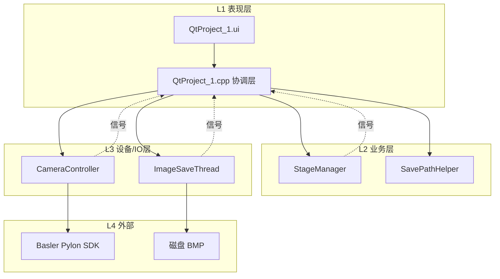
```mermaid
flowchart TB
    subgraph L1["L1 表现层"]
        UI[QtProject_1.ui]
        MW[QtProject_1.cpp 协调层]
    end

    subgraph L2["L2 业务层"]
        SM[StageManager]
        SPH[SavePathHelper]
    end

    subgraph L3["L3 设备/IO层"]
        CC[CameraController]
        IST[ImageSaveThread]
    end

    subgraph L4["L4 外部"]
        PYLON[Basler Pylon SDK]
        DISK[磁盘 BMP]
    end

    UI --> MW
    MW --> SM
    MW --> SPH
    MW --> CC
    MW --> IST
    CC --> PYLON
    IST --> DISK
    SM -.信号.-> MW
    CC -.信号.-> MW
    IST -.信号.-> MW
```

**规则**：L2 不直接调用 L3 的 Pylon/文件 IO；由 L1 `QtProject_1` 编排。

---

## 2. 类图（核心类）

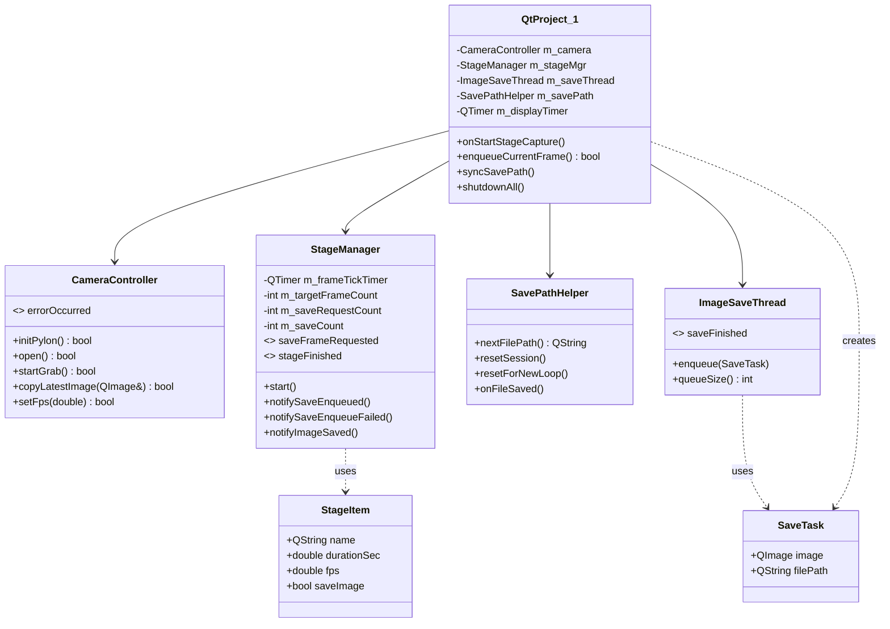
```mermaid
classDiagram
    class QtProject_1 {
        -CameraController m_camera
        -StageManager m_stageMgr
        -ImageSaveThread m_saveThread
        -SavePathHelper m_savePath
        -QTimer m_displayTimer
        +onStartStageCapture()
        +enqueueCurrentFrame() bool
        +syncSavePath()
        +shutdownAll()
    }

    class CameraController {
        +initPylon() bool
        +open() bool
        +startGrab() bool
        +copyLatestImage(QImage&) bool
        +setFps(double) bool
        <<signal>> errorOccurred
    }

    class StageManager {
        -QTimer m_frameTickTimer
        -int m_targetFrameCount
        -int m_saveRequestCount
        -int m_saveCount
        +start()
        +notifySaveEnqueued()
        +notifySaveEnqueueFailed()
        +notifyImageSaved()
        <<signal>> saveFrameRequested
        <<signal>> stageFinished
    }

    class SavePathHelper {
        +nextFilePath() QString
        +resetSession()
        +resetForNewLoop()
        +onFileSaved()
    }

    class ImageSaveThread {
        +enqueue(SaveTask)
        +queueSize() int
        <<signal>> saveFinished
    }

    class StageItem {
        +QString name
        +double durationSec
        +double fps
        +bool saveImage
    }

    class SaveTask {
        +QImage image
        +QString filePath
    }

    QtProject_1 --> CameraController
    QtProject_1 --> StageManager
    QtProject_1 --> ImageSaveThread
    QtProject_1 --> SavePathHelper
    StageManager ..> StageItem : uses
    ImageSaveThread ..> SaveTask : uses
    QtProject_1 ..> SaveTask : creates
```

---

## 3. 文件树与职责

```
QtProject_1/
├── main.cpp
│     入口：QApplication → QtProject_1::show()
│
├── QtProject_1.h / .cpp / .ui
│     主窗口：UI + 全部槽函数 + 模块编排
│
├── core/
│   ├── AppTypes.h      StageItem, SaveTask, SaveFolderMode, kImageWidth/Height
│   └── AppConfig.cpp   QSettings ↔ UI（loadUi / saveUi）
│
├── camera/
│   └── CameraController.cpp
│         Pimpl(Impl) 内含 CInstantCamera, grabThread, latestImage
│
├── stage/
│   └── StageManager.cpp
│         阶段 FSM，仅 QTimer frameTick，无 wall-clock stageTimer
│
└── save/
    ├── SavePathHelper.cpp   纯 C++，Pic/CAMERA 逻辑
    └── ImageSaveThread.cpp  QThread 写 BMP
```

---

## 4. 模块边界（禁止做什么）

| 模块 | ✅ 允许 | ❌ 禁止 |
|------|---------|---------|
| `CameraController` | Pylon、帧缓存 | UI、存图、阶段 |
| `StageManager` | 定时、计数、发信号 | 直接 `copyLatestImage`、写文件 |
| `SavePathHelper` | 算路径、计数 | 开线程、发 Qt 信号 |
| `ImageSaveThread` | 写 BMP | 决定路径、改 UI |
| `QtProject_1` | 连接一切 | `#include Pylon` |

---

## 5. 数据流向总览

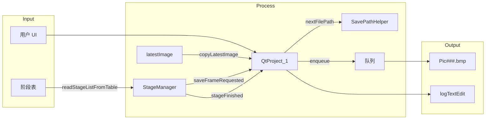
```mermaid
flowchart LR
    subgraph Input
        USER[用户 UI]
        TABLE[阶段表]
    end

    subgraph Process
        SM[StageManager]
        MW[QtProject_1]
        CAM[latestImage]
        PATH[SavePathHelper]
        Q[队列]
    end

    subgraph Output
        LOG[logTextEdit]
        BMP[Pic###.bmp]
    end

    USER --> MW
    TABLE -->|readStageListFromTable| SM
    SM -->|saveFrameRequested| MW
    CAM -->|copyLatestImage| MW
    MW -->|nextFilePath| PATH
    MW -->|enqueue| Q
    Q --> BMP
    SM -->|stageFinished| MW --> LOG
```

---

## 6. 并发与定时器

### 6.1 三个执行上下文

| 上下文 | 类型 | 代码 | 工作 |
|--------|------|------|------|
| GUI | 主线程 | `QtProject_1`, `StageManager` | UI、入队、信号 |
| 抓图 | `std::thread` | `grabLoopWorker` | `RetrieveResult` → `latestImage` |
| 存图 | `QThread` | `ImageSaveThread::run` | `QImage::save(BMP)` |

### 6.2 两个 QTimer

| 定时器 | 所属 | 间隔 | 用途 |
|--------|------|------|------|
| `m_displayTimer` | `QtProject_1` | **33 ms** | 仅刷新 `imageLabel` |
| `m_frameTickTimer` | `StageManager` | **1000/fps ms** | 阶段存图节拍 |

> 已删除 `m_stageTimer`。阶段不再「跑满 N 秒」，而按 **目标张数** 结束。

### 6.3 同步机制

| 资源 | 机制 |
|------|------|
| `latestImage` | `QMutex` + 深拷贝 |
| 存图队列 | `QMutex` |
| 抓图停止 | `std::atomic<bool> grabStop` |
| 跨线程 UI | Qt 信号 `QueuedConnection` |

---

## 7. 信号方向（StageManager ↔ 主窗口）

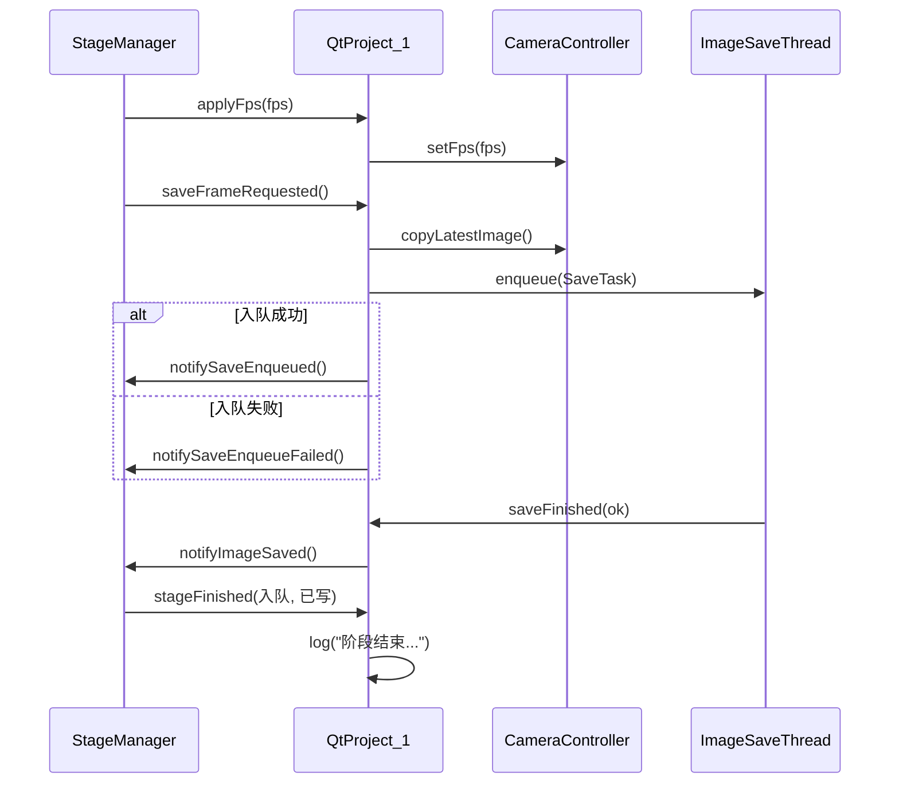
```mermaid
sequenceDiagram
    participant SM as StageManager
    participant MW as QtProject_1
    participant CAM as CameraController
    participant IO as ImageSaveThread

    SM->>MW: applyFps(fps)
    MW->>CAM: setFps(fps)

    SM->>MW: saveFrameRequested()
    MW->>CAM: copyLatestImage()
    MW->>IO: enqueue(SaveTask)
    alt 入队成功
        MW->>SM: notifySaveEnqueued()
    else 入队失败
        MW->>SM: notifySaveEnqueueFailed()
    end

    IO->>MW: saveFinished(ok)
    MW->>SM: notifyImageSaved()

    SM->>MW: stageFinished(入队, 已写)
    MW->>MW: log("阶段结束...")
```

---

## 8. 扩展开发该改哪

| 需求 | 改这里 | 别改这里 |
|------|--------|----------|
| 新 GenICam 参数 | `CameraController` + UI spin | StageManager |
| 阶段结束条件 | `tryFinishStageIfDone` | 在 UI 写 while |
| PNG 代替 BMP | `ImageSaveThread::run` | SavePathHelper |
| 新分文件夹策略 | `SavePathHelper::needNewCameraFolder` | StageManager |
| 新按钮 | `.ui` + connect + 槽 | CameraController 里操作 UI |

---

# 程序生命周期

---

## 1. 启动流程

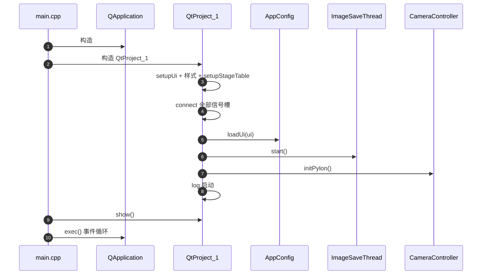
```mermaid
sequenceDiagram
    autonumber
    participant M as main.cpp
    participant APP as QApplication
    participant MW as QtProject_1
    participant CFG as AppConfig
    participant IO as ImageSaveThread
    participant CAM as CameraController

    M->>APP: 构造
    M->>MW: 构造 QtProject_1
    MW->>MW: setupUi + 样式 + setupStageTable
    MW->>MW: connect 全部信号槽
    MW->>CFG: loadUi(ui)
    MW->>IO: start()
    MW->>CAM: initPylon()
    MW->>MW: log 启动
    M->>MW: show()
    M->>APP: exec() 事件循环
```

### 构造顺序清单

| # | 动作 | 文件 |
|---|------|------|
| 1 | `ui.setupUi` | QtProject_1.cpp L31 |
| 2 | splitter 比例、log 2000 行 | L33–36 |
| 3 | `setupStageTable` | L50 |
| 4 | connect 按钮 + 模块信号 | L53–77 |
| 5 | `AppConfig::loadUi` | L79 |
| 6 | `m_displayTimer` 33ms | L84–85 |
| 7 | `m_saveThread.start()` | L86 |
| 8 | `initPylon()` | L88 |
| 9 | `refreshButtonState()` | L91 |

---

## 2. 运行中状态变量

| 变量 | 含义 | true 时 |
|------|------|---------|
| `m_camera.isOpen()` | 设备已 Open | 可 grab |
| `m_capturing` | 连续采集 | 预览或阶段 |
| `m_stageRunning` | StageManager 运行 | 阶段表锁定 |
| `m_shutdownDone` | 正在/已退出 | 禁止 log/回调碰 UI |

---

## 3. 退出流程

### 3.1 触发点

- 用户关窗口 → `closeEvent`
- 程序结束 → `~QtProject_1`

两者都：`saveUi` → `shutdownAll`

### 3.2 shutdownAll 时序

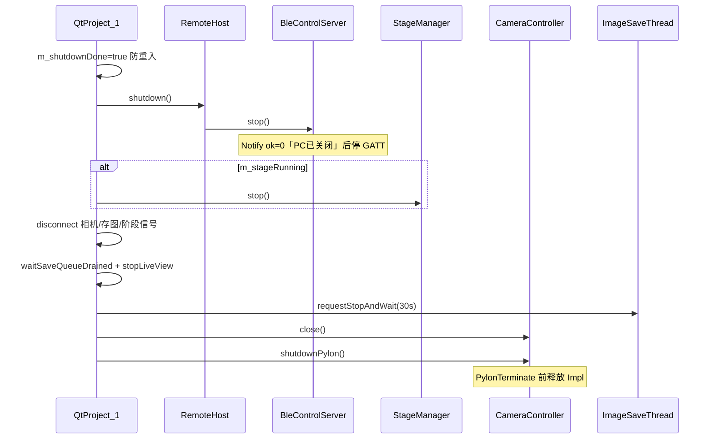
```mermaid
sequenceDiagram
    participant MW as QtProject_1
    participant RH as RemoteHost
    participant BLE as BleControlServer
    participant SM as StageManager
    participant CAM as CameraController
    participant IO as ImageSaveThread

    MW->>MW: m_shutdownDone=true 防重入
    MW->>RH: shutdown()
    RH->>BLE: stop()
    Note over BLE: Notify ok=0「PC已关闭」后停 GATT
    alt m_stageRunning
        MW->>SM: stop()
    end
    MW->>MW: disconnect 相机/存图/阶段信号
    MW->>MW: waitSaveQueueDrained + stopLiveView
    MW->>IO: requestStopAndWait(30s)
    MW->>CAM: close()
    MW->>CAM: shutdownPylon()
    Note over CAM: PylonTerminate 前释放 Impl
```

**代码**：`QtProject_1.cpp` `shutdownAll`；遥控关停见 `RemoteHost::shutdown` → `BleControlServer::stop`

### 3.3 为什么顺序不能乱

| 错误顺序 | 后果 |
|----------|------|
| 先 PylonTerminate 再 close 相机 | 崩溃 0xC0000005 |
| 不 wait 存图队列就退出 | 丢图 / 线程野指针 |
| 不 disconnect 就析构 | 回调碰已销毁 UI |

---

## 4. stopCaptureAndWaitSave

**调用场景**：

| 场景 | userStop 参数 |
|------|---------------|
| 关相机 | false |
| 停预览 | false |
| 阶段全部完成 | false |
| 用户停阶段 | **true**（多一条 log） |
| shutdownAll | false |

**步骤**：

1. `m_displayTimer.stop()`
2. `m_camera.stopGrab()` if capturing
3. `m_stageRunning = false`
4. `m_saveThread.waitUntilEmpty(30000)`
5. 恢复状态栏、`refreshButtonState`

---

## 5. 析构与 closeEvent 关系

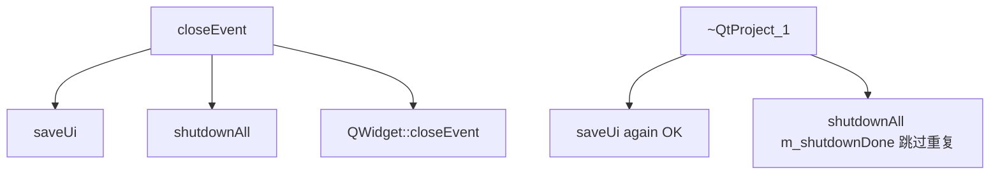
```mermaid
flowchart TD
    CE[closeEvent] --> SU1[saveUi]
    CE --> SH1[shutdownAll]
    CE --> CE2[QWidget::closeEvent]

    DT[~QtProject_1] --> SU2[saveUi  again OK]
    DT --> SH2[shutdownAll m_shutdownDone 跳过重复]
```

`m_shutdownDone` 保证 `shutdownAll` 只执行一次。

---

## 6. 线程生命周期

| 线程 | 创建 | 销毁 |
|------|------|------|
| 主线程 | 进程开始 | 进程结束 |
| grabThread | `startGrab` | `stopGrab` join |
| ImageSaveThread | 构造后 `start()` | `requestStopAndWait` |

**注意**：存图线程 **进程级** 长驻，不是每次存图创建。

---

## 7. StageManager 生命周期

| 事件 | 动作 |
|------|------|
| `start()` | m_running=true, enterCurrentStage |
| 自然结束 | allLoopsFinished → 主窗口 stopCapture |
| `stop()` | 停 tick, emit stoppedByUser |
| shutdownAll | stop() if stageRunning |

---

## 8. 时间线示例：一次完整阶段采集


```mermaid
gantt
    title 两阶段单次循环（示意）
    dateFormat X
    axisFormat %L ms

    section 阶段1
    enter + 20张入队     :a1, 0, 950
    写盘完成             :a2, 0, 1100
    stageFinished 日志   :milestone, m1, 1100, 0

    section 阶段2
    enter + 20张入队     :b1, 1100, 3000
    写盘完成             :b2, 1100, 3200
    allLoopsFinished     :milestone, m2, 3200, 0
```

（实际毫秒数取决于 fps 与磁盘速度）

---

# 相机与预览

---

## 1. 模块位置

| 项目 | 值 |
|------|-----|
| 头文件 | `camera/CameraController.h` |
| 实现 | `camera/CameraController.cpp` |
| 实例 | `QtProject_1::m_camera` |
| Pylon 头 | **仅**在 `.cpp` 中 include |

---

## 2. 类职责

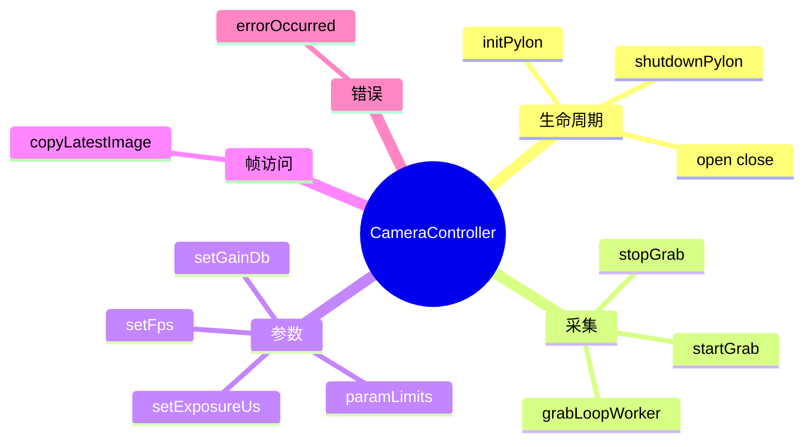
```mermaid
mindmap
  root((CameraController))
    生命周期
      initPylon
      shutdownPylon
      open close
    采集
      startGrab
      stopGrab
      grabLoopWorker
    参数
      setExposureUs
      setGainDb
      setFps
      paramLimits
    帧访问
      copyLatestImage
    错误
      errorOccurred
```

---

## 3. Pimpl 结构

```cpp
// CameraController.cpp — 不暴露在 .h
struct CameraController::Impl {
    CInstantCamera camera;
    CImageFormatConverter converter;  // → RGB8packed
    QMutex imageMutex;
    QImage latestImage;
    std::thread grabThread;
    std::atomic<bool> grabStop;
};
```

**为什么**：主窗口和其他模块看不到 Pylon 类型，编译隔离。

---

## 4. 打开相机流程

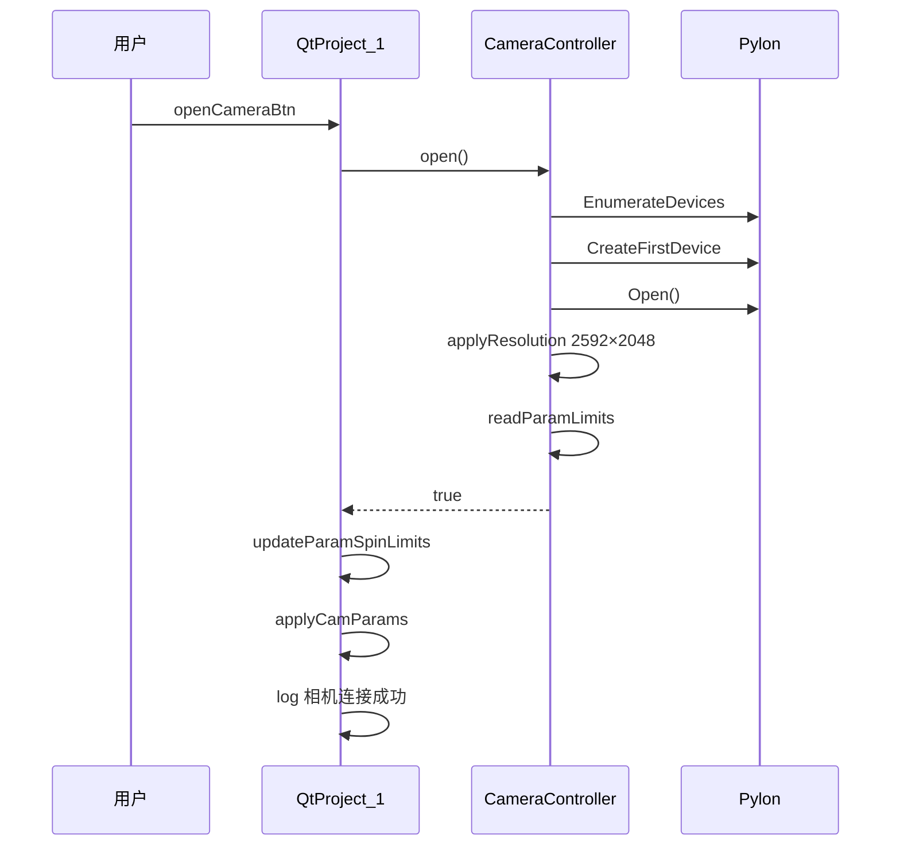
```mermaid
sequenceDiagram
    participant U as 用户
    participant MW as QtProject_1
    participant CC as CameraController
    participant PY as Pylon

    U->>MW: openCameraBtn
    MW->>CC: open()
    CC->>PY: EnumerateDevices
    CC->>PY: CreateFirstDevice
    CC->>PY: Open()
    CC->>CC: applyResolution 2592×2048
    CC->>CC: readParamLimits
    CC-->>MW: true
    MW->>MW: updateParamSpinLimits
    MW->>MW: applyCamParams
    MW->>MW: log 相机连接成功
```

**代码**：`onOpenCamera` → `CameraController::open()` ~L121

**限制**：当前固定 **第一台** 设备（`CreateFirstDevice`）。

---

## 5. 连续采集与抓图线程

### 5.1 startGrab

```cpp
StartGrabbing(GrabStrategy_LatestImageOnly, GrabLoop_ProvidedByUser);
grabThread = std::thread(&CameraController::grabLoopWorker, this);
```

**策略**：只保留最新帧；抓图循环由 **自建线程** 驱动，不用 Pylon 内置 loop。

### 5.2 grabLoopWorker 循环

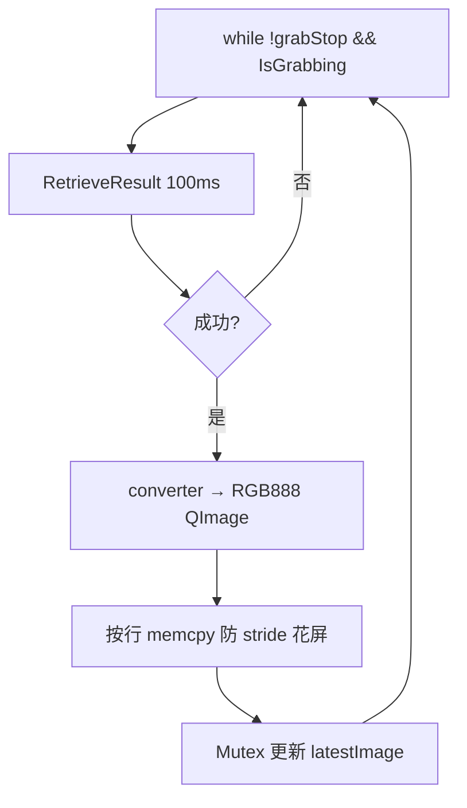
```mermaid
flowchart TD
    A[while !grabStop && IsGrabbing] --> B[RetrieveResult 100ms]
    B --> C{成功?}
    C -->|否| A
    C -->|是| D[converter → RGB888 QImage]
    D --> E[按行 memcpy 防 stride 花屏]
    E --> F[Mutex 更新 latestImage]
    F --> A
```

**代码**：`CameraController.cpp` ~L263–310

### 5.3 stopGrab

1. `grabStop = true`
2. `StopGrabbing()`
3. `grabThread.join()`
4. 清空 `latestImage`

---

## 6. copyLatestImage — 谁在用

| 调用者 | 文件 | 用途 |
|--------|------|------|
| `onDisplayTimer` | QtProject_1.cpp ~L369 | 预览 label |
| `enqueueCurrentFrame` | QtProject_1.cpp ~L296 | 存图 |

```cpp
bool copyLatestImage(QImage &out) {
    QMutexLocker lock(&m_impl->imageMutex);
    if (m_impl->latestImage.isNull()) return false;
    out = m_impl->latestImage.copy();  // 深拷贝
    return true;
}
```

**线程安全**：抓图线程写、主线程读，Mutex 保护。

---

## 7. 预览链路（与阶段 tick 无关）

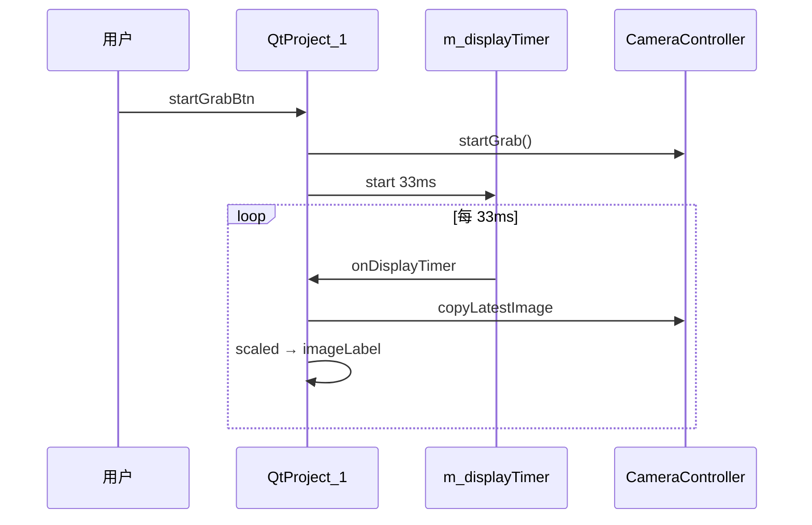
```mermaid
sequenceDiagram
    participant U as 用户
    participant MW as QtProject_1
    participant DT as m_displayTimer
    participant CAM as CameraController

    U->>MW: startGrabBtn
    MW->>CAM: startGrab()
    MW->>DT: start 33ms

    loop 每 33ms
        DT->>MW: onDisplayTimer
        MW->>CAM: copyLatestImage
        MW->>MW: scaled → imageLabel
    end
```

| 项目 | 预览 | 阶段存图 |
|------|------|----------|
| 定时器 | 33ms 固定 | 1000/fps ms |
| 目的 | 显示画面 | 触发存图请求 |
| 是否写盘 | 否 | 勾存图则是 |

---

## 8. 参数读写

| UI | 写入函数 | GenICam 节点 |
|----|----------|--------------|
| exposureSpin | `setExposureUs` | ExposureTime (μs) |
| gainSpin | `setGainDb` | Gain / GainRaw (dB) |
| fpsSpin | `setFps` | AcquisitionFrameRateEnable + AcquisitionFrameRate |

**应用时机**：

- 打开相机后 `applyCamParams`
- 开始预览 / 阶段采集前
- 用户点「应用参数」
- 阶段切换 `onStageApplyFps`（仅 fps）

**范围显示**：`updateParamSpinLimits` ← `paramLimits()` ← `readParamLimits()`（open 时）

---

## 9. 错误处理

| 来源 | 传递 |
|------|------|
| Pylon 异常 | `emit errorOccurred(msg)` |
| 主窗口 | `onCameraError` → log + QMessageBox |
| 抓图线程内异常 | `QMetaObject::invokeMethod` Queued 到主线程 |

---

## 10. 与阶段采集的配合

阶段开始时：

1. `onStartStageCapture` → `startGrab()`（若未在 grab）
2. `m_displayTimer.start()` — 预览继续
3. `StageManager` emit `applyFps` → `setFps` 切阶段帧率
4. 存图时 `copyLatestImage` 取 **当前最新帧**（非硬件逐帧同步）

---

## 11. 改相机功能 checklist

- [ ] 新参数：加 `setXxx` + GenICam 节点 + UI spin
- [ ] 选指定相机：改 `open()` 读 `cameraSelectCombo`
- [ ] 更高帧率存图：同时看 `StageManager` tick 与相机实际上限
- [ ] 不要在 `StageManager` 里 include Pylon

---

# 阶段采集 — 完整说明

本文是 **最核心的业务文档**：阶段怎么配置、怎么算张数、状态机怎么转、信号怎么串、日志何时打。

---

## 1. 用户视角：阶段采集是什么

1. 在 **阶段表** 填多行：名称、时长(s)、帧率(fps)、是否勾「存图」
2. 设 **循环次数** `loopCountSpin`
3. 点 **开始阶段采集**
4. 软件按表 **顺序** 执行：阶段1 → 阶段2 → … → 若有多轮则重复
5. 每个勾了存图的阶段，按公式保存固定张数 BMP
6. 日志栏输出「阶段开始 / 阶段结束（入队、已写）」

---

## 2. 目标张数公式

### 2.1 公式

```text
m_targetFrameCount = round( durationSec × fps )
```

**代码位置**：`stage/StageManager.cpp` → `enterCurrentStage()` 约 **L61**

```cpp
m_targetFrameCount = qMax(0, qRound(st.durationSec * st.fps));
```

### 2.2 计算示例

| 阶段 | 时长(s) | fps | 计算 | 目标张数 |
|------|---------|-----|------|----------|
| 阶段1 | 1.0 | 20 | round(20) | **20** |
| 阶段2 | 2.0 | 10 | round(20) | **20** |
| 测试 | 0.5 | 5 | round(2.5) | **3** |
| 测试 | 1.0 | 5 | round(5) | **5** |

### 2.3 重要说明

| 概念 | 说明 |
|------|------|
| **时长(s)** | 用于 **算张数**，不是 wall-clock 定时器跑满 N 秒 |
| **实际耗时** | 约 `(target - 1) × (1000/fps)` ms + t=0 首帧 |
| **未勾存图** | 仍按 target 计 **帧 tick**，但不入队 BMP |

---

## 3. 状态机总览

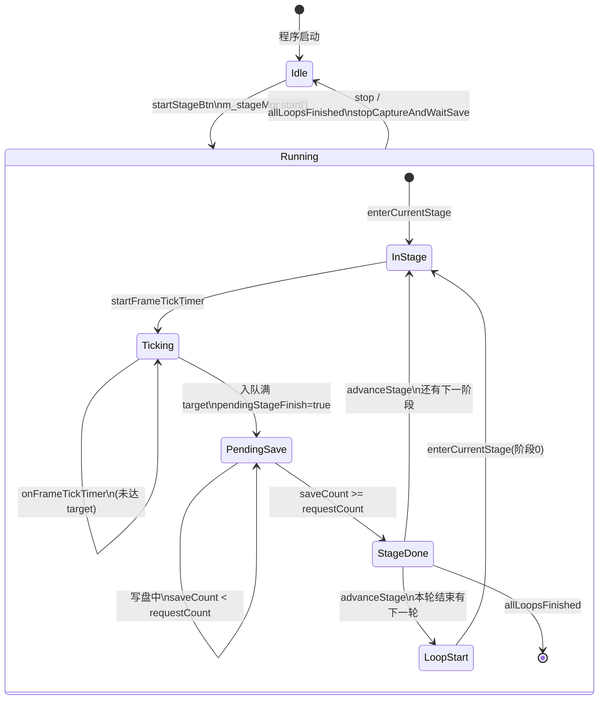
```mermaid
stateDiagram-v2
    [*] --> Idle: 程序启动

    Idle --> Running: startStageBtn\nm_stageMgr.start()

    state Running {
        [*] --> InStage: enterCurrentStage
        InStage --> Ticking: startFrameTickTimer
        Ticking --> Ticking: onFrameTickTimer\n(未达 target)
        Ticking --> PendingSave: 入队满 target\npendingStageFinish=true
        PendingSave --> PendingSave: 写盘中\nsaveCount < requestCount
        PendingSave --> StageDone: saveCount >= requestCount
        StageDone --> InStage: advanceStage\n还有下一阶段
        StageDone --> LoopStart: advanceStage\n本轮结束有下一轮
        LoopStart --> InStage: enterCurrentStage(阶段0)
        StageDone --> [*]: allLoopsFinished
    }

    Running --> Idle: stop / allLoopsFinished\nstopCaptureAndWaitSave
```

---

## 4. StageManager 成员变量

| 变量 | 类型 | 含义 |
|------|------|------|
| `m_stages` | `QList<StageItem>` | 阶段表（启动时 `setStages` 注入） |
| `m_loopCount` | int | 总轮数（UI `loopCountSpin`） |
| `m_currentLoop` | int | 当前第几轮，从 **1** 开始 |
| `m_currentStage` | int | 当前阶段索引，从 **0** 开始 |
| `m_targetFrameCount` | int | 本阶段目标张数 |
| `m_saveRequestCount` | int | 本阶段 **入队成功** 次数 |
| `m_saveCount` | int | 本阶段 **写盘完成** 次数 |
| `m_frameCount` | int | 本阶段帧计数（存图时与入队同步） |
| `m_awaitingEnqueueAck` | bool | 已 emit 存图请求，等主窗口回调 |
| `m_pendingStageFinish` | bool | 入队已满，等写盘对齐 |
| `m_frameTickTimer` | QTimer | 间隔 `1000/fps` ms |
| `m_running` / `m_userStop` | bool | 运行 / 用户停止标志 |

---

## 5. 单阶段执行步骤（对应源码）

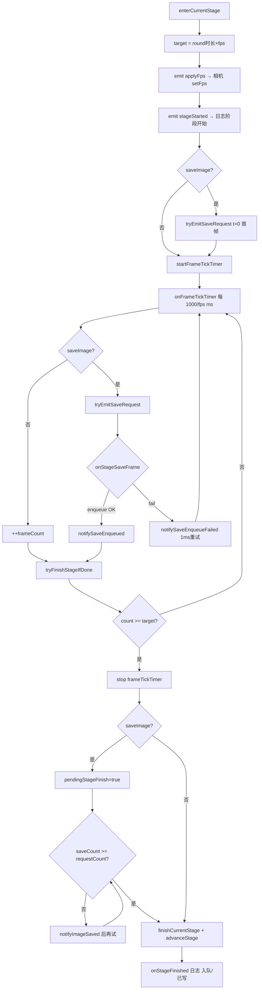
```mermaid
flowchart TD
    A[enterCurrentStage] --> B[target = round时长×fps]
    B --> C[emit applyFps → 相机 setFps]
    C --> D[emit stageStarted → 日志阶段开始]
    D --> E{saveImage?}
    E -->|是| F[tryEmitSaveRequest t=0 首帧]
    E -->|否| G[startFrameTickTimer]
    F --> G

    G --> H[onFrameTickTimer 每 1000/fps ms]
    H --> I{saveImage?}
    I -->|是| J[tryEmitSaveRequest]
    I -->|否| K[++frameCount]

    J --> L{onStageSaveFrame}
    K --> M[tryFinishStageIfDone]

    L -->|enqueue OK| N[notifySaveEnqueued]
    L -->|fail| O[notifySaveEnqueueFailed 1ms重试]

    N --> M
    O --> H

    M --> P{count >= target?}
    P -->|否| H
    P -->|是| Q[stop frameTickTimer]
    Q --> R{saveImage?}
    R -->|是| S[pendingStageFinish=true]
    S --> T{saveCount >= requestCount?}
    T -->|否| U[notifyImageSaved 后再试]
    U --> T
    T -->|是| V[finishCurrentStage + advanceStage]
    R -->|否| V

    V --> W[onStageFinished 日志 入队/已写]
```

### 5.1 函数 ↔ 文件行号

| 步骤 | 函数 | 文件 |
|------|------|------|
| 进入阶段 | `enterCurrentStage` | `StageManager.cpp` ~L48 |
| 发存图请求 | `tryEmitSaveRequest` | ~L90 |
| 主窗口入队 | `onStageSaveFrame` | `QtProject_1.cpp` ~L461 |
| 入队成功 | `notifySaveEnqueued` | `StageManager.cpp` ~L108 |
| 入队失败重试 | `notifySaveEnqueueFailed` | ~L117 |
| tick | `onFrameTickTimer` | ~L165 |
| 入队满 | `tryFinishStageIfDone` | ~L126 |
| 写盘对齐 | `tryCompleteStageAfterSave` | ~L151 |
| 打日志信号 | `finishCurrentStage` | ~L180 |
| 下一阶段 | `advanceStage` | ~L191 |

---

## 6. 启动阶段采集时序图

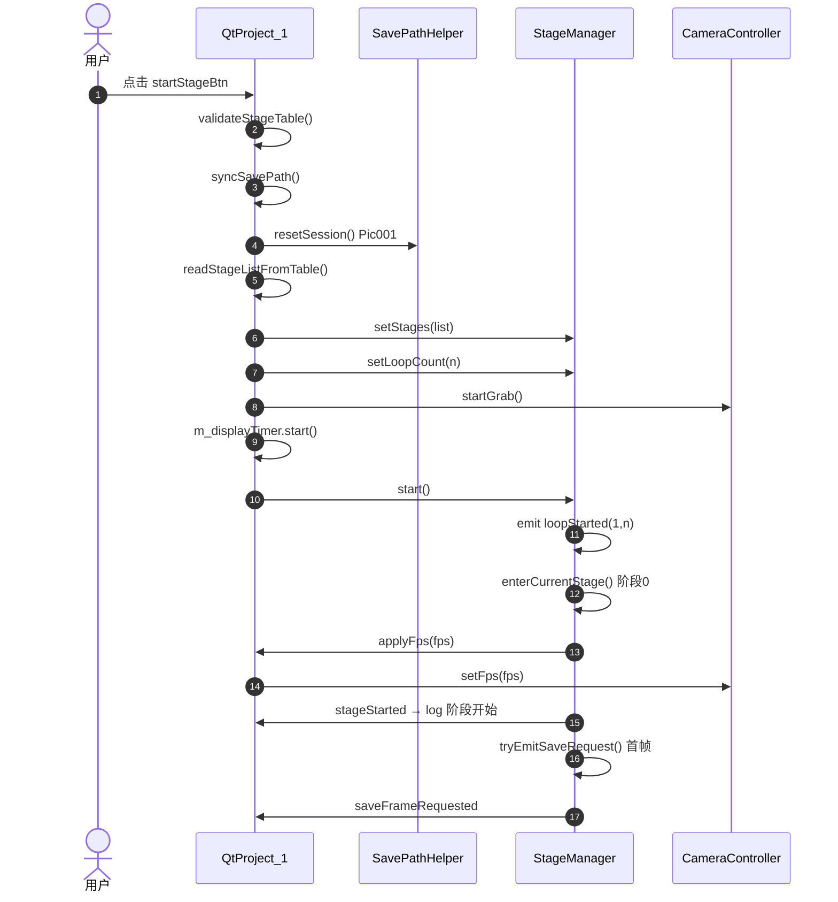
```mermaid
sequenceDiagram
    autonumber
    actor U as 用户
    participant MW as QtProject_1
    participant SPH as SavePathHelper
    participant SM as StageManager
    participant CAM as CameraController

    U->>MW: 点击 startStageBtn
    MW->>MW: validateStageTable()
    MW->>MW: syncSavePath()
    MW->>SPH: resetSession() Pic001
    MW->>MW: readStageListFromTable()
    MW->>SM: setStages(list)
    MW->>SM: setLoopCount(n)
    MW->>CAM: startGrab()
    MW->>MW: m_displayTimer.start()
    MW->>SM: start()
    SM->>SM: emit loopStarted(1,n)
    SM->>SM: enterCurrentStage() 阶段0
    SM->>MW: applyFps(fps)
    MW->>CAM: setFps(fps)
    SM->>MW: stageStarted → log 阶段开始
    SM->>SM: tryEmitSaveRequest() 首帧
    SM->>MW: saveFrameRequested
```

---

## 7. 单帧存图时序图（核心循环）

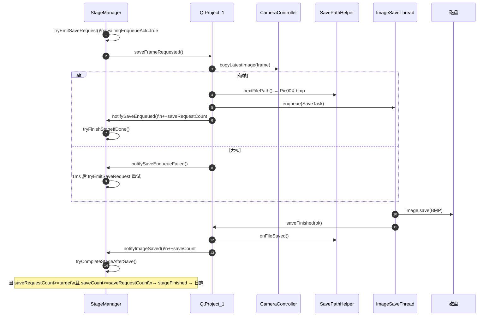
```mermaid
sequenceDiagram
    autonumber
    participant SM as StageManager
    participant MW as QtProject_1
    participant CAM as CameraController
    participant SPH as SavePathHelper
    participant Q as ImageSaveThread
    participant DISK as 磁盘

    SM->>SM: tryEmitSaveRequest()\nawaitingEnqueueAck=true
    SM->>MW: saveFrameRequested()

    MW->>CAM: copyLatestImage(frame)
    alt 有帧
        MW->>SPH: nextFilePath() → Pic00X.bmp
        MW->>Q: enqueue(SaveTask)
        MW->>SM: notifySaveEnqueued()\n++saveRequestCount
        SM->>SM: tryFinishStageIfDone()
    else 无帧
        MW->>SM: notifySaveEnqueueFailed()
        SM->>SM: 1ms 后 tryEmitSaveRequest 重试
    end

    Q->>DISK: image.save(BMP)
    Q->>MW: saveFinished(ok)
    MW->>SPH: onFileSaved()
    MW->>SM: notifyImageSaved()\n++saveCount
    SM->>SM: tryCompleteStageAfterSave()

    Note over SM: 当 saveRequestCount>=target\n且 saveCount>=saveRequestCount\n→ stageFinished → 日志
```

---

## 8. 多阶段 + 多轮推进

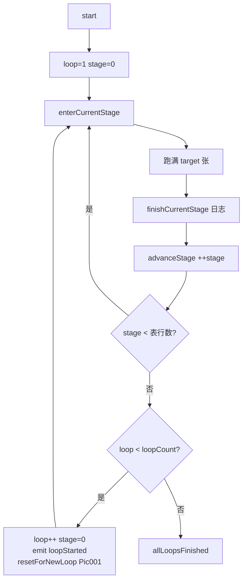
```mermaid
flowchart TD
    START[start] --> L1[loop=1 stage=0]
    L1 --> ES[enterCurrentStage]
    ES --> RUN[跑满 target 张]
    RUN --> FS[finishCurrentStage 日志]
    FS --> ADV[advanceStage ++stage]

    ADV --> MORE{stage < 表行数?}
    MORE -->|是| ES
    MORE -->|否| LOOP{loop < loopCount?}

    LOOP -->|是| RL[loop++ stage=0\nemit loopStarted\nresetForNewLoop Pic001]
    RL --> ES
    LOOP -->|否| END[allLoopsFinished]
```

**`resetForNewLoop()`**（`SavePathHelper`）：新一轮开始时 **Pic 序号回 001**，CAMERA 文件夹编号 **不重置**。

**调用位置**：`QtProject_1::onStageLoopStarted` → `m_savePath.resetForNewLoop()`

---

## 9. UI 数据如何进入 StageManager

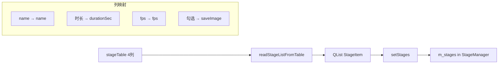
```mermaid
flowchart LR
    T[stageTable 4列] --> R[readStageListFromTable]
    R --> L[QList StageItem]
    L --> S[setStages]
    S --> M[m_stages in StageManager]

    subgraph 列映射
        C0[name → name]
        C1[时长 → durationSec]
        C2[fps → fps]
        C3[勾选 → saveImage]
    end
```

**校验**（启动前 `validateStageTable`）：

- 至少 1 行
- 名称非空
- 时长 > 0
- fps 在相机 `paramLimits()` 范围内

---

## 10. 日志数字为何能对齐

| 阶段 | 旧问题 | 现实现 |
|------|--------|--------|
| 入队 ≠ 时长×fps | 时间定时器截断 tick | 目标帧数驱动 |
| 入队 20 磁盘 39 | emit 就 +1，入队失败也计 | 仅 `notifySaveEnqueued` 计数 |
| 入队 20 已写 19 | `stageFinished` 打太早 | `pendingStageFinish` 等写盘 |

**日志打印位置**：`QtProject_1::onStageFinished` → `log("阶段结束: %1，入队%2，已写%3")`

**触发时机**：`tryCompleteStageAfterSave` 成功后才 `finishCurrentStage` → 此时 `saveCount == saveRequestCount`。

---

## 11. 停止与异常

| 场景 | 代码路径 |
|------|----------|
| 用户点停止 | `onStopStageCapture` → `m_stageMgr.stop()` → `stoppedByUser` → `stopCaptureAndWaitSave(true)` |
| 达 maxSaveCount | `onStageSaveFrame` 入队失败且 `isSaveLimitReached` → `m_stageMgr.stop()` |
| target=0 | `enterCurrentStage` 直接 finish + advance |

---

## 12. 自测用例

| # | 配置 | 期望 |
|---|------|------|
| 1 | 1s×20fps 勾存图 | 入队20 已写20 Pic20张 |
| 2 | 2s×10fps 勾存图 | 入队20 已写20 |
| 3 | 两阶段各20 | 磁盘共40 Pic001–040 |
| 4 | loopCount=2 | 第二轮 Pic 从 001 重计 |
| 5 | 不勾存图 | 无 BMP，阶段仍按 target tick 结束 |

---

# 存图流水线

从「决定要存一张图」到「BMP 落盘」的完整路径。

---

## 1. 流水线总览

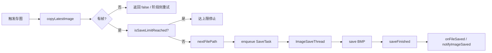
```mermaid
flowchart LR
    A[触发存图] --> B[copyLatestImage]
    B --> C{有帧?}
    C -->|否| FAIL[返回 false / 阶段则重试]
    C -->|是| D[isSaveLimitReached?]
    D -->|是| FAIL2[达上限停止]
    D -->|否| E[nextFilePath]
    E --> F[enqueue SaveTask]
    F --> G[ImageSaveThread]
    G --> H[save BMP]
    H --> I[saveFinished]
    I --> J[onFileSaved / notifyImageSaved]
```

**唯一入队入口**：`QtProject_1::enqueueCurrentFrame()` — `QtProject_1.cpp` ~L296

**谁调用它**：

| 调用者 | 场景 |
|--------|------|
| `onSaveOneBmp` | 手动存一张 |
| `onStageSaveFrame` | 阶段自动存图 |

---

## 2. SavePathHelper 路径规则

**文件**：`save/SavePathHelper.h`、`save/SavePathHelper.cpp`  
**实例**：`QtProject_1::m_savePath`（主窗口成员）

### 2.1 UI 同步到 Helper

**函数**：`QtProject_1::syncSavePath()` — `QtProject_1.cpp` ~L211

| UI 控件 | Helper 方法 |
|---------|---------------|
| `savePathEdit` | `setRootPath` |
| `saveModeCombo` | `setMode(SaveFolderMode)` |
| `picsPerFolderSpin` | `setPicsPerFolder` |
| `secondsPerFolderSpin` | `setSecondsPerFolder` |
| `maxSaveCountSpin` | `setMaxSaveCount` |

**何时 sync**：

- `onStartStageCapture` 开始前
- `onSaveOneBmp` 手动存图前

> 运行中改 UI **不会**自动生效，需下次 sync。

### 2.2 三种文件夹模式

| UI 选项 | 枚举 | 行为 | 实现函数 |
|---------|------|------|----------|
| 单文件夹 | `SingleFolder=0` | 全在根目录 | `activeFolderPath` 返回 root |
| 按张数分文件夹 | `ByCount=1` | 每 N 张新建 `CAMERA###` | `needNewCameraFolder` 看 `m_picsInCurrentFolder` |
| 按时间分文件夹 | `ByTime=2` | 每 T 秒新建 `CAMERA###` | 看 `m_folderStartTime` |

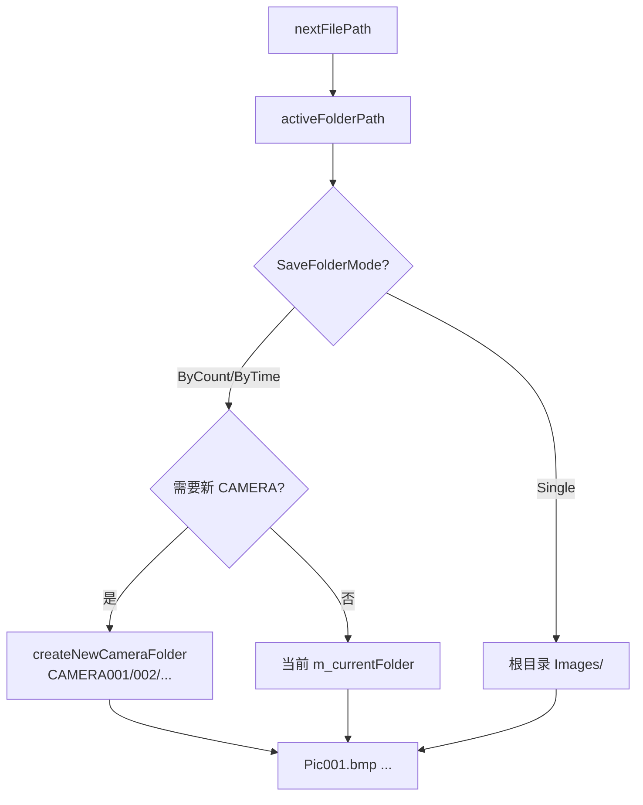
```mermaid
flowchart TD
    NF[nextFilePath] --> AF[activeFolderPath]
    AF --> M{SaveFolderMode?}
    M -->|Single| ROOT[根目录 Images/]
    M -->|ByCount/ByTime| NN{需要新 CAMERA?}
    NN -->|是| CF[createNewCameraFolder\nCAMERA001/002/...]
    NN -->|否| CUR[当前 m_currentFolder]
    CF --> PIC[Pic001.bmp ...]
    CUR --> PIC
    ROOT --> PIC
```

**注意**：模式管 **目录结构**，不管 **多久存一张**（频率由阶段 fps 决定）。

### 2.3 Pic / CAMERA 命名

```cpp
// SavePathHelper.cpp nextFilePath
"Pic%1.bmp".arg(m_picIndex++, 3, 10, QChar('0'))  // Pic001, Pic002, ...

// createNewCameraFolder
"CAMERA%1".arg(m_cameraFolderIndex++, 3, 10, QChar('0'))  // CAMERA001, ...
```

| 事件 | 函数 | 效果 |
|------|------|------|
| 开始阶段采集 | `resetSession()` | Pic001、CAMERA001、计数清零 |
| 新一轮 loop | `resetForNewLoop()` | **仅** Pic→001，CAMERA 继续累加 |
| 每次入队 | `nextFilePath()` | Pic 序号 +1（写盘前） |
| 写盘成功 | `onFileSaved()` | 分文件夹计数 +1 |

### 2.4 默认根路径

```cpp
SavePathHelper::defaultRootPath()
// exe 目录 cdUp cdUp → 项目根/Images
```

`AppConfig::loadUi` 每次启动把 `savePathEdit` 设为此路径（不记上次浏览）。

---

## 3. enqueueCurrentFrame 逐步

**文件**：`QtProject_1.cpp` L296–312

| 步骤 | 代码 | 失败时 |
|------|------|--------|
| 1 | `copyLatestImage(frame)` | return false |
| 2 | `isSaveLimitReached()` | return false |
| 3 | `nextFilePath(&ok)` | return false |
| 4 | `SaveTask{frame.copy(), path}` | — |
| 5 | `m_saveThread.enqueue(task)` | return true |

---

## 4. ImageSaveThread

**文件**：`save/ImageSaveThread.cpp`  
**启动**：主窗口构造 L86 `m_saveThread.start()`

### 4.1 run() 循环

```mermaid
flowchart TD
    A[run loop] --> B{队列空?}
    B -->|是且 m_stop| Z[exit]
    B -->|是| S[sleep 5ms]
    S --> A
    B -->|否| D[dequeue SaveTask]
    D --> E[image.save path BMP]
    E --> F{m_stop?}
    F -->|否| G[emit saveFinished]
    G --> H{queueSize>=15?}
    H -->|是| I[emit queueBacklog]
    F -->|是| A
    H -->|否| A
    I --> A
```

### 4.2 主窗口处理 saveFinished

**函数**：`onSaveThreadFinished` — `QtProject_1.cpp` ~L512

```mermaid
flowchart TD
    SF[saveFinished] --> OK{ok?}
    OK -->|否| ERR[log 保存失败]
    OK -->|是| OFS[m_savePath.onFileSaved]
    OFS --> ST{m_stageRunning?}
    ST -->|是| NIS[notifyImageSaved → StageManager]
    ST -->|否| LOG[log 已保存: path]
    NIS --> SS[setStageStatus 刷新队列数]
```

### 4.3 队列等待

| 函数 | 用途 | 调用处 |
|------|------|--------|
| `waitUntilEmpty(30s)` | 停采前排空 | `stopCaptureAndWaitSave` |
| `requestStopAndWait(30s)` | 退出线程 | `shutdownAll` |

---

## 5. 手动存图 vs 阶段存图

| 对比项 | 手动 `onSaveOneBmp` | 阶段 `onStageSaveFrame` |
|--------|---------------------|-------------------------|
| 触发 | 用户点按钮 | `StageManager` 信号 |
| syncSavePath | ✅ | ✅（开始前已 sync） |
| resetSession | ❌ Pic 连续 | ✅ 开始时 reset |
| 入队回调 | ❌ | ✅ notifySaveEnqueued/Failed |
| 写完 log | `已保存: path` | 阶段内不逐张 log |
| 统计 | 无 | 阶段结束 log 入队/已写 |

---

## 6. 时序：手动存一张

```mermaid
sequenceDiagram
    participant U as 用户
    participant MW as QtProject_1
    participant CAM as CameraController
    participant SPH as SavePathHelper
    participant Q as ImageSaveThread

    U->>MW: saveOneBmpBtn
    MW->>MW: syncSavePath()
    MW->>CAM: copyLatestImage
    MW->>SPH: nextFilePath
    MW->>Q: enqueue
    MW->>MW: log 手动存图已入队
    Q->>Q: save BMP
    Q->>MW: saveFinished
    MW->>SPH: onFileSaved
    MW->>MW: log 已保存: path
```

---

## 7. 常见问题

| 现象 | 原因 | 查哪里 |
|------|------|--------|
| 没有 CAMERA 子文件夹 | 选了单文件夹模式 | saveModeCombo |
| Pic 不从 001 开始 | 未 resetSession | onStartStageCapture |
| 入队成功但无文件 | 写盘失败 | log `[错误] 保存失败` |
| 队列积压警告 | ≥15 张未写完 | `onSaveQueueBacklog` |
| 磁盘张数 < 入队 | 历史 bug 已修；查写盘失败 | ImageSaveThread |

---

# UI 与信号槽参考

---

## 1. 界面布局

```
QtProject_1 (QWidget)
├── outerSplitter [上5 : 下2，下半可拖到 0 收起]
│   ├── topPanel
│   │   └── mainSplitter [左5 : 右4]
│   │       ├── previewGroup
│   │       │   ├── imageLabel          ← 相机画面
│   │       │   └── previewInfoLabel    ← 分辨率 / 模式 / 队列 / 像素灰度
│   │       └── workflowScroll (QScrollArea)
│   │           └── workflowContainer (5 个 GroupBox 自顶向下)
│   │               ├── cameraConnectGroup   ← ① 连接相机
│   │               ├── cameraParamGroup     ← ② 调节参数
│   │               ├── cameraCaptureGroup   ← ③ 采集 / 单张存图
│   │               ├── stageGroup           ← ④ 阶段表 + 循环 + 启停
│   │               └── saveSettingGroup     ← ⑤ 存图设置
│   └── logGroup (横贯下半)
│       ├── logTextEdit
│       └── clearLogBtn
└── statusBarFrame (底部 24 px 状态条)
    ├── statusCamera   ← 相机摘要
    ├── statusStage    ← 阶段摘要
    ├── statusQueue    ← 队列 N/48（≥80% 红字告警）
    └── statusTotal    ← 总保存累计
```

**布局原则**：单一界面工作流——5 个 GroupBox 自顶向下即操作流程；预览与日志同屏可见；底部状态条常驻全局摘要。

**样式**：构造函数内 `setStyleSheet` — 蓝 primary / 红 danger 按钮；状态条浅灰底加顶部分隔线。

---

## 2. 工作流栏「① 连接相机 + ② 调节参数 + ③ 采集」控件表

| objectName | 类型 | 槽 / 作用 |
|------------|------|-----------|
| `exposureSpin` | QDoubleSpinBox | 曝光 μs |
| `gainSpin` | QDoubleSpinBox | 增益 dB |
| `fpsSpin` | QDoubleSpinBox | 帧率 |
| `paramRangeLabel` | QLabel | 相机合法范围 |
| `applyParamBtn` | QPushButton | → `onApplyParams` |
| `cameraSelectCombo` | QComboBox | 预留（当前仅 Basler） |
| `cameraStatusLabel` | QLabel | 连接状态颜色 |
| `openCameraBtn` | QPushButton | → `onOpenCamera` |
| `closeCameraBtn` | QPushButton | → `onCloseCamera` |
| `startGrabBtn` | QPushButton | → `onStartGrab` |
| `stopGrabBtn` | QPushButton | → `onStopGrab` |
| `saveOneBmpBtn` | QPushButton | → `onSaveOneBmp` |

---

## 3. 工作流栏「④ 阶段表 + ⑤ 存图设置」控件表

| objectName | 类型 | 槽 / 作用 |
|------------|------|-----------|
| `stageTable` | QTableWidget | 5 列：序号/名称/时长/fps/存图 |
| `loopCountSpin` | QSpinBox | 循环次数 → `setLoopCount` |
| `addStageBtn` | QPushButton | → `onAddStage` |
| `deleteStageBtn` | QPushButton | → `onDeleteStage` |
| `clearStageBtn` | QPushButton | → `onClearStages` |
| `startStageBtn` | QPushButton | → `onStartStageCapture` |
| `stopStageBtn` | QPushButton | → `onStopStageCapture` |
| `stageStatusLabel` | QLabel | 阶段状态 + 队列 |
| `savePathEdit` | QLineEdit | 保存根路径 |
| `browsePathBtn` | QPushButton | → `onBrowseSavePath` |
| `saveModeCombo` | QComboBox | 0单/1张数/2时间 |
| `picsPerFolderSpin` | QSpinBox | 按张数分夹 N |
| `secondsPerFolderSpin` | QSpinBox | 按时间分夹 T 秒 |
| `maxSaveCountSpin` | QSpinBox | 总上限 0=不限 |

**阶段表默认**：`setupStageTable` 插入一行「阶段1」，1.0s，20fps，默认勾选存图。

---

## 4. 信号槽完整表

**定义位置**：`QtProject_1.cpp` 构造函数 L53–77

### 4.1 按钮 → 槽

| 信号源 | 槽 |
|--------|-----|
| openCameraBtn | onOpenCamera |
| closeCameraBtn | onCloseCamera |
| startGrabBtn | onStartGrab |
| stopGrabBtn | onStopGrab |
| applyParamBtn | onApplyParams |
| saveOneBmpBtn | onSaveOneBmp |
| browsePathBtn | onBrowseSavePath |
| clearLogBtn | logTextEdit::clear |
| saveModeCombo | updateSaveModeUi |
| add/delete/clearStageBtn | onAddStage / onDeleteStage / onClearStages |
| startStageBtn | onStartStageCapture |
| stopStageBtn | onStopStageCapture |

### 4.2 模块 → 槽

| 信号源 | 信号 | 槽 |
|--------|------|-----|
| m_displayTimer | timeout | onDisplayTimer |
| m_camera | errorOccurred | onCameraError |
| m_stageMgr | applyFps | onStageApplyFps |
| m_stageMgr | saveFrameRequested | onStageSaveFrame |
| m_stageMgr | stageStarted | onStageStarted |
| m_stageMgr | stageFinished | onStageFinished |
| m_stageMgr | loopStarted | onStageLoopStarted |
| m_stageMgr | allLoopsFinished | onStageAllFinished |
| m_stageMgr | stoppedByUser | onStageStoppedByUser |
| m_saveThread | saveFinished | onSaveThreadFinished |
| m_saveThread | queueBacklog | onSaveQueueBacklog |

---

## 5. 按钮状态机

**函数**：`refreshButtonState()` — `QtProject_1.cpp` ~L230

```mermaid
stateDiagram-v2
    [*] --> Disconnected: 未开相机
    Disconnected --> Connected: openCamera
    Connected --> Preview: startGrab
    Connected --> StageRun: startStage
    Preview --> Connected: stopGrab
    StageRun --> Connected: 阶段结束/停止
    Connected --> Disconnected: closeCamera

    note right of Disconnected : 只能 open
    note right of Preview : 不能改阶段表\n不能 startStage
    note right of StageRun : 只能 stopStage
```

| 条件 | 启用 |
|------|------|
| `!open` | openCamera |
| `open && !grab` | closeCamera, startGrab, startStage |
| `open && grab && !stage` | stopGrab, saveOneBmp |
| `stage` | stopStage |
| `idle = !grab && !stage` | 阶段表、loopCount、增删阶段 |

---

## 6. updateSaveModeUi

按 `saveModeCombo` 启用/禁用：

- 模式 1（按张数）→ `picsPerFolderSpin`
- 模式 2（按时间）→ `secondsPerFolderSpin`

---

## 7. 阶段状态栏

**函数**：`setStageStatus(text)` — 缓存 `m_stageStatusText`，阶段运行中追加 `| 队列 N`。

---

## 8. 日志系统

### 8.1 写入入口

```cpp
void QtProject_1::log(const QString &msg)  // L134
→ logTextEdit append "[时间] 消息"
```

### 8.2 日志来源表

| 消息模式 | 槽函数 | 条件 |
|----------|--------|------|
| Pylon 初始化 / 软件启动 | 构造函数 | 启动 |
| 相机连接成功/失败 | onOpenCamera | |
| 开始/停止采集 | onStartGrab / onStopGrab | |
| 手动存图已入队/失败 | onSaveOneBmp | |
| 开始阶段采集 | onStartStageCapture | |
| 第 i/j 轮开始 | onStageLoopStarted | |
| **阶段开始: 名** | onStageStarted | |
| **阶段结束: 名，入队N，已写M** | onStageFinished | 写盘对齐后 |
| 阶段采集全部完成 | onStageAllFinished | |
| 用户停止，等待存图队列 | stopCaptureAndWaitSave(true) | |
| 已保存: path | onSaveThreadFinished | **非** m_stageRunning |
| [警告] 存图队列积压 | onSaveQueueBacklog | queue≥15 |
| [错误] 保存失败 | onSaveThreadFinished | !ok |

### 8.3 stageFinished 参数

```cpp
void onStageFinished(..., int saveRequestCount, int savedCount, ...)
log("阶段结束: %1，入队%2，已写%3")
```

| 参数 | 含义 |
|------|------|
| saveRequestCount | 本阶段入队成功次数 |
| savedCount | 本阶段 BMP 写完次数 |

---

## 9. Designer 文件

| 文件 | 工具 |
|------|------|
| `QtProject_1.ui` | Qt Designer 编辑 |
| `uic/ui_QtProject_1.h` | 编译生成，勿手改 |

改 UI 后重新编译，`setupUi` 自动更新控件。

---

# 配置、编译与排错

---

## 1. 配置持久化

### 1.1 存储位置

```cpp
QSettings("BaslerGrab", "QtProject_1")
```

**Windows**：`HKEY_CURRENT_USER\Software\BaslerGrab\QtProject_1`

### 1.2 会保存的项（saveUi）

| QSettings 键 | UI 控件 |
|--------------|---------|
| `save/mode` | saveModeCombo |
| `save/picsPerFolder` | picsPerFolderSpin |
| `save/secondsPerFolder` | secondsPerFolderSpin |
| `save/maxCount` | maxSaveCountSpin |
| `stage/loopCount` | loopCountSpin |
| `stage/rows[i]/name` | 阶段表列0 |
| `stage/rows[i]/duration` | 列1 |
| `stage/rows[i]/fps` | 列2 |
| `stage/rows[i]/save` | 列3 勾选 |

### 1.3 不会保存的项（每次启动默认）

| 项 | 启动行为 |
|----|----------|
| 保存路径 | `SavePathHelper::defaultRootPath()` → `Images/` |
| 曝光 | 10000 μs |
| 增益 | 0 dB |
| fps | 20 |

**代码**：`core/AppConfig.cpp` `loadUi` L19–35

### 1.4 读写时机

| 时机 | 函数 |
|------|------|
| 构造 | `AppConfig::loadUi(ui)` |
| closeEvent / 析构 | `AppConfig::saveUi(ui)` |

---

## 2. 编译环境

### 2.1 必需

| 组件 | 版本 |
|------|------|
| Visual Studio | 2019, v142, x64 |
| Qt | 5.15.2 msvc2019_64 |
| Basler pylon | 5 Development + Runtime x64 |
| 宏 | `QT_PROJECT_USE_PYLON` |

### 2.2 vcxproj 路径

```xml
<PYLON_DEV>C:\Program Files\Basler\pylon 5\Development</PYLON_DEV>
<QT_BIN>C:\Qt\5.15.2\msvc2019_64\bin</QT_BIN>
```

### 2.3 编译命令

```bat
msbuild QtProject_1.sln /p:Configuration=Debug /p:Platform=x64 /t:Rebuild
```

输出：`x64\Debug\QtProject_1.exe`

### 2.4 Pylon 头文件警告

C26812、C26495、C26451 — 来自 SDK，已在 `CameraController.cpp` 与 vcxproj 压制。

---

## 3. 运行部署

1. 相机连接，pylon Viewer 可见  
2. `C:\Program Files\Basler\pylon 5\Runtime\x64` 加入 PATH  
3. 或复制 DLL 到 exe 同目录  
4. 确保 `Images/` 可写  

---

## 4. 排错清单

### 4.1 决策树

```mermaid
flowchart TD
    A[出问题] --> B{能开相机?}
    B -->|否| B1[Pylon/DLL/占用]
    B -->|是| C{能预览?}
    C -->|否| C1[startGrab 失败]
    C -->|是| D{阶段/存图?}
    D --> E{入队数不对?}
    E -->|是| E1[查 STAGE_CAPTURE 公式]
    E -->|否| F{磁盘少图?}
    F -->|是| F1[查 enqueue 失败/写盘错误 log]
    F -->|否| G{日志已写少于入队?}
    G -->|是| G1[旧版问题 已修 pendingStageFinish]
    G -->|否| H[查 savePath 权限/模式]
```

### 4.2 常见问题表

| 现象 | 可能原因 | 处理 |
|------|----------|------|
| Pylon 初始化失败 | 无 Runtime / 宏未开 | PATH、QT_PROJECT_USE_PYLON |
| 未找到相机 | USB/驱动/被占用 | 关 Viewer/其他程序 |
| 预览黑屏 | 未 startGrab 或无帧 | 等曝光出图 |
| 入队15 期望20 | 旧版双定时器 | 已改目标帧数，确认最新代码 |
| 入队20 已写19 日志 | 旧版早打日志 | 已改写盘对齐 |
| 入队20 磁盘39 | 旧版 emit 计数 | 已改 notifySaveEnqueued |
| 手动存图失败 | 未采集 / 无帧 | 先 startGrab |
| 存图队列积压 | 磁盘慢 / fps 高 | 降 fps 或换 SSD |
| 退出崩溃 | Pylon 顺序 | 必须走 shutdownAll |
| 无 CAMERA 子夹 | 单文件夹模式 | saveModeCombo |

### 4.3 建议调试手段

1. 看 **日志栏** 全文  
2. 数 **Images/** 下 Pic 数量  
3. 对照 **docs/STAGE_CAPTURE.md** 时序图  
4. 在 `onStageFinished` / `notifySaveEnqueued` 打断点  
5. 检查 `stageTable` 时长、fps、存图勾选  

---

## 5. 测试清单

| # | 步骤 | 期望 |
|---|------|------|
| 1 | 开相机 → 采集 | 预览正常 |
| 2 | 手动存 3 张 | Pic001–003 |
| 3 | 阶段 1s×20 + 2s×10 勾存图 | 各入队20已写20，共40文件 |
| 4 | loopCount=2 | 第二轮 Pic001 起 |
| 5 | 按张数分夹 N=5 | CAMERA001/002… |
| 6 | 采集中关窗口 | 不崩溃，配置恢复 |
| 7 | 阶段中点停止 | 队列排空 log |

---

## 6. GenICam 节点速查

| 节点 | 用途 |
|------|------|
| Width / Height | 2592×2048 |
| ExposureTime | 曝光 μs |
| Gain / GainRaw | 增益 dB |
| AcquisitionFrameRateEnable | 使能帧率 |
| AcquisitionFrameRate | 目标 fps |

**仅** `camera/CameraController.cpp` 访问。

---

## 7. 相关文档

- 阶段公式与时序 → 本文「阶段采集」章节
- 存图路径 → 本文「存图流水线」章节
- 架构 → 本文「架构说明」章节

