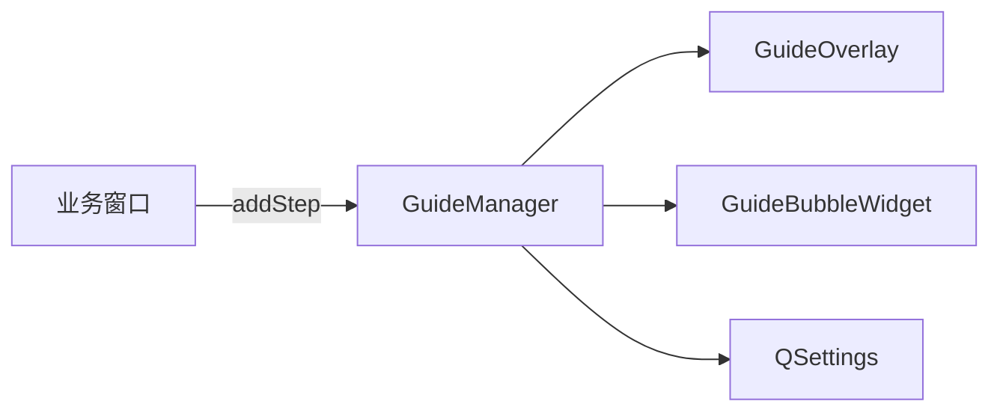

# GuideKit 新手引导 — 开发说明

Qt 5.15+ Widgets 新手引导组件：**遮罩 + 高亮 + 气泡 + 步骤导航**。库源码 **C++14**，不拦截界面操作。

---

## 1. 是什么

`guide/` 为可复制的 Qt Widgets 新手引导库：

| 层 | 职责 |
|----|------|
| **库** | 遮罩、高亮洞、气泡文案、上一步/下一步/跳过/完成、QSettings 完成记录 |
| **业务** | 步骤文案、`beforeShow`/`afterLeave`、可选 `setEnabled`、条件回调 |

库不拦截鼠标；高亮 `target` 仅表示建议关注位置。



---

## 2. 文件结构

```text
guide/
  GuideKit.h              对外唯一入口
  GuideStep.h             步骤模型
  GuideTheme.h            主题
  GuideManager.h/.cpp     流程控制
  GuideOverlay.h/.cpp     遮罩绘制
  GuideBubbleWidget.h/.cpp  气泡
```

---

## 3. 复制与工程配置

将整个 `guide/` 目录复制到目标工程。

### 3.1 Visual Studio + Qt

**编译**

- `GuideManager.cpp`
- `GuideOverlay.cpp`
- `GuideBubbleWidget.cpp`

**Moc**

- `GuideManager.h`
- `GuideBubbleWidget.h`

**头文件**

- `GuideKit.h`（对外唯一入口）
- `GuideStep.h`、`GuideTheme.h`、`GuideOverlay.h`

语言标准：`/std:c++14` 或更高（库内不使用 C++17 特性）。

### 3.2 注释约定

库内注释遵循项目 `code-comments.mdc`：

- 每个 `.cpp` 函数实现上方须有一行中文注释
- 头文件中类、成员、对外方法须有简短说明

---

## 4. 最小接入

```cpp
#include "guide/GuideKit.h"

// 构造函数
m_guide = new GuideManager(this, this);
m_guide->setProductId(QStringLiteral("MyApp"));
m_guide->setGuideId(QStringLiteral("intro"));
m_guide->setVersion(1);

GuideStep step;
step.id = QStringLiteral("step1");
step.title = QStringLiteral("标题");
step.description = QStringLiteral("说明");
step.actionHint = QStringLiteral("您可在此操作；完成后点下一步");
step.targetGetter = [this]() { return ui.myButton; };
m_guide->addStep(step);

// 首次 show 且布局完成后
m_guide->startIfNeeded();
```

---

## 5. GuideStep 字段

| 字段 | 说明 |
|------|------|
| `id` | 步骤 ID |
| `title` / `description` / `actionHint` | 文案；`actionHint` 空则用库内默认 |
| `targetObjectName` / `targetGetter` | 高亮参考（仅绘制） |
| `beforeShow` / `afterLeave` | 切 Tab、滚屏、enable 等（业务实现） |
| `conditionId` + `canProceed` + `requireCanProceed` | 可选：条件满足后「下一步」才可点 |
| `allowSkip` / `allowPrevious` | 导航按钮 |
| `margin` / `maxBubbleWidth` | 高亮边距、气泡宽度 |

---

## 6. GuideManager 接口

| 方法 | 说明 |
|------|------|
| `startIfNeeded()` | 未完成才显示 |
| `start()` | 强制显示 |
| `stop()` | 中止，不写完成标记 |
| `skip()` | 跳过，写完成标记 |
| `complete()` | 正常完成 |
| `notifyCondition(id)` | 刷新「下一步」可点状态 |
| `isCompleted()` / `resetCompletion()` | QSettings |

**信号**：`started`、`stopped(bool)`、`skipped`、`stepChanged`

**完成键**：`GuideKit/<productId>/<guideId>/v<version>/Completed`

改步骤内容时 **升 version**，用户会重新看到引导。

---

## 7. 行为契约

| 规则 | 说明 |
|------|------|
| 不挡操作 | `GuideOverlay` 使用 `WA_TransparentForMouseEvents` |
| 不自动跳步 | 仅用户点「下一步」/「完成」 |
| 条件门控 | `requireCanProceed` + `canProceed` 只控制「下一步」是否可点 |
| 末步 | 「完成」始终可点 |
| 遮罩不接收鼠标 | 界面照常操作 |
| `requireCanProceed` | 只灰「下一步」，不禁用其它控件 |

---

## 8. notifyCondition

业务完成某动作时调用，用于刷新「下一步」按钮（不自动前进）：

```cpp
// 打开相机成功后
m_guide->notifyCondition(QStringLiteral("camera_opened"));
```

`GuideStep` 中 `conditionId` 须与之一致。

---

## 9. 多组引导

换 `guideId` + `setVersion` + 重新 `clearSteps`/`addStep`，再 `start()` 即可。无需库内「引导链」。

---

## 10. 限制操作（业务侧）

GuideKit 不封界面。若需只让用户动局部：

```cpp
step.beforeShow = [this]() { ui.otherPanel->setEnabled(false); };
step.afterLeave = [this]() { ui.otherPanel->setEnabled(true); };
```

---

## 11. 本仓库样例

`QtProject_1::setupStartupGuide()` + `populateBasicCaptureGuide()` 为**测试样例**，非库的一部分。

完成键示例：`GuideKit/QtProject_1/basic_capture/v4/Completed`

---

## 12. 测试要点

| 场景 | 预期 |
|------|------|
| 首次 `startIfNeeded` | 显示第 1 步 |
| 已完成后再启动 | 不显示 |
| 引导中点击任意控件 | 与无引导时一致 |
| 条件未满足 | 「下一步」灰，其它仍可操作 |
| 点「下一步」 | 手动推进 |
| resize 窗口 | 遮罩/气泡跟随 |
| 目标控件销毁 | 不崩溃 |

---

## 13. C++14

`guide/` 源码须能在 **C++14** 下编译；不使用 structured binding、if constexpr、optional 等 C++17 特性。
