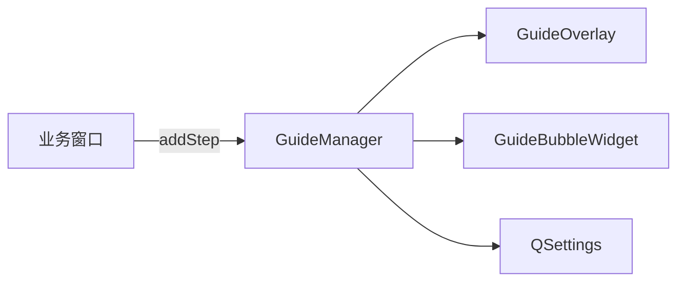

# GuideKit 开发说明

移植请优先阅读 **[guide/README.md](../guide/README.md)**（一页即可接入）。

## 1. 是什么

`guide/` 为可复制的 Qt Widgets 新手引导库：遮罩、高亮洞、气泡文案、上一步/下一步/跳过/完成、QSettings 完成记录。

- **库负责**：视觉提示与步骤流
- **业务负责**：步骤文案、`beforeShow`、可选 `setEnabled`、条件回调

库不拦截鼠标；高亮 `target` 仅表示建议关注位置。

## 2. 文件

```text
guide/
  GuideKit.h           对外入口
  GuideStep.h          步骤模型
  GuideTheme.h         主题
  GuideManager.h/.cpp  流程
  GuideOverlay.h/.cpp  遮罩绘制
  GuideBubbleWidget.h/.cpp  气泡
  README.md            移植步骤
```

## 3. 架构



## 4. 交互契约

| 规则 | 说明 |
|------|------|
| 不挡操作 | `GuideOverlay` 使用 `WA_TransparentForMouseEvents` |
| 不自动跳步 | 仅用户点「下一步」/「完成」 |
| 条件门控 | `requireCanProceed` + `canProceed` 只控制「下一步」是否可点 |
| 末步 | 「完成」始终可点 |

## 5. notifyCondition

业务完成某动作时调用，用于刷新「下一步」按钮（不自动前进）：

```cpp
// 打开相机成功后
m_guide->notifyCondition(QStringLiteral("camera_opened"));
```

`GuideStep` 中 `conditionId` 须与之一致。

## 6. 多组引导

换 `guideId` + `setVersion` + 重新 `clearSteps`/`addStep`，再 `start()` 即可。无需库内「引导链」。

## 7. 本仓库测试接入

`QtProject_1::setupStartupGuide()` + `populateBasicCaptureGuide()` 为**测试样例**，非库的一部分。完成键示例：

`GuideKit/QtProject_1/basic_capture/v4/Completed`

## 8. 测试要点

| 场景 | 预期 |
|------|------|
| 首次 `startIfNeeded` | 显示第 1 步 |
| 已完成后再启动 | 不显示 |
| 引导中点击任意控件 | 与无引导时一致 |
| 条件未满足 | 「下一步」灰，其它仍可操作 |
| 点「下一步」 | 手动推进 |
| resize 窗口 | 遮罩/气泡跟随 |
| 目标控件销毁 | 不崩溃 |

## 9. C++14

`guide/` 源码须能在 **C++14** 下编译；不使用 structured binding、if constexpr、optional 等 C++17 特性。
