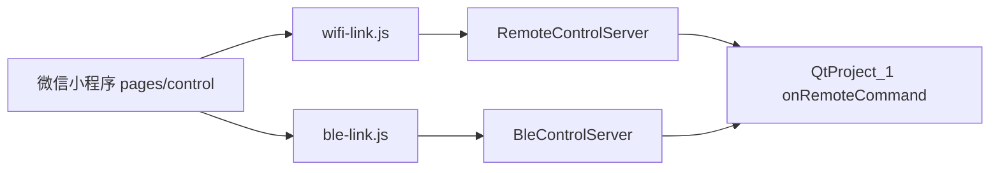

# 微信小程序遥控 — 开发文档

本文档面向**开发者**：协议、目录、扩展命令、联调排错。  
使用者操作说明见 **[BLE_REMOTE_GUIDE.md](BLE_REMOTE_GUIDE.md)**（含 WiFi / BLE 连接步骤）。

---

## 1. 总览

| 项 | 说明 |
|----|------|
| 产品 | PhotoMech 相机采集软件的手机遥控端 |
| PC 端 | `QtProject_1` + `remote/`（HTTP + BLE 双通道） |
| 小程序 | 项目根 `miniprogram/` |
| 配置 | `config/netconfig.ini`（口令、HTTP、BLE 名称） |
| 推荐链路 | **WiFi（HTTP）** — 稳定、无需蓝牙权限 |
| 可选链路 | **BLE** — 真机、Windows 外设 GATT |



WiFi 与 BLE **共用**命令名、状态字段、按钮禁用规则；仅在传输层不同。

---

## 2. 文档与代码索引

| 文档 / 目录 | 用途 |
|-------------|------|
| **本文档** | 小程序 + 协议 + 扩展 |
| [BLE_REMOTE_GUIDE.md](BLE_REMOTE_GUIDE.md) | 使用手册、真机联调 |
| [remote/README.md](../remote/README.md) | PC 遥控套件移植、`RemoteHost` 集成 |
| [miniprogram/README.md](../miniprogram/README.md) | 小程序快速说明 |
| `config/netconfig.ini` | 运行配置 |

| 代码入口 | 文件 |
|----------|------|
| PC 命令分发 | `QtProject_1.cpp` → `onRemoteCommand` |
| PC 状态 JSON | `QtProject_1.cpp` → `buildRemoteStatusJson` |
| 命令白名单 | `remote/RemoteCommands.h` |
| HTTP 服务 | `remote/RemoteControlServer.cpp` |
| BLE GATT | `remote/ble/BleControlServer.cpp` |
| 小程序主页面 | `miniprogram/pages/control/index.js` |

---

## 3. 配置 `config/netconfig.ini`

程序从 **exe 所在目录向上**查找第一份 `config/netconfig.ini`。

```ini
[remote]
token=1234

[http]
bind=192.168.2.184    ; 本机 WiFi IPv4，与手机同网段；日志与小程序填写一致
port=18765

[ble]
device_name=PhotoMech
```

| 键 | 说明 |
|----|------|
| `remote/token` | HTTP / BLE **共用**口令 |
| `http/bind` | 监听 IP；**即**日志与小程序显示的地址（不再自动扫网卡） |
| `http/port` | HTTP 端口，默认 18765 |
| `ble/device_name` | 广播名称提示；列表仍按有名称设备展示 |

改 ini 后须**重启 PC 软件**。部署时确保 exe 能读到这份文件（可复制到输出目录旁 `config/`）。

---

## 4. 命令协议

命令名在 **PC `RemoteCommands.h`** 与 **小程序 `remote-buttons.js` `CMD_LABELS`** 必须一致。

| 命令 | 说明 | PC 映射 |
|------|------|---------|
| `status` | 查询状态（不执行业务） | `pushRemoteStatus` |
| `open_camera` | 打开相机 | `onOpenCamera` |
| `close_camera` | 关闭相机 | `onCloseCamera` |
| `start_capture` | 开始采集 | `onStartGrab` |
| `stop_capture` | 停止采集 / 阶段中则停阶段 | `onStopGrab` / `onStopStageCapture` |
| `save_one` | 保存单张 BMP | `onSaveOneBmp` |
| `start_stage` | 开始阶段采集 | `onStartStageCapture` |
| `stop_stage` | 停止阶段 | `onStopStageCapture` |

### 4.1 HTTP

| 接口 | 方法 | 说明 |
|------|------|------|
| `/api/status?token=` | GET | 返回状态 JSON |
| `/api/command?token=` | POST | Body: `{"cmd":"open_camera","token":"1234"}`，响应带最新状态 |

- Token 无效 → HTTP 403  
- 未知命令 → HTTP 400  

实现：`remote/RemoteControlServer.cpp`

### 4.2 BLE

| 特征 | UUID | 方向 |
|------|------|------|
| Service | `A1B2C3D4-E5F6-4A5B-8C9D-0E1F2A3B4C5D` | — |
| CMD | `…C5E` | 小程序 **Write** |
| STATUS | `…C5F` | PC **Notify**，小程序 Subscribe |

**写入格式**（UTF-8 文本）：

```
cmd
cmd:token
```

示例：`open_camera:1234`、`status:1234`

- PC 端常量：`remote/ble/BleProtocol.h`  
- 小程序常量：`miniprogram/utils/protocol.js`  
- **修改 UUID 须两端同步**

Notify 载荷为**紧凑 JSON**（省 MTU），小程序 `parseStatus` → `normalizeStatus` 展开为长键名。

---

## 5. 状态 JSON

PC `buildRemoteStatusJson()` 返回的字段（HTTP 全名；BLE Notify 为短键）：

| 长键（HTTP / 按钮逻辑） | 短键（BLE Notify） | 类型 | 说明 |
|-------------------------|-------------------|------|------|
| `ok` | `ok` | bool/int | `false`/`0` 表示 PC 主动离线（关程序前推送） |
| `cameraOpen` | `cam` | bool | 相机已打开 |
| `liveViewActive` | `lv` | bool | 连续 grab / 预览 |
| `acquisitionActive` | `grab` | bool | 业务采集中 |
| `stageRunning` | `stg` | bool | 阶段运行中 |
| `queueSize` | `q` | int | 存图队列长度 |
| `queueCapacity` | `qc` | int | 队列容量 |
| `totalSaved` | `tot` | int | 累计已存张数 |
| `message` | `msg` | string | 摘要文案（预览中 / 采集中 / 阶段采集中…） |
| `cameraStatus` | — | string | 相机摘要（HTTP 有，BLE 紧凑格式可能省略） |
| `stageStatus` | — | string | 阶段摘要 |

紧凑化实现：`remote/ble/BleCommandProtocol.cpp` → `compactStatusJson`  
小程序展开：`miniprogram/utils/protocol.js` → `normalizeStatus`

---

## 6. 小程序架构

```
miniprogram/
├── app.js / app.json / app.wxss
├── pages/control/          # 唯一业务页
│   ├── index.js            # 模式切换、连接、发令、状态 UI
│   ├── index.wxml
│   └── index.wxss
└── utils/
    ├── remote-buttons.js   # 命令表 + computeBtnState（与 PC 一致）
    ├── wifi-link.js        # WiFi 模式门面
    ├── ble-link.js         # BLE 模式门面
    ├── http.js             # wx.request 封装
    ├── ble.js              # 扫描、GATT、Notify
    ├── protocol.js         # UUID、命令串、状态解析
    └── errors.js           # 错误文案
```

### 6.1 分层原则

| 层 | 职责 |
|----|------|
| `pages/control` | UI、互斥锁、本地存储（host/token/mode） |
| `*-link.js` | 模式专用：连接、轮询、发令后拉状态 |
| `http.js` / `ble.js` | 微信 API，不含页面逻辑 |
| `remote-buttons.js` | **与 PC 共用的业务规则** |

切换 WiFi / BLE 时会 **teardown 另一链路**（断开 + 停轮询）。

### 6.2 页面交互

- **全局互斥** `runAction`：连接、扫描、发令不可并发  
- **轮询** `POLL_MS = 2000`：连接后每 2 秒 `status`  
- **按钮禁用** `computeBtnState(status, locked)` — 与 PC 主界面相同前置条件  
- **BLE 离线**：收到 `ok=0` → `handleBlePcOffline` 立即断开 UI  
- **本地记忆**：`photomech_host`、`photomech_token`、`photomech_mode`

### 6.3 BLE 设备列表

`ble.js` → `getDeviceList()`：

- 显示所有**有名称**的设备（`name` / `localName`）  
- 隐藏无名称、「未知设备」「Unknown」  
- 含遥控 UUID 或名称含 `PHOTOMECH` 的排最前（`isRemote`）  
- 连错设备 → GATT 无服务 → 提示「未找到遥控服务」

---

## 7. 按钮禁用规则

与 `QtProject_1` 主界面一致，见 `remote-buttons.js`：

| 按钮 | 禁用条件 |
|------|----------|
| 打开相机 | 已连接且 locked / 相机已开 |
| 关闭相机 | 未开 / 阶段运行中 |
| 开始采集 | 未开 / 已在采集 / 阶段中 |
| 停止采集 | 未开 / 未在采集 / 阶段中 |
| 保存单张 | 未开 / 未采集 / 无 liveView / 阶段中 |
| 开始阶段 | 未开 / 采集中 / 阶段中 |
| 停止阶段 | 阶段未运行 |

---

## 8. 扩展新命令（Checklist）

1. **`remote/RemoteCommands.h`** — `knownCommands()` + `label()`  
2. **`QtProject_1.cpp`** — `onRemoteCommand` 分支（前置条件与 UI 按钮一致）  
3. **`miniprogram/utils/remote-buttons.js`** — `CMD_LABELS` + `computeBtnState`  
4. **`miniprogram/pages/control/index.wxml`** — 按钮与 `data-cmd`  
5. 若改 BLE UUID → `BleProtocol.h` + `protocol.js`  
6. 重启 PC；重新编译 / 预览小程序  

---

## 9. 开发与联调

### 9.1 微信开发者工具

1. 打开目录 `miniprogram/`  
2. 填写 AppID（测试号亦可）  
3. **详情 → 本地设置 → 不校验合法域名**（HTTP 为局域网 IP）  
4. WiFi：模拟器可测连接；BLE **必须真机预览**  

### 9.2 推荐验证顺序

1. PC 启动 → 日志 `HTTP 遥控已启动，手机可连接 x.x.x.x:18765`  
2. WiFi 模式连接 → 状态行「预览中/未连接」随操作变化  
3. 各按钮与 PC 同步禁用/可用  
4. BLE 真机：刷新列表 → 选 PC → 同上  
5. 关 PC → 小程序 BLE 应显示「已断开 / PC已关闭」  

### 9.3 PC 退出与 BLE

`shutdownAll()` → `RemoteHost::shutdown()` → `BleControlServer::stop()`：

1. 先发 Notify `ok=0, msg=PC已关闭`  
2. 再停 GATT / 广播  

---

## 10. 常见问题（开发向）

| 现象 | 原因 | 处理 |
|------|------|------|
| 日志 IP 与 WiFi 不符 | exe 读到旧 ini 或 bind 未改 | 改 `http/bind` 为 WiFi IP，复制 ini 到输出目录，重启 |
| WiFi 连不上 | 防火墙 / 不同网段 / 虚拟网卡 IP | 手机与 PC 同 WiFi；填 ini 里 bind 地址 |
| BLE 按钮全灰、仅「打开相机」可用 | 曾收短键状态未展开 | 确认 `protocol.js` 含 `normalizeStatus` |
| BLE 列表空 | 周围无**有名称**设备 | 确认 PC 蓝牙开、软件已启 BLE；Windows 设置可见电脑名 |
| 点到耳机/其它设备 | 列表已放宽 | 正常；连上后会报无遥控服务 |
| token 错误 | 与 ini 不一致 | 统一 `[remote] token` |
| HTTP 403 | token 校验失败 |  query/body 带 token |

---

## 11. 版本与行为摘要

| 行为 | 说明 |
|------|------|
| HTTP 地址 | 直读 `netconfig.ini` 的 `http/bind`，不自动扫网卡 |
| BLE 状态键 | Notify 短键，小程序 `normalizeStatus` 转长键 |
| BLE 列表 | 有名称设备均可选，遥控 PC 优先排序 |
| PC 退出 | BLE 推送离线 Notify，小程序强制断开 |

---

**相关**：PC 套件移植 [remote/README.md](../remote/README.md) · 相机主流程 [DEVELOPER_GUIDE.md](DEVELOPER_GUIDE.md)
