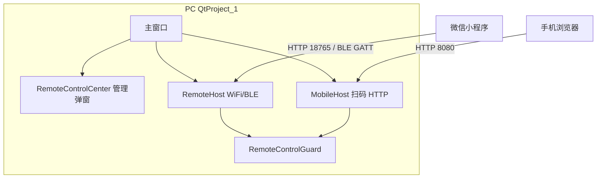
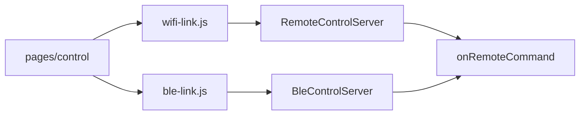

# 远程控制 — 开发说明

本文档为 **QtProject_1 远程控制唯一开发说明**，涵盖 PC 端集成、共享协议，以及两种移动终端方式的差异：

| 方式 | 目录 | 端口 / 配置 | 终端 |
|------|------|-------------|------|
| **微信小程序** | `remote/` + `miniprogram/` | `config/netconfig.ini`，默认 18765 | 微信 App |
| **扫码网页** | `remote-qr/` | `config/mobile.ini`，默认 8080 | 手机浏览器 |

两种方式 **命令语义与状态 JSON 一致**，共用宿主 `onRemoteCommand()` 与 `buildRemoteStatusJson()`；通过 `RemoteControlGuard` 实现**命令互斥**（状态/预览可并行，断开即释放）。

---

## 1. 总览



| 项 | 说明 |
|----|------|
| 远程总闸 | 默认关闭；主界面「打开远程控制」→ 开启后启动 HTTP/BLE；扫码须切至「扫码网页」页 |
| 管理弹窗 | `host-remote/RemoteControlCenter`：WiFi/BLE 状态、扫码 IP/二维码/URL |
| 命令分发 | `QtProject_1.cpp` → `onRemoteCommand` |
| 状态 JSON | `QtProject_1.cpp` → `buildRemoteStatusJson` |
| 命令白名单 | 小程序：`remote/RemoteCommands.h`；扫码：`remote-qr/MobileCommands.h` |

**套件 README（移植速查）**

| 目录 | 说明 |
|------|------|
| [remote/README.md](../remote/README.md) | HTTP + BLE 可移植套件 |
| [remote-wifi/README.md](../remote-wifi/README.md) | 纯 HTTP 版（无 BLE，全局 C++14） |
| [remote-qr/README.md](../remote-qr/README.md) | 扫码 HTTP 套件速查 |
| [miniprogram/README.md](../miniprogram/README.md) | 小程序工程入口 |

---

## 2. PC 端集成（共用）

### 2.1 本仓库接线

```cpp
// QtProject_1 构造函数（摘要）
m_remoteHost.setControlGuard(&m_remoteGuard);
m_mobileHost.setControlGuard(&m_remoteGuard);
m_mobileHost.setStatusProvider([this]() { return buildRemoteStatusJson(); });
connect(&m_mobileHost, &MobileHost::commandReceived, this, &QtProject_1::onRemoteCommand);

m_remoteHost.setStatusProvider([this]() { return buildRemoteStatusJson(); });
connect(&m_remoteHost, &RemoteHost::commandReceived, this, &QtProject_1::onRemoteCommand);
```

远程总闸开启时调用 `m_remoteHost.bootstrap()`；扫码会话由 `RemoteControlCenter` 在选定 IP 上调用 `MobileHost::startSession()`。

### 2.2 宿主须实现

| 函数 | 职责 |
|------|------|
| `buildRemoteStatusJson()` | 返回状态 JSON（字段须满足按钮禁用规则） |
| `onRemoteCommand(cmd)` | 命令 → 业务逻辑；每分支结束调用 `pushRemoteStatus()` |
| 预览（可选） | `RemoteHost::setPreviewProvider()` → GET `/api/preview.jpg` |

### 2.3 RemoteControlGuard

- 状态查询、预览 JPEG **可并行**
- **命令**同一时刻仅一条通道生效
- `POST /api/release` 或断开连接即释放占用

---

## 3. 共享协议

### 3.1 默认命令

| 命令 | 说明 | PC 映射（QtProject_1） |
|------|------|------------------------|
| `status` | 查询状态 | `pushRemoteStatus` |
| `open_camera` | 打开相机 | `onOpenCamera` |
| `close_camera` | 关闭相机 | `onCloseCamera` |
| `start_capture` | 开始采集 | `onStartGrab` |
| `stop_capture` | 停止采集 / 阶段中则停阶段 | `onStopGrab` / `onStopStageCapture` |
| `save_one` | 保存单张 BMP | `onSaveOneBmp` |
| `start_stage` | 开始阶段采集 | `onStartStageCapture` |
| `stop_stage` | 停止阶段 | `onStopStageCapture` |

扫码网页 REST 路径与命令名映射见 `remote-qr/MobileCommands.h`（如 `POST /api/camera/open` → `open_camera`）。

### 3.2 状态 JSON（HTTP 长键）

| 字段 | 类型 | 说明 |
|------|------|------|
| `ok` | bool | 设备在线；关程序前 BLE 推送 false |
| `cameraOpen` | bool | 相机已打开 |
|  `liveViewActive` | bool | 连续 grab / 预览 |
| `acquisitionActive` | bool | 业务采集中 |
| `stageRunning` | bool | 阶段运行中 |
| `message` | string | 摘要文案 |
| `queueSize` / `queueCapacity` | int | 存图队列 |
| `totalSaved` | int | 累计已存张数 |
| `cameraStatus` / `stageStatus` | string | 可选摘要 |

BLE Notify 使用短键（`cam`、`lv`、`grab` 等），小程序 `normalizeStatus()` 展开为长键。

### 3.3 按钮禁用规则

移动终端不独立推断设备状态，依据 PC 返回 JSON 及 `computeBtnState(status, locked)` 计算。规则与 PC 主界面一致，实现于 `miniprogram/utils/remote-buttons.js`（扫码页 `mobile.html` 内嵌逻辑对齐）。

| 按钮 | 禁用条件 |
|------|----------|
| 打开相机 | locked 或相机已开 |
| 关闭相机 | 未开 / 阶段运行中 |
| 开始采集 | 未开 / 已在采集 / 阶段中 |
| 停止采集 | 未开 / 未采集 / 阶段中 |
| 保存单张 | 未开 / 未采集 / 无预览 / 阶段中 |
| 开始阶段 | 未开 / 采集中 / 阶段中 |
| 停止阶段 | 阶段未运行 |

### 3.4 扩展新命令（Checklist）

1. **`remote/RemoteCommands.h`**（及 `remote-qr/MobileCommands.h` 若扫码也要）— `knownCommands()` + `label()`
2. **`QtProject_1.cpp`** — `onRemoteCommand` 分支
3. **`miniprogram/utils/remote-buttons.js`** — `CMD_LABELS` + `computeBtnState`
4. **`miniprogram/pages/control/index.wxml`** — 按钮与 `data-cmd`
5. 扫码页 — `remote-qr/assets/mobile.html` 对应按钮
6. 若改 BLE UUID → `remote/ble/BleProtocol.h` + `miniprogram/utils/protocol.js`
7. 重启 PC；重新编译 / 预览小程序或重扫二维码

---

## 4. 微信小程序遥控

### 4.1 是什么

用手机微信小程序，通过 **WiFi（推荐）** 或 **蓝牙 BLE** 遥控 PC：开关相机、采集、存图、阶段采集。

| 项 | 值 |
|----|-----|
| PC 套件 | `remote/`（HTTP + BLE） |
| 小程序 | 项目根 `miniprogram/` |
| 配置 | `config/netconfig.ini` |
| 默认端口 | 18765 |



WiFi 与 BLE **共用**命令名、状态字段、按钮规则；仅在传输层不同。切换模式时会 **teardown 另一链路**。

### 4.2 使用者操作

#### 准备

| 项目 | 要求 |
|------|------|
| PC | Windows 10/11，蓝牙适配器（BLE 模式需要） |
| 手机 | Android / iPhone，安装微信 |
| 网络 | WiFi 模式：手机与 PC **同一 WiFi** |
| 相机 | Basler + Pylon（与主程序相同） |

**不支持**：开发者工具模拟器测 BLE（须真机）；经典蓝牙串口；小程序改阶段表（须在 PC 编辑）。

#### PC 配置 `config/netconfig.ini`

```ini
[remote]
token=1234

[http]
bind=192.168.x.x    ; 本机 WiFi IPv4，与手机同网段
port=18765

[ble]
device_name=PhotoMech
```

改 ini 后 **重启 PC 软件**。`http/bind` 即日志与小程序填写的 IP。

#### WiFi 模式（推荐）

1. 主界面「打开远程控制」→ **开启** 远程总闸
2. 日志出现 `HTTP 遥控已启动，手机可连接 x.x.x.x:18765`
3. 小程序选 **WiFi**，填 `IP:18765` 与 token
4. 开发者工具勾选 **不校验合法域名**；真机预览更稳

#### BLE 模式

1. PC 软件已开启远程总闸，BLE 行显示 **已广播**
2. 小程序填 token → **刷新设备列表** → 点选电脑
3. Android 须授予微信蓝牙/定位权限
4. **无需**在 Windows「添加蓝牙设备」里配对

#### 推荐流程

- **单张**：打开相机 → 开始采集 → 保存单张 → 停止采集
- **阶段**：PC 配置阶段表 → 打开相机 → 开始阶段 → 停止阶段

### 4.3 开发与协议

#### 小程序目录

```text
miniprogram/
├── pages/control/          # 主页面
│   ├── index.js
│   ├── index.wxml
│   └── index.wxss
└── utils/
    ├── remote-buttons.js   # 命令表 + computeBtnState
    ├── wifi-link.js        # WiFi 门面
    ├── ble-link.js         # BLE 门面
    ├── http.js             # wx.request
    ├── ble.js              # GATT
    ├── protocol.js         # UUID、状态解析
    └── errors.js
```

#### HTTP 接口

| 接口 | 方法 | 说明 |
|------|------|------|
| `/api/status?token=` | GET | 状态 JSON |
| `/api/command?token=` | POST | Body: `{"cmd":"open_camera","token":"1234"}` |
| `/api/preview.jpg?token=` | GET | 可选 JPEG 预览 |

Token 无效 → 403；未知命令 → 400。

#### BLE GATT

| 特征 | UUID |
|------|------|
| Service | `A1B2C3D4-E5F6-4A5B-8C9D-0E1F2A3B4C5D` |
| CMD（Write） | `…C5E` |
| STATUS（Notify） | `…C5F` |

写入格式（UTF-8）：`cmd` 或 `cmd:token`，如 `open_camera:1234`。

PC 常量：`remote/ble/BleProtocol.h`；小程序：`miniprogram/utils/protocol.js`。**修改 UUID 须两端同步**。

#### 页面交互要点

- 全局互斥 `runAction`：连接、扫描、发令不可并发
- 轮询 `POLL_MS = 2000`
- BLE 离线：收到 `ok=0` → 立即断开 UI
- 本地记忆：`photomech_host`、`photomech_token`、`photomech_mode`

### 4.4 联调与排错

| 步骤 | 操作 |
|------|------|
| 1 | PC 开启远程总闸 → 日志 HTTP 地址 |
| 2 | WiFi 连接 → 状态随操作变化 |
| 3 | 各按钮与 PC 同步禁用/可用 |
| 4 | BLE 真机重复 2–3 |
| 5 | 关 PC → BLE 显示「PC已关闭」 |

| 现象 | 处理 |
|------|------|
| WiFi 连不上 | 同网段；防火墙放行 18765；bind 填 WiFi IP 非虚拟网卡 |
| HTTP 403 | token 与 ini 不一致 |
| BLE 列表空 | PC 蓝牙开、远程已启；Android 开定位 |
| 按钮全灰 | 确认 `protocol.js` 含 `normalizeStatus` |
| 日志 IP 不对 | 改 `http/bind`，复制 ini 到输出目录，重启 |

### 4.5 移植（小程序 + remote/）

1. 复制 `remote/`、`config/netconfig.ini`、`miniprogram/`
2. VS 加入 `remote/**/*.cpp`；5 个 `Q_OBJECT` 类 Moc；3 个 WinRT `.cpp` 单独 C++17
3. 接入 `RemoteHost`（见 [remote/README.md](../remote/README.md)）
4. 实现 `buildRemoteStatusJson`、`onRemoteCommand`
5. 微信开发者工具导入 `miniprogram/`，勾选不校验合法域名

纯 HTTP、全局 C++14 工程可选用 [remote-wifi/](../remote-wifi/README.md)。

---

## 5. 扫码网页遥控

### 5.1 是什么

局域网内用手机 **浏览器扫二维码**，打开内嵌 H5 页控制 PC；带 JPEG 预览，无需微信/小程序。

| 项 | 值 |
|----|-----|
| PC 套件 | `remote-qr/` |
| 配置 | `config/mobile.ini` |
| 默认端口 | 8080 |
| URL 格式 | `http://{所选IP}:{port}/mobile?token={uuid}` |

与 `remote/`（18765 / 小程序）**独立并存**；共用 `RemoteControlGuard` 与宿主命令分发。

### 5.2 使用者操作

1. 主界面「打开远程控制」→ **开启** 远程总闸
2. 切至 **「扫码网页」** 页签
3. 选择本机 WiFi IP → 显示二维码与 URL
4. 手机浏览器扫码或打开 URL（须与 PC 同网段）
5. 页内操作按钮与 PC 主界面等价
6. 「刷新」生成新 token；「断开」结束会话

| 行为 | 说明 |
|------|------|
| 关弹窗 | 不断开会话 |
| 手机关页 | 约 4 s 无轮询 → PC 显示断开 |
| token 过期 | 自动 `stopSession`，须重新扫码 |
| 预览 | 框始终保留；关相机清图像 |

### 5.3 开发与集成

#### 目录

```text
remote-qr/
  MobileHost.h/.cpp           唯一集成入口
  RemoteControlDialog.h/.cpp  二维码弹窗（可选；本仓库用 RemoteControlCenter）
  MobileWebServer.h/.cpp      HTTP 服务
  MobileCommands.h            REST → 命令名
  assets/mobile.html          手机页
  PreviewFrameCache / TokenManager / QrCodeHelper ...
```

#### 配置 `config/mobile.ini`

```ini
[mobile]
port=8080
token_lifetime_sec=600

[preview]
max_width=480
max_height=360
jpeg_quality=55
poll_ms=120
status_poll_ms=800
```

#### HTTP 接口（均需 `?token=`）

| 方法 | 路径 | 说明 |
|------|------|------|
| GET | `/mobile` | 手机页 |
| GET | `/api/config` | 轮询间隔 |
| GET | `/api/status` | 状态 JSON |
| GET | `/api/preview.jpg` | JPEG 预览 |
| POST | `/api/camera/open` … `/stage/stop` | 见 `MobileCommands.h` |
| POST | `/api/release` | 释放命令互斥 |

#### 最小宿主代码

```cpp
#include "remote/RemoteControlGuard.h"
#include "remote-qr/MobileHost.h"

RemoteControlGuard m_remoteGuard;
MobileHost m_mobileHost;

m_mobileHost.setControlGuard(&m_remoteGuard);
m_mobileHost.setStatusProvider([this]() { return buildRemoteStatusJson(); });
connect(&m_mobileHost, &MobileHost::commandReceived, this, &MainWindow::onRemoteCommand);

// 每帧（相机已打开）
m_mobileHost.previewCache().updateFrame(frame, frameSeq);

// 关相机
m_mobileHost.clearPreviewFrame();

// 退出
m_mobileHost.stopSession();
```

**工程**：`remote-qr/*.cpp`、`thirdparty/qrcodegen.cpp`、`remote-qr.qrc`；Moc：`MobileHost`、`MobileWebServer`。

`buildRemoteStatusJson` 须含：`cameraOpen`、`liveViewActive`、`acquisitionActive`、`stageRunning`、`message`。

### 5.4 排错

| 现象 | 处理 |
|------|------|
| 等待手机 | 同网段；防火墙 8080；PC 浏览器试 URL；点刷新重扫 |
| 一直已连接 | 手机关页后约 4 s 应收断开 |
| 启动失败 | `lastError()`：端口占用、qrc 未编入 |
| 命令无响应 | 检查 `RemoteControlGuard` 是否被小程序占用 |

### 5.5 移植清单

- [ ] 复制 `remote-qr/`
- [ ] 部署 `config/mobile.ini`
- [ ] vcxproj + qrc + Moc
- [ ] 接线 + `onRemoteCommand` + 取帧 `updateFrame`

---

## 6. 两种方式对比

| 项 | 微信小程序 | 扫码网页 |
|----|-----------|----------|
| 终端 | 微信 App | 任意浏览器 |
| 套件 | `remote/` | `remote-qr/` |
| 配置 | `netconfig.ini` | `mobile.ini` |
| 端口 | 18765 | 8080 |
| 连接 | 填 IP + token / BLE 扫描 | 扫二维码 |
| BLE | 支持 | 不支持 |
| 预览 | 可选 `/api/preview.jpg` | 内置轮询 JPEG |
| 开发 | 微信开发者工具 + 真机 | 无需额外 SDK |
| 互斥 | 与扫码共用 `RemoteControlGuard` | 同左 |

---

## 7. 测试要点

| 编号 | 场景 | 预期 |
|------|------|------|
| T01 | PC 编译链接 | 无错误 |
| T02 | 开启远程总闸 | HTTP 监听；BLE 广播（若启用） |
| T03 | `GET /api/status?token=valid` | 200 + JSON |
| W01 | 小程序 WiFi 连接 | 状态已连接，2 s 轮询 |
| W02 | 各命令按钮 | PC 执行；禁用态与主界面一致 |
| Q01 | 扫码打开 `/mobile` | 页内按钮可用 |
| Q02 | 预览轮询 | JPEG 随帧更新 |
| C01 | 双通道命令互斥 | 一方占用时另一方命令等待/释放 |
| C02 | POST 未登记命令 | HTTP 400 |

---

## 8. 相关源文件

| 路径 | 说明 |
|------|------|
| `QtProject_1.cpp` | `onRemoteCommand`、`buildRemoteStatusJson`、远程接线 |
| `host-remote/RemoteControlCenter.*` | 管理弹窗 |
| `remote/RemoteHost.*` | WiFi/BLE 门面 |
| `remote-qr/MobileHost.*` | 扫码 HTTP 门面 |
| `remote/RemoteControlGuard.*` | 命令互斥 |
| `config/netconfig.ini` | 小程序 HTTP/BLE |
| `config/mobile.ini` | 扫码 HTTP |
| `miniprogram/` | 微信小程序 |
| `remote-qr/assets/mobile.html` | 扫码 H5 页 |

相机主流程见 [DEVELOPER_GUIDE.md](DEVELOPER_GUIDE.md)；编译排错见项目 `debug-helper` Skill。
