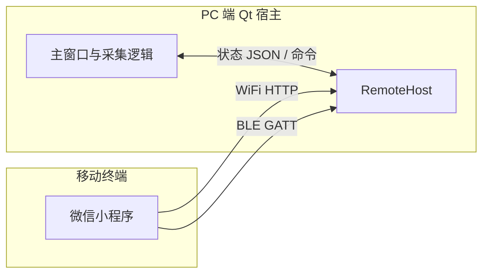
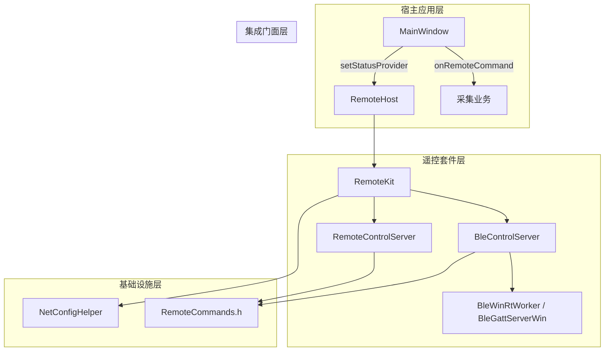
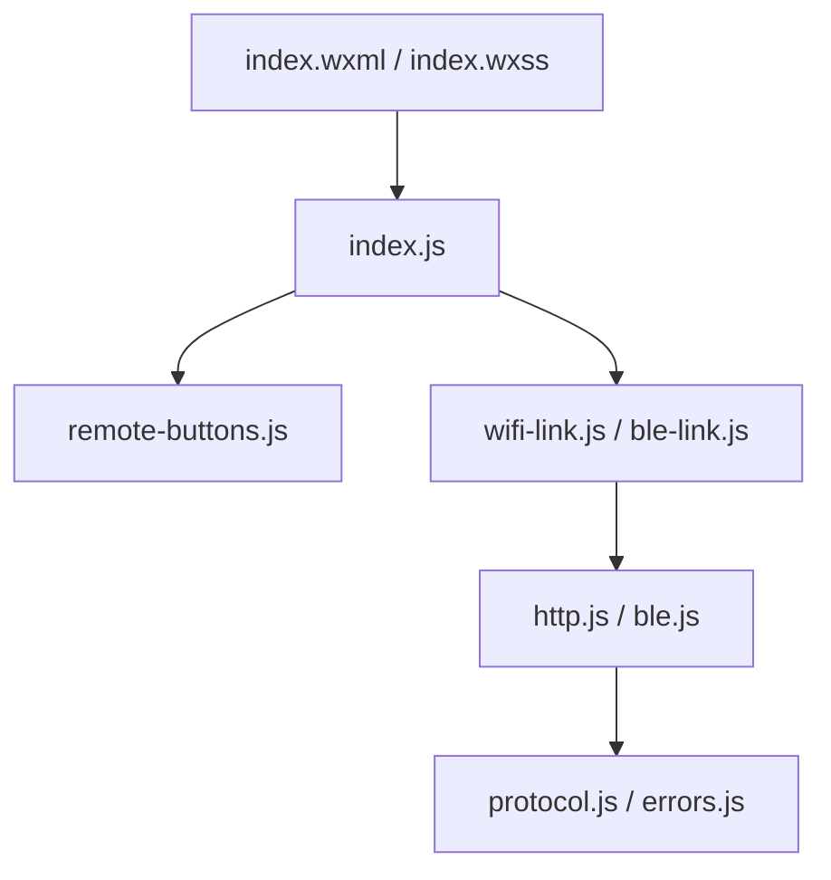
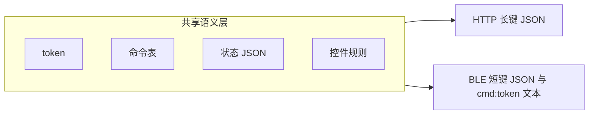
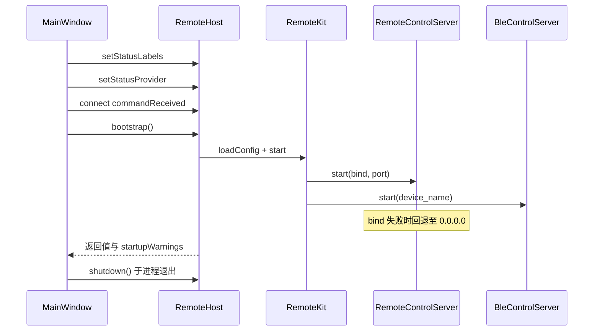
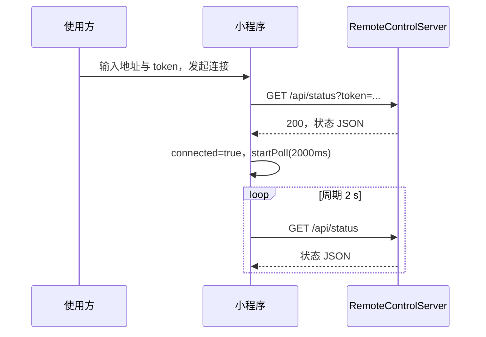
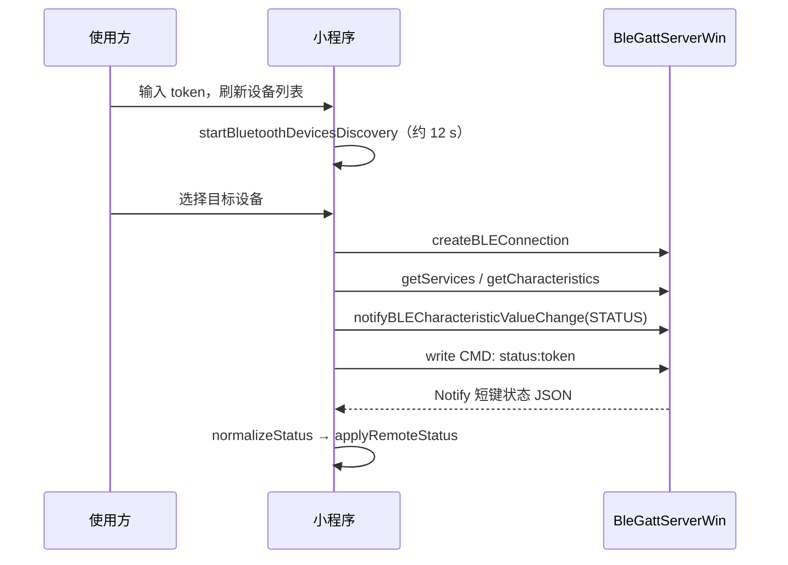
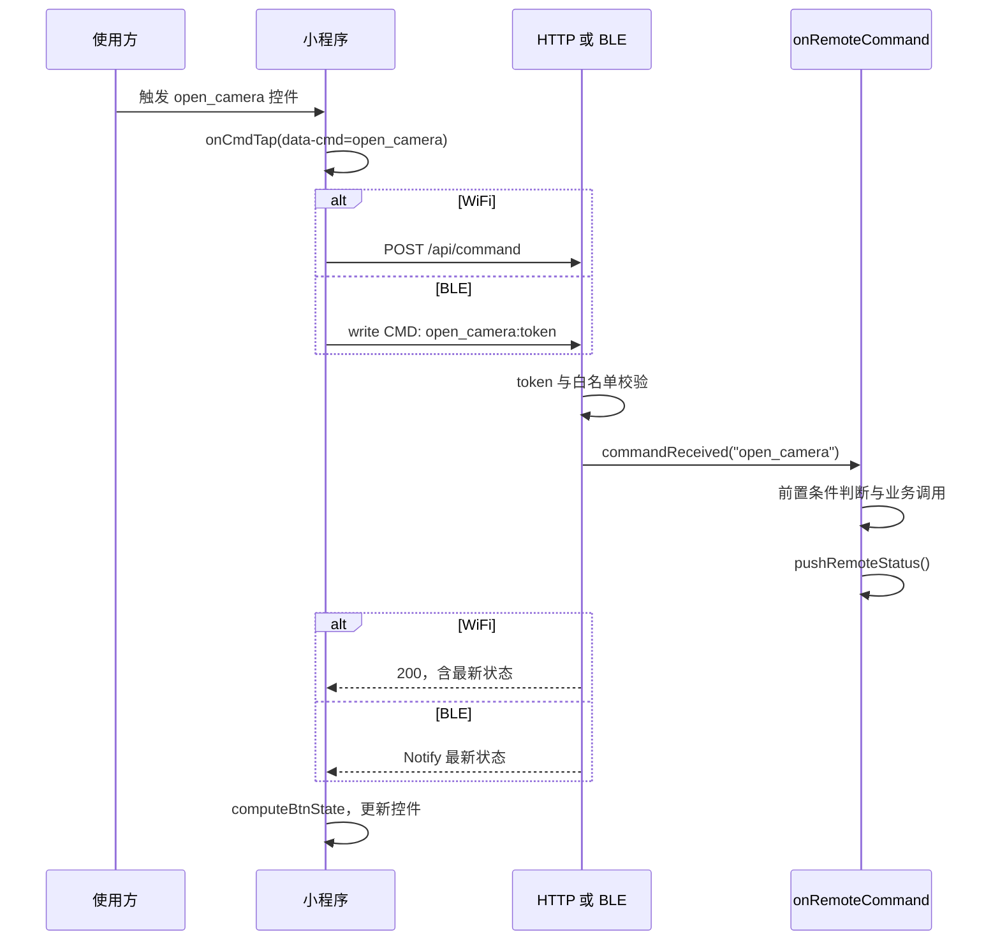
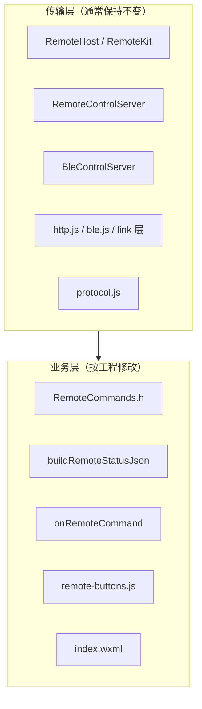

# WiFi 与 BLE 远程控制模块移植及开发规格书

## 摘要

本文档说明 PC 端 Qt 采集程序与微信小程序之间的远程控制机制，包括模块接入、通信流程、命令与按钮适配、接口约定、异常处理和测试验收。PC 端代码位于 `remote/`，小程序位于 `miniprogram/`，运行参数位于 `config/netconfig.ini`。

模块分为传输层和业务层。传输层负责 WiFi、BLE 连接及数据收发，通常在移植后保持不变；业务层负责命令定义、控制点映射、状态字段和按钮启用规则，移植到新工程时通常需要适配。业务层命令名须在 PC 端和小程序端保持一致，具体要求见第 4.11 节。

---

## 1. 功能描述

本章说明模块提供哪些能力、不提供哪些能力。

### 1.1 系统目标

本模块用于在局域网或 BLE 近场环境下建立微信小程序与 PC 端采集程序之间的双向通信。小程序向 PC 端发送控制命令，PC 端执行业务操作后返回运行状态；小程序根据状态字段更新界面并计算按钮是否可用。按钮可用规则应与 PC 主界面保持一致。

通信通道包括 WiFi HTTP 和 BLE GATT。两种通道共用同一套命令名、状态语义和口令，仅传输格式不同。

### 1.2 术语说明

| 术语 | 说明 | 示例 |
|------|------|------|
| 命令 | 小程序发送给 PC 的操作标识，使用固定英文字符串 | `open_camera` 表示打开相机 |
| 状态 | PC 返回给小程序的 JSON 对象，用于描述当前运行情况 | `"cameraOpen": true` 表示相机已打开 |
| 口令 token | PC 端与小程序端共同使用的鉴权字段 | `netconfig.ini` 与小程序输入均为 `1234` |
| 白名单 | PC 端允许执行的命令集合 | 未登记命令返回 HTTP 400 |
| 控件禁用 | 当前状态不满足操作条件时，按钮不可触发 | 相机已打开时禁用“打开相机” |
| 四处同步 | 同一命令名须在 PC 端和小程序端四个维护点一致 | 见第 4.11.2 节 |

### 1.3 功能条目

| 编号 | 功能 | WiFi | BLE | 说明 |
|------|------|:----:|:---:|------|
| F01 | 建立连接 | 是 | 是 | WiFi：IP 与口令；BLE：设备选择与口令 |
| F02 | 状态上报 | 是 | 是 | 状态摘要显示；轮询周期 2 s |
| F03 | 相机开关 | 是 | 是 | 命令 `open_camera`、`close_camera` |
| F04 | 采集启停 | 是 | 是 | 命令 `start_capture`、`stop_capture` |
| F05 | 单帧存图 | 是 | 是 | 命令 `save_one`；前置条件为采集与预览均已启动 |
| F06 | 阶段采集启停 | 是 | 是 | 命令 `start_stage`、`stop_stage`；阶段参数仅在 PC 端配置 |
| F07 | 控件禁用 | 是 | 是 | PC 回传状态后，由 `computeBtnState` 计算 |
| F08 | 口令鉴权 | 是 | 是 | 配置项 `remote/token` |
| F09 | 双通道并行 | 是 | 是 | PC 端 HTTP 与 BLE 可同时运行；移动终端单次仅使用一种通道 |
| F10 | 服务状态指示 | 是 | 是 | 可选；主窗口 QLabel 显示各通道启动状态 |

### 1.4 非功能性要求

| 要求 | 说明 |
|------|------|
| 低侵入 | 宿主仅实现状态 JSON 生成与命令分发 |
| 可移植 | 交付物为 `remote/`、`config/netconfig.ini`、`miniprogram/` |
| 可扩展 | 新增或修改命令须四处同步（第 4.9、4.11 节） |

### 1.5 功能边界

下列能力不在本模块范围内：图像或预览流传输；移动终端侧阶段参数与存图路径配置；非 iOS/Android 终端；非 Windows 平台的 BLE 外设实现；公网远程访问。有效通信范围为局域网 WiFi 或 BLE 近场链路。

---

## 2. 技术约束

本章列出硬件、软件环境与修改时必须遵守的对齐规则。

### 2.1 运行环境

| 端 | 要求 |
|----|------|
| PC | Windows 10/11 x64；Visual Studio 2019；Qt 5.15.2；宿主 C++14（BLE WinRT 两文件 C++17） |
| PC 蓝牙 | 系统蓝牙可用；支持 BLE 外设角色（WinRT） |
| 移动终端 | 微信客户端；蓝牙功能须在真机上测试（电脑版开发者工具无蓝牙） |
| 网络 | 移动终端与 PC 处于同一 WiFi；HTTP 默认端口 18765 |

### 2.2 软件依赖

| 端 | 依赖项 |
|----|--------|
| PC | Qt Core、Qt Network；含界面时 Qt Gui、Qt Widgets |
| PC 链接 | `windowsapp.lib`（WinRT） |
| PC 编译 | 附加选项 `/utf-8`；`WinRtBootstrap.cpp`、`BleAdapterChecker.cpp`、`BleGattServerWin.cpp` 单独 C++17 |
| 小程序 | 微信基础库；`wx.request` 及蓝牙相关 API |

### 2.3 一致性约束

下列项若不一致，将直接导致连接失败或命令无效：

| 约束对象 | 约束内容 | 不一致时的表现 |
|----------|----------|----------------|
| 命令名 | `RemoteCommands.h`、`data-cmd`、`remote-buttons.js` 键名相同 | HTTP 400 未知命令 |
| 状态字段 | `buildRemoteStatusJson` 输出满足 `computeBtnState` 输入 | 控件启用状态与实际业务状态不一致 |
| 口令 | ini、HTTP、BLE、小程序输入相同 | HTTP 403 |
| BLE UUID | `BleProtocol.h` 与 `protocol.js` 相同 | 蓝牙连上但找不到服务 |
| 配置生效 | 改 ini 后重启 PC | 仍用旧端口或旧口令 |

### 2.4 移植交付物

```text
remote/                 PC 端遥控实现
config/netconfig.ini    运行参数
miniprogram/            微信小程序工程根目录
```

---

## 3. 架构设计

本章描述 PC、小程序各有哪些文件、如何分层协作。改代码前先弄清“动哪一层”。

### 3.1 系统上下文



### 3.2 PC 端逻辑分层



| 层次 | 组件 | 职责 |
|------|------|------|
| 宿主应用层 | MainWindow | 实现 `buildRemoteStatusJson()`、`onRemoteCommand()` |
| 集成门面层 | RemoteHost | 对外入口：启动服务、转发命令；**接工程时主要对接此类** |
| 遥控套件层 | RemoteKit | 统一管理 HTTP 与 BLE，共享状态提供函数 |
| 传输层 | RemoteControlServer | HTTP 服务，`/api/status`、`/api/command` |
| 传输层 | BleControlServer | GATT 服务、状态 Notify、命令特征写入 |
| 基础设施层 | RemoteCommands.h、NetConfigHelper | 命令校验、配置文件解析 |

### 3.3 小程序逻辑分层



| 模块 | 职责 |
|------|------|
| `pages/control/index.js` | 连接管理、命令发送、状态应用、控件状态更新 |
| `utils/remote-buttons.js` | 命令表与 `computeBtnState` |
| `utils/wifi-link.js`、`ble-link.js` | 通道封装与轮询 |
| `utils/http.js`、`ble.js` | 网络与蓝牙 API 封装 |
| `utils/protocol.js` | 协议常量、报文编解码 |
| `utils/errors.js` | 错误信息本地化 |

### 3.4 双通道架构说明



HTTP 与 BLE 在 PC 端独立启动；`bootstrap()` 在至少一个通道成功时返回 true。移动终端同一时刻仅维持一种通道连接；切换模式时断开当前通道并停止轮询。状态数据由宿主 `buildRemoteStatusJson()` 统一生成；HTTP 使用长键 JSON，BLE 经 `compactStatusJson()` 压缩后传输。

### 3.5 源文件索引

| 功能 | 路径 |
|------|------|
| PC 接入入口 | `remote/RemoteHost.cpp` |
| 套件编排 | `remote/RemoteKit.cpp` |
| HTTP 服务 | `remote/RemoteControlServer.cpp` |
| BLE 服务 | `remote/ble/BleControlServer.cpp` |
| 命令白名单 | `remote/RemoteCommands.h` |
| BLE 协议常量 | `remote/ble/BleProtocol.h` |
| 状态压缩 | `remote/ble/BleCommandProtocol.cpp` |
| 配置读取 | `remote/NetConfigHelper.cpp` |
| 小程序逻辑 | `miniprogram/pages/control/index.js` |
| 小程序界面 | `miniprogram/pages/control/index.wxml` |
| 运行配置 | `config/netconfig.ini` |

---

## 4. 详细功能设计

### 4.1 术语与数据流语义

| 术语 | 方向 | 定义 |
|------|------|------|
| 命令（command） | 移动终端 → PC | 英文字符串，标识一项遥控操作 |
| 状态（status） | PC → 移动终端 | JSON 对象，描述设备与采集运行态 |
| 口令（token） | 双向校验 | 与配置文件 `remote/token` 一致方可通信 |

### 4.2 PC 端生命周期



宿主接入参考代码：

```cpp
#include "remote/RemoteHost.h"

RemoteHost m_remoteHost;

m_remoteHost.setStatusLabels(nullptr, nullptr);
m_remoteHost.setStatusProvider([this]() { return buildRemoteStatusJson(); });
connect(&m_remoteHost, &RemoteHost::commandReceived,
        this, &MainWindow::onRemoteCommand);
m_remoteHost.bootstrap();

// 进程退出时
m_remoteHost.shutdown();
```

### 4.3 WiFi 连接流程



地址规范化：仅输入 IP 时，小程序自动追加端口 `:18765`（`http.js` 中 `normalizeHost`），该端口须与配置文件 `http/port` 一致。

### 4.4 BLE 连接流程



设备列表排序规则：广播数据包含目标 Service UUID，或设备名称包含 `PHOTOMECH` 的条目优先显示。

### 4.5 命令执行流程

以 `open_camera` 为例：



### 4.6 默认命令定义与前置条件

| 命令 | 标签 | 执行前置条件 | 宿主处理函数（QtProject_1） |
|------|------|--------------|----------------------------|
| `open_camera` | 打开相机 | 相机未打开 | `onOpenCamera()` |
| `close_camera` | 关闭相机 | 相机已打开 | `onCloseCamera()` |
| `start_capture` | 开始采集 | 相机已打开；未采集；未处于阶段 | `onStartGrab()` |
| `stop_capture` | 停止采集 | 阶段运行中则停止阶段；否则在采集中则停止采集 | `onStopStageCapture()` / `onStopGrab()` |
| `save_one` | 保存单张 | 相机已打开；采集中；预览中；未处于阶段 | `onSaveOneBmp()` |
| `start_stage` | 开始阶段采集 | 相机已打开；未采集；未处于阶段 | `onStartStageCapture()` |
| `stop_stage` | 停止阶段采集 | 阶段运行中 | `onStopStageCapture()` |
| `status` | 查询状态 | 无业务前置条件 | `pushRemoteStatus()` |

`status` 命令通道差异：

| 通道 | 行为 |
|------|------|
| HTTP | `GET /api/status`，不触发 `onRemoteCommand` |
| BLE | 写入 `status:token`，PC 仅推送状态，通常不进入宿主业务分支 |
| 宿主 | 在 `cmd == "status"` 分支中主动调用 `pushRemoteStatus()` |

### 4.7 控件禁用规则

移动终端不独立推断设备状态，仅依据 PC 返回的 JSON 及 `computeBtnState(status, locked)` 计算结果更新控件。`locked` 为命令执行期间的互斥标志。

| 命令 | 禁用条件 |
|------|----------|
| `open_camera` | `locked` 或 `cameraOpen` 为真 |
| `close_camera` | `locked` 或相机未打开或 `stageRunning` 为真 |
| `start_capture` | `locked` 或相机未打开或已采集或 `stageRunning` 为真 |
| `stop_capture` | `locked` 或相机未打开或未采集或 `stageRunning` 为真 |
| `save_one` | `locked` 或相机未打开或未采集或无预览或 `stageRunning` 为真 |
| `start_stage` | `locked` 或相机未打开或已采集或 `stageRunning` 为真 |
| `stop_stage` | `locked` 或未处于阶段 |

实现位置：`remote-buttons.js` 中 `computeBtnState`；界面层 `btnState.<cmd>` 为真时应用 `tap-btn--disabled` 样式。

### 4.8 状态轮询

| 通道 | 机制 | 周期 |
|------|------|------|
| WiFi | `wifi-link.startPoll` → `GET /api/status` | 2000 ms |
| BLE | `ble-link.startPoll` → 写入 `status:token` | 2000 ms |
| 页面生命周期 | `onShow` 恢复轮询；`onHide`、`onUnload` 停止 | — |

PC 主界面引起状态变化时，宿主应调用 `pushRemoteStatus()`，以降低移动终端等待轮询周期的延迟。

### 4.9 命令扩展程序

新增单条命令时，须依次修改下列位置。完整定制程序见第 4.11 节。

（1）`remote/RemoteCommands.h`：在 `knownCommands()` 及 `label()` 中登记。

（2）宿主 `onRemoteCommand()`：增加分支、前置条件判断及 `pushRemoteStatus()` 调用。

（3）`miniprogram/utils/remote-buttons.js`：在 `CMD_LABELS` 与 `computeBtnState` 返回值中登记。

（4）`miniprogram/pages/control/index.wxml`：增加控件，`data-cmd` 与命令名一致。

示例：新增 `clear_counter`（清空计数）。修改完成后须重启 PC 程序并重新编译小程序。

### 4.10 移植程序

| 步骤 | 内容 |
|------|------|
| 1 | 复制 `remote/`、`config/netconfig.ini`、`miniprogram/` |
| 2 | 将 `remote/**/*.cpp` 加入 VS 工程；对五个 `Q_OBJECT` 类执行 Moc |
| 3 | 配置 `/utf-8`、`windowsapp.lib`；宿主 C++14，上述 3 个 WinRT `.cpp` 单独 C++17（见 `remote/CPP14_PORTING.md`） |
| 4 | 编辑 `netconfig.ini`：`token`、`bind`（本机 WiFi IPv4）、`port=18765` |
| 5 | 按第 4.2 节接入 `RemoteHost` |
| 6 | 实现 `buildRemoteStatusJson()`、`onRemoteCommand()` |
| 7 | 以 `miniprogram/` 为根目录导入微信开发者工具；启用「不校验合法域名」 |
| 8 | 执行第 8 节测试用例 |
| 9 | 命令或界面与默认不一致时，按第 4.11 节执行业务层定制 |

### 4.11 业务层定制：命令与控件变更

#### 4.11.1 分层原则



| 修改项 | 涉及文件 | 传输层 |
|--------|----------|--------|
| 增删遥控命令 | 第 4.11.2 节所列四处 | 无需修改 |
| 控件文案与布局 | `index.wxml`、`index.wxss` | 无需修改 |
| 命令与宿主函数映射 | `onRemoteCommand` | 无需修改 |
| 控件禁用逻辑 | `computeBtnState`、`buildRemoteStatusJson` | 无需修改 |
| BLE 广播名称 | `netconfig.ini` 中 `ble/device_name` | 无需修改 |
| 小程序标题 | `app.json` | 无需修改 |

#### 4.11.2 四处同步要求

每一项遥控能力须在下列位置使用相同的命令名字符串：

| 序号 | 位置 | 文件 | 修改内容 |
|:----:|------|------|----------|
| 1 | PC 白名单 | `remote/RemoteCommands.h` | `knownCommands()` |
| 2 | PC 命令分发 | 宿主 `onRemoteCommand()` | 命令分支与业务调用 |
| 3 | 小程序规则 | `remote-buttons.js` | `CMD_LABELS`、`computeBtnState` |
| 4 | 小程序界面 | `index.wxml` | `data-cmd`、`btnState.<cmd>` |

`index.js` 无需为各命令单独实现处理函数；统一入口为 `onCmdTap`，读取 `data-cmd` 后调用 `sendCommand`。在 `CMD_LABELS` 中登记键名后，`CMD_KEYS` 与 `btnState` 由模块自动派生。

命令 `status` 须保留于 PC 白名单；界面层可不提供对应控件。

#### 4.11.3 定制场景分类

**场景 A：删除命令与控件**

以取消阶段采集为例：（1）从 `knownCommands()` 移除 `start_stage`、`stop_stage`；（2）删除 `onRemoteCommand` 对应分支；（3）从 `CMD_LABELS` 与 `computeBtnState` 移除相关项；（4）删除 `index.wxml` 中对应控件区域；（5）`buildRemoteStatusJson` 可固定返回 `stageRunning: false`，或移除该字段并同步修改 `computeBtnState`。

**场景 B：仅修改界面呈现**

| 修改对象 | 文件 |
|----------|------|
| 控件显示文本 | `index.wxml`；可选同步 `RemoteCommands.h` 中 `label()` |
| 分组标题 | `index.wxml` 中 `section-title` |
| 控件样式 | `index.wxss` |
| 导航栏标题 | `app.json` 中 `navigationBarTitleText` |

`data-cmd` 不得变更，否则与 PC 端白名单不一致。

**场景 C：新增命令**

按第 4.9 节执行，并按第 4.11.5 节验证。

**场景 D：替换全部业务命令**

（1）定义新命令表（建议小写字母与下划线）；（2）重写 `knownCommands()`，保留 `status`；（3）重写 `onRemoteCommand`；（4）重写 `CMD_LABELS` 与 `computeBtnState`；（5）重建 `index.wxml` 业务控件区；（6）调整 `buildRemoteStatusJson`；若新状态字段须经 BLE 传输，须同步修改 `compactStatusJson` 与 `normalizeStatus`。

#### 4.11.4 命令分发实现规范

`onRemoteCommand` 为移动终端命令名与宿主业务逻辑的唯一映射点。

```cpp
void MainWindow::onRemoteCommand(const QString &cmd)
{
    if (cmd == QStringLiteral("<command_name>")) {
        if (/* 与主界面一致的前置条件 */) {
            existingBusinessSlot();
        }
        pushRemoteStatus();
        return;
    }
}
```

| 规范 | 说明 |
|------|------|
| 逻辑复用 | 须调用与主界面相同的业务函数，不得重复实现 |
| 前置条件 | 与主界面控件启用条件一致 |
| 状态推送 | 每个命令分支结束前须调用 `pushRemoteStatus()` |
| 本地操作 | 主界面操作引起状态变化时，须同步调用 `pushRemoteStatus()` |

默认命令与宿主函数对照（QtProject_1）：

| 命令 | 宿主函数 |
|------|----------|
| `open_camera` | `onOpenCamera()` |
| `close_camera` | `onCloseCamera()` |
| `start_capture` | `onStartGrab()` |
| `stop_capture` | `onStopGrab()` / `onStopStageCapture()` |
| `save_one` | `onSaveOneBmp()` |
| `start_stage` | `onStartStageCapture()` |
| `stop_stage` | `onStopStageCapture()` |

#### 4.11.5 状态字段与控件禁用联动

```text
宿主业务状态变量
  → buildRemoteStatusJson()（长键）
  → HTTP 原样传输 / BLE 经 compactStatusJson 压缩
  → normalizeStatus()（BLE）
  → computeBtnState(status, locked)
  → index.wxml 中 btnState.<cmd>
```

状态字段不一致时的处理策略：

| 策略 | 适用条件 | 操作 |
|------|----------|------|
| 复用既有字段名 | 语义可映射至现有字段 | 仅在 `buildRemoteStatusJson` 中赋值；小程序可不变 |
| 新增字段 | 语义无法映射 | PC 增加字段；更新 `computeBtnState`；BLE 须同步短键映射 |

控件模板：

```xml
<view
  class="tap-btn tap-btn--primary
    {{ pendingAction === '<cmd>' ? 'tap-btn--pending' : '' }}
    {{ btnState.<cmd> ? 'tap-btn--disabled' : '' }}"
  bindtap="onCmdTap"
  data-cmd="<cmd>">
  <显示文本>
</view>
```

| 属性 | 约束 |
|------|------|
| `data-cmd` | 与白名单及 `onRemoteCommand` 分支字符串一致 |
| `btnState.<cmd>` | 键名与 `data-cmd` 一致；须在 `computeBtnState` 返回值中定义 |
| `bindtap` | 固定为 `onCmdTap` |

#### 4.11.6 定制验证程序

| 序号 | 操作 | 判定准则 |
|:----:|------|----------|
| 1 | 重启 PC 程序 | 白名单已加载 |
| 2 | 重新编译小程序 | 界面与规则文件已更新 |
| 3 | WiFi 连接并请求 `/api/status` | JSON 与 PC 实际状态一致 |
| 4 | 依次触发各命令控件 | PC 执行对应业务；控件禁用状态与主界面一致 |
| 5 | 对已禁用控件发起操作 | 不发送命令或 `onCmdTap` 提前返回 |
| 6 | BLE 通道重复步骤 4、5 | 与 WiFi 行为一致 |
| 7 | POST 未登记命令名 | HTTP 400，消息为「未知命令」 |

#### 4.11.7 定制过程故障对照

| 现象 | 成因 |
|------|------|
| HTTP 400 未知命令 | 白名单未登记或 PC 未重启 |
| 命令无 PC 侧响应 | `onRemoteCommand` 无对应分支，或前置条件不满足 |
| 控件持续禁用 | `computeBtnState` 条件过严，或状态 JSON 字段未正确置位 |
| 控件应禁用但仍可触发 | `computeBtnState` 条件过松，或状态 JSON 字段错误 |
| `btnState` 不生效 | `data-cmd` 与 `btnState` 键名不一致 |
| BLE 状态与 WiFi 不一致 | `normalizeStatus` 或 `compactStatusJson` 未包含新字段 |

#### 4.11.8 示例：命令重命名 `save_one` → `save_frame`

（1）`RemoteCommands.h`：以 `save_frame` 替换 `save_one`，更新 `label()`。

（2）`onRemoteCommand`：

```cpp
if (cmd == QStringLiteral("save_frame")) {
    if (m_camera.isOpen() && m_acquisitionActive && m_liveViewActive)
        onSaveOneBmp();
    pushRemoteStatus();
    return;
}
```

（3）`remote-buttons.js`：更新 `CMD_LABELS` 与 `computeBtnState` 中对应键名。

（4）`index.wxml`：将 `save_one` 相关属性全部替换为 `save_frame`。

### 4.12 操作程序

| 步骤 | WiFi | BLE |
|:----:|------|-----|
| 1 | PC 程序已启动；与移动终端同一 WiFi | PC 程序已启动；移动终端蓝牙已开启（Android 须启用定位权限） |
| 2 | 输入 `IP:18765` 与口令 | 输入口令；刷新设备列表；选择目标设备 |
| 3 | 执行连接操作 | 连接成功后状态区显示已连接 |
| 4 | 按业务顺序触发控件 | 禁用控件表示当前状态不满足前置条件 |
| 5 | 执行断开操作 | 同左 |

口令与地址须与 `config/netconfig.ini` 中 `remote/token`、`http/bind`、`http/port` 一致。

---

## 5. 数据结构

### 5.1 配置结构 RemoteConfig

定义文件：`remote/NetConfigHelper.h`

| 字段 | 类型 | 配置键 | 说明 |
|------|------|--------|------|
| `token` | QString | `[remote] token` | 遥控口令；为空时服务端不校验 |
| `httpBind` | QString | `[http] bind` | HTTP 绑定 IPv4 |
| `httpPort` | quint16 | `[http] port` | 默认 18765 |
| `bleDeviceName` | QString | `[ble] device_name` | BLE 广播名称 |

`httpEndpoint()` 返回格式为 `bind:port`。配置文件自可执行文件目录向上检索，最大深度 8 层，路径为 `config/netconfig.ini`。

配置示例：

```ini
[remote]
token=1234

[http]
bind=192.168.2.184
port=18765

[ble]
device_name=PhotoMech
```

### 5.2 状态 JSON（HTTP 长键）

由 `buildRemoteStatusJson()` 生成。

| 字段 | 类型 | 必填 | 用途 |
|------|------|:----:|------|
| `ok` | bool | 建议 | 设备在线标志；关程序前 BLE 推送 false |
| `cameraOpen` | bool | 是 | 相机开关控件 |
| `liveViewActive` | bool | 是 | `save_one` 前置 |
| `acquisitionActive` | bool | 是 | 采集相关控件 |
| `stageRunning` | bool | 是 | 阶段相关控件 |
| `message` | string | 建议 | 状态摘要 |
| `totalSaved` | int | 否 | 累计存图数 |
| `queueSize` | int | 否 | 存图队列长度 |
| `queueCapacity` | int | 否 | 队列容量 |
| `cameraStatus` | string | 否 | 相机状态摘要 |
| `stageStatus` | string | 否 | 阶段状态摘要 |

### 5.3 BLE 状态 JSON 短键映射

| 长键 | 短键 | 类型 |
|------|------|------|
| `ok` | `ok` | 0/1 |
| `cameraOpen` | `cam` | 0/1 |
| `liveViewActive` | `lv` | 0/1 |
| `acquisitionActive` | `grab` | 0/1 |
| `stageRunning` | `stg` | 0/1 |
| `message` | `msg` | string |
| `queueSize` | `q` | int |
| `queueCapacity` | `qc` | int |
| `totalSaved` | `tot` | int |

小程序 `normalizeStatus()` 执行短键至长键展开。字段缺失将导致控件状态计算错误。

### 5.4 BLE 命令报文

UTF-8 文本，写入 CMD 特征，格式：

```text
<command>[:<token>]
```

### 5.5 HTTP 命令请求体

```json
{
  "cmd": "open_camera",
  "token": "1234"
}
```

token 可置于 URL 查询参数，与 body 字段满足其一即可。

### 5.6 命令白名单

| 命令名 | 标签 |
|--------|------|
| `open_camera` | 打开相机 |
| `close_camera` | 关闭相机 |
| `start_capture` | 开始采集 |
| `stop_capture` | 停止采集 |
| `save_one` | 保存单张 |
| `start_stage` | 开始阶段采集 |
| `stop_stage` | 停止阶段采集 |
| `status` | 查询状态 |

### 5.7 小程序页面状态字段

| 字段 | 含义 |
|------|------|
| `mode` | `wifi` 或 `ble` |
| `host` | WiFi 地址 |
| `token` | 口令 |
| `connected` | 连接状态 |
| `statusText` | 状态摘要文本 |
| `btnState` | 各命令控件禁用状态 |
| `uiLocked` | 操作互斥锁 |
| `errorHint` | 错误提示 |

本地存储键：`photomech_host`、`photomech_token`、`photomech_mode`。

### 5.8 GATT UUID

| 角色 | UUID |
|------|------|
| Service | `A1B2C3D4-E5F6-4A5B-8C9D-0E1F2A3B4C5D` |
| CMD（写） | `A1B2C3D4-E5F6-4A5B-8C9D-0E1F2A3B4C5E` |
| STATUS（Notify） | `A1B2C3D4-E5F6-4A5B-8C9D-0E1F2A3B4C5F` |

---

## 6. 接口设计

### 6.1 RemoteHost 接口

| 接口 | 调用时机 | 说明 |
|------|----------|------|
| `setStatusLabels(ble, http)` | `bootstrap` 之前 | QLabel 指针，可为 nullptr |
| `setStatusProvider(fn)` | `bootstrap` 之前 | 注册状态 JSON 提供函数 |
| `bootstrap()` | 构造完成时 | 加载配置并启动服务；返回值表示是否至少一个通道成功 |
| `shutdown()` | 进程退出时 | 停止服务；BLE 先发 `ok=0` |
| `pushBleStatus()` | 命令或状态变更后 | 向 BLE 客户端推送状态 |
| `refreshStatusLabels()` | 需要时 | 刷新状态标签 |
| `startupWarnings()` | `bootstrap` 之后 | 失败通道的错误说明 |
| `kit()` | 任意时刻 | 访问 RemoteKit |

信号：`commandReceived(QString cmd)`；`notify(QString message)`（可选连接）。

宿主须实现：

```cpp
QJsonObject buildRemoteStatusJson() const;
void onRemoteCommand(const QString &cmd);
```

### 6.2 HTTP API

基址：`http://<bind>:<port>`

**GET `/api/status`**

| 项目 | 内容 |
|------|------|
| 查询参数 | `token` |
| 成功响应 | 200；body 为第 5.2 节状态对象 |
| 失败响应 | 403；token 无效 |

**POST `/api/command`**

| 项目 | 内容 |
|------|------|
| 查询参数 | `token`（可选） |
| 请求体 | `{"cmd":"...", "token":"..."}` |
| 成功响应 | 200；body 含状态字段及 `cmd`、`message` |
| 失败响应 | 400（JSON 错误或未知命令）；403（token 无效） |

**其它路径**

| 路径 | 响应 |
|------|------|
| `GET /` | 200；提示使用 `/api/status` |
| 未定义路径 | 404 |

实现文件：`RemoteControlServer.cpp`。连接模式为 `Connection: close`。

### 6.3 RemoteKit 接口

| 方法 | 说明 |
|------|------|
| `loadConfig()` | 读取配置文件 |
| `start()` / `stop()` | 启停 HTTP 与 BLE |
| `setStatusProvider(fn)` | 设置共享状态提供函数 |
| `pushBleStatus()` | 推送 BLE 状态 |
| `http()` / `ble()` | 子服务访问 |
| `httpEndpoint()` | 返回 `bind:port` |
| `configFilePath()` / `lastError()` | 配置路径与错误信息 |

### 6.4 小程序 HttpClient（http.js）

| 方法 | 说明 |
|------|------|
| `connect(host, token)` | 探活并建立连接 |
| `fetchStatus(token)` | 获取状态 |
| `sendCommand(cmd, token)` | 发送命令 |
| `disconnect()` | 断开连接 |

常量：`REQUEST_TIMEOUT_MS = 5000`；默认端口 18765。

### 6.5 小程序 BleClient（ble.js）

| 方法 | 说明 |
|------|------|
| `refreshDeviceList(onProgress)` | 扫描设备，约 12 s |
| `connectToDevice(deviceId, token)` | 建立连接并订阅状态 |
| `sendCommand(cmd, token)` | 写入 CMD 特征 |
| `fetchStatus(token)` | 等同 `sendCommand('status', token)` |
| `disconnect()` / `closeAdapter()` | 断开连接 / 关闭适配器 |

### 6.6 Link 层接口

`wifi-link.js` 与 `ble-link.js` 提供统一接口：`setOnStatus`、`connect`、`disconnect`、`sendCommand`、`startPoll`、`stopPoll`、`isConnected`。

### 6.7 页面事件

| 函数 | 触发条件 | 行为 |
|------|----------|------|
| `onConnect` | WiFi 连接控件 | `wifiLink.connect` |
| `onRefresh` | BLE 刷新控件 | 设备扫描 |
| `onSelectDevice` | 选择设备 | `bleLink.connect` |
| `onCmdTap` | 业务控件 | 读取 `data-cmd` 并 `sendCommand` |
| `onModeChange` | 切换通道模式 | 断开当前连接 |
| `applyRemoteStatus` | 收到状态 JSON | 更新界面与 `btnState` |

---

## 7. 异常处理

### 7.1 PC 启动异常

| 场景 | 检测方式 | 处理 |
|------|----------|------|
| 配置文件缺失或格式错误 | `loadConfig()` 返回 false | `startupWarnings()` 记录原因；对应通道不启动 |
| HTTP 绑定地址不可用 | `listen` 失败 | 回退至 `0.0.0.0`；`lastError` 记录 |
| HTTP 端口占用 | 回退后仍失败 | HTTP 不启动；BLE 可独立启动 |
| 蓝牙适配器不可用 | BleAdapterChecker | BLE 不启动 |
| 双通道均失败 | `bootstrap()` 返回 false | 宿主提示检查配置与系统环境 |

### 7.2 HTTP 异常

| HTTP 状态码 | 含义 | 移动终端处理 |
|-------------|------|--------------|
| 400 | 请求格式错误或未知命令 | 显示错误信息 |
| 403 | token 无效 | 提示口令错误 |
| 404 | 路径不存在 | 提示服务未找到 |
| 网络错误 | 连接失败或超时 | 触发 `onConnectionLost` |

配置项 `token` 为空时，服务端跳过 token 校验（仅限开发环境）。

### 7.3 BLE 异常

| 场景 | PC 行为 | 移动终端行为 |
|------|---------|--------------|
| token 错误 | 不执行命令 | 状态不变 |
| 未知命令 | 不触发 `commandReceived` | 无业务响应 |
| PC 关闭 | Notify `{"ok":0,"msg":"PC已关闭"}` | 断开并提示 |
| 错误设备 | — | 报告未找到遥控服务 |
| Android 定位未授权 | — | 扫描失败 |

### 7.4 宿主命令处理

| 场景 | 处理 |
|------|------|
| 前置条件不满足 | 不执行业务逻辑；仍调用 `pushRemoteStatus()` |
| 关机过程中 | `m_shutdownDone` 为真时直接返回 |
| 未识别命令进入宿主 | 白名单已在传输层拦截；宿主可调用 `pushRemoteStatus()` |

### 7.5 移动终端错误映射（errors.js）

`humanizeError(err, scene)` 按场景 `connect`、`lost`、`command`、`scan`、`ble` 返回本地化错误文本。

### 7.6 故障现象与处置

| 现象 | 原因 | 处置 |
|------|------|------|
| WiFi 无法连接 | 地址、端口、防火墙或网络隔离 | 验证 `/api/status` 可达性；核对 `port` |
| 仅 BLE 可用 | HTTP 通道故障 | 检查 `bind` 与防火墙 |
| HTTP 403 | token 不一致 | 对齐配置文件与移动终端输入 |
| HTTP 400 | 命令未登记 | 检查四处同步 |
| 控件全部禁用 | 未连接或状态字段错误 | 检查 `buildRemoteStatusJson` 与 `normalizeStatus` |
| BLE 设备列表为空 | 服务未启动或权限不足 | 确认 `bootstrap` 成功；检查蓝牙与定位权限 |
| `save_one` 无效 | 前置条件未满足 | 须 `acquisitionActive` 与 `liveViewActive` 均为真 |
| 控件状态与 PC 不一致 | 状态字段与 `computeBtnState` 不匹配 | 按第 4.11.5 节检查 |

---

## 8. 测试用例

### 8.1 PC 端冒烟测试

| 编号 | 步骤 | 预期结果 |
|------|------|----------|
| T01 | 编译链接 | 无链接错误 |
| T02 | 启动后检查 `kit().http().isListening()` | 为 true |
| T03 | `GET /api/status?token=<valid>` | 200，有效 JSON |
| T04 | 错误 token | 403 |
| T05 | `bootstrap()` 返回值 | true（至少一个通道） |

### 8.2 WiFi 功能测试

| 编号 | 步骤 | 预期结果 |
|------|------|----------|
| W01 | 正确地址与 token 连接 | 状态为已连接 |
| W02 | 执行 `open_camera` | PC 相机打开；`cameraOpen` 为真；对应控件禁用 |
| W03 | 采集—存图—停止序列 | 控件状态与 PC 一致；生成 BMP 文件 |
| W04 | 错误 token | 提示口令错误 |
| W05 | 断开网络或关闭 PC | 连接丢失处理正确 |
| W06 | 空闲轮询 | 2 s 内状态更新 |

### 8.3 BLE 功能测试

| 编号 | 步骤 | 预期结果 |
|------|------|----------|
| B01 | 物理设备扫描 | 列表含目标广播名 |
| B02 | 连接 | 自动接收状态 |
| B03 | 重复 W02、W03 | 与 WiFi 一致 |
| B04 | 关闭 PC | 离线提示 |
| B05 | 错误 token | 命令不生效 |

### 8.4 安全与边界测试

| 编号 | 步骤 | 预期结果 |
|------|------|----------|
| C01 | POST 未登记命令 | 400 |
| C02 | 阶段中触发 `close_camera` | 控件禁用；命令不执行 |
| C03 | 采集中触发 `start_stage` | 控件禁用；命令不执行 |

### 8.5 扩展回归测试

| 编号 | 步骤 | 预期结果 |
|------|------|----------|
| E01 | PC 重启后 WiFi 发送新命令 | 200；业务执行 |
| E02 | BLE 发送同一命令 | Notify 状态正确 |
| E03 | 控件禁用逻辑 | 与 `computeBtnState` 一致 |

### 8.6 定制回归测试

| 编号 | 步骤 | 预期结果 |
|------|------|----------|
| K01 | 删除阶段命令并四处同步 | 控件移除；旧命令名返回 400 |
| K02 | 仅修改控件文案 | 功能不变 |
| K03 | 新增命令四处同步 | 双通道均可触发 |
| K04 | 修正状态字段与规则不一致 | 控件状态恢复正确 |
| K05 | 命令重命名 | 旧名 400；新名正常 |

### 8.7 联调顺序

1. T01–T05  
2. 按第 4.11 节完成业务层定制（若需要）  
3. W01–W06  
4. B01–B05  
5. C01–C03、K01–K05  
6. 修改配置后重启验证  

---

## 9. 附录

### 9.1 开发与运行环境

| 项目 | 规格 |
|------|------|
| 操作系统 | Windows 10/11 x64 |
| IDE | Visual Studio 2019 |
| Qt | 5.15.2（core、network、gui、widgets） |
| C++ | 宿主 C++14；`ble/WinRtBootstrap.cpp`、`ble/BleAdapterChecker.cpp`、`ble/BleGattServerWin.cpp` 为 C++17 |
| 相机 SDK（宿主示例） | Basler Pylon 5 |
| 微信开发者工具 | https://developers.weixin.qq.com/miniprogram/dev/devtools/download.html |
| 小程序基础库 | 与开发者工具稳定版一致 |

### 9.2 Visual Studio 工程配置

源文件：

```text
remote/NetConfigHelper.cpp
remote/RemoteHost.cpp
remote/RemoteKit.cpp
remote/RemoteControlServer.cpp
remote/ble/WinRtBootstrap.cpp
remote/ble/BleAdapterChecker.cpp
remote/ble/BleGattServerWin.cpp
remote/ble/BleCommandProtocol.cpp
remote/ble/BleControlServer.cpp
remote/ble/BleWinRtWorker.cpp
```

Moc 类：`RemoteHost`、`RemoteKit`、`RemoteControlServer`、`BleControlServer`、`BleWinRtWorker`

| 配置项 | 值 |
|--------|-----|
| 语言标准 | 宿主 `stdcpp14`；`WinRtBootstrap.cpp`、`BleAdapterChecker.cpp`、`BleGattServerWin.cpp` 单独 `stdcpp17` |
| C/C++ 附加选项 | `/utf-8` |
| 链接器附加依赖项 | `windowsapp.lib` |

### 9.3 第三方库与系统 API

| 组件 | 用途 |
|------|------|
| Qt Network | HTTP 服务（QTcpServer） |
| WinRT Bluetooth API | BLE GATT Server |
| windowsapp.lib | WinRT 链接 |
| 微信小程序 API | HTTP 与蓝牙通信 |

### 9.4 部署目录

```text
<Application>.exe
config/netconfig.ini
```

### 9.5 网络与防火墙

| 项目 | 要求 |
|------|------|
| PC IPv4 | 写入 `http/bind`，与移动终端同网段 |
| 端口 | 18765，与 `normalizeHost` 默认一致 |
| 防火墙 | 入站放行应用程序或 TCP 18765 |
| 小程序调试 | 开发者工具中启用「不校验合法域名」 |

### 9.6 小程序工程导入

1. 微信开发者工具导入项目  
2. 项目目录为 `miniprogram/`  
3. 配置 AppID  
4. 启用不校验合法域名  
5. Android：为微信授予蓝牙与定位权限  

### 9.7 典型业务流程

| 目标 | 操作序列 |
|------|----------|
| 单帧采集存图 | 打开相机 → 开始采集 → 保存单张 → 停止采集 |
| 阶段采集 | PC 配置阶段表 → 打开相机 → 开始阶段 → 停止阶段 |

### 9.8 onRemoteCommand 参考实现

```cpp
void MainWindow::onRemoteCommand(const QString &cmd)
{
    if (cmd == QStringLiteral("status")) {
        pushRemoteStatus();
        return;
    }
    if (cmd == QStringLiteral("open_camera")) {
        if (!m_camera.isOpen()) onOpenCamera();
        pushRemoteStatus();
        return;
    }
    if (cmd == QStringLiteral("close_camera")) {
        if (m_camera.isOpen()) onCloseCamera();
        pushRemoteStatus();
        return;
    }
    if (cmd == QStringLiteral("start_capture")) {
        if (m_camera.isOpen() && !m_stageRunning && !m_acquisitionActive)
            onStartGrab();
        pushRemoteStatus();
        return;
    }
    if (cmd == QStringLiteral("stop_capture")) {
        if (m_stageRunning) onStopStageCapture();
        else if (m_camera.isOpen() && m_acquisitionActive) onStopGrab();
        pushRemoteStatus();
        return;
    }
    if (cmd == QStringLiteral("save_one")) {
        if (m_camera.isOpen() && m_acquisitionActive && m_liveViewActive)
            onSaveOneBmp();
        pushRemoteStatus();
        return;
    }
    if (cmd == QStringLiteral("start_stage")) {
        if (m_camera.isOpen() && !m_stageRunning && !m_acquisitionActive)
            onStartStageCapture();
        pushRemoteStatus();
        return;
    }
    if (cmd == QStringLiteral("stop_stage")) {
        if (m_stageRunning) onStopStageCapture();
        pushRemoteStatus();
        return;
    }
    pushRemoteStatus();
}
```

### 9.9 文档元数据

| 项目 | 值 |
|------|-----|
| 适用工程 | QtProject_1 |
| HTTP 默认端口 | 18765 |
| 状态轮询周期 | 2000 ms |
| 状态 JSON 格式 | HTTP 长键；BLE 短键 |
