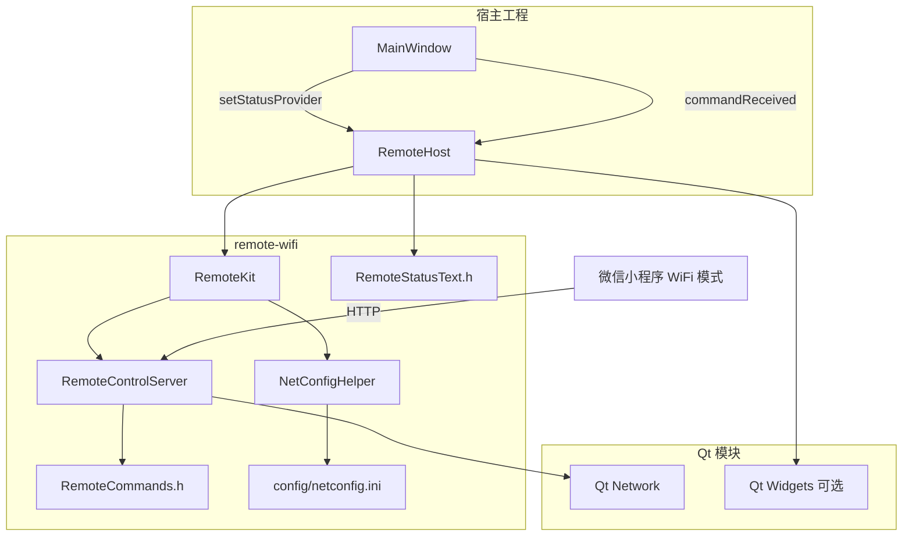

# remote-wifi 移植审计与可移植性验证报告

> 审计日期：2026-06-29  
> 对照源：`remote/` 完整版（HTTP + BLE）  
> 交付物：`remote-wifi/`（仅 HTTP/WiFi）

---

## 1. 审计结论（摘要）

| 维度 | 结果 | 说明 |
|------|:----:|------|
| 功能完整性（WiFi） | ✅ 通过 | HTTP 命令/状态/鉴权与完整版一致 |
| C++14 兼容 | ✅ 通过 | 无 C++17 语法、无 WinRT 头文件 |
| 外部依赖 | ✅ 通过 | 仅 Qt Core + Network；无 `windowsapp.lib` |
| 符号冲突风险 | ✅ 通过 | 类名与完整版相同，**勿与 `remote/` 同时编入同一工程** |
| 配置自洽 | ✅ 通过 | 已移除 `ble/device_name` 必填校验 |
| 小程序对齐 | ✅ 通过 | WiFi 模式协议不变 |
| 实机编译 | ✅ 已验证（C++14） | MSVC 2019 + Qt 5.15.2 下 4 个 `.cpp` + Moc 编译通过；链接须在目标工程完成 |

**总体判定：可移植至 C++14 + Qt 5.12+ 工程；移植后须在目标工程完成一次编译与 WiFi 联调。**

---

## 2. 文件清单与取舍

### 2.1 纳入 remote-wifi/ 的文件

| 文件 | 行数级 | 职责 | 相对完整版变更 |
|------|--------|------|----------------|
| `RemoteControlServer.h/.cpp` | ~240 | HTTP 服务 | **无变更**（逻辑相同） |
| `RemoteCommands.h` | ~55 | 命令白名单 | 注释微调 |
| `RemoteStatusText.h` | ~40 | 状态行文案 | 移除 `bleSummary()` |
| `NetConfigHelper.h/.cpp` | ~70 | ini 加载 | 移除 `bleDeviceName` 及 BLE 校验 |
| `RemoteKit.h/.cpp` | ~50 | 套件层 | 移除 `BleControlServer`、`pushBleStatus()` |
| `RemoteHost.h/.cpp` | ~70 | 集成门面 | 单 HTTP 标签 API |
| `config/netconfig.ini` | 10 | 配置样本 | 无 `[ble]` 段 |

### 2.2 刻意排除的文件（BLE / C++17）

| 原路径 | 排除原因 |
|--------|----------|
| `remote/ble/BleControlServer.*` | 依赖 WinRT 工作线程 |
| `remote/ble/BleWinRtWorker.*` | WinRT MTA 线程 |
| `remote/ble/BleGattServerWin.*` | C++/WinRT，**须 C++17** |
| `remote/ble/BleAdapterChecker.*` | C++/WinRT，**须 C++17** |
| `remote/ble/BleCommandProtocol.*` | 仅 BLE 载荷解析 |
| `remote/ble/BleProtocol.h` | BLE UUID |
| `remote/ble/WinRtBootstrap.h` | WinRT 初始化 |

---

## 3. 依赖关系图



**无箭头指向 WinRT / windowsapp.lib。**

---

## 4. C++14 兼容性静态验证

对 `remote-wifi/` 全量扫描，检查项与结果：

| 检查项 | 结果 |
|--------|------|
| `std::optional` / `std::variant` / `std::string_view` | 未使用 ✅ |
| `if constexpr` / 结构化绑定 `auto [...]` | 未使用 ✅ |
| `inline` 变量（C++17） | 未使用 ✅；仅 `inline` 函数 ✅ |
| `co_await` / 协程 | 未使用 ✅ |
| `#include <winrt/...>` | 未使用 ✅ |
| `std::make_unique`（C++14） | 未使用 |
| `std::function` / lambda | 使用 ✅（C++11） |
| Qt 信号槽 / `QStringLiteral` | 使用 ✅ |

**结论：源码层面满足 C++14。**

---

## 5. Qt 模块与头文件依赖

| 编译单元 | Qt 头文件 | 模块 |
|----------|-----------|------|
| `NetConfigHelper.cpp` | QCoreApplication, QDir, QFile, QHostAddress, QSettings | core |
| `RemoteControlServer.cpp` | QTcpServer, QTcpSocket, QJson*, QUrlQuery | core, **network** |
| `RemoteKit.cpp` | QObject | core |
| `RemoteHost.cpp` | QLabel | gui, widgets（仅 UI 集成时） |

| Moc 类 | 原因 |
|--------|------|
| `RemoteControlServer` | 含 `Q_OBJECT`、signals |
| `RemoteKit` | 含 `Q_OBJECT`、signals |
| `RemoteHost` | 含 `Q_OBJECT`、signals |

**无界面集成时**：可将 `RemoteHost` 中 `QLabel` 改为可选依赖，或直接使用 `RemoteKit` 跳过 Widgets。

---

## 6. 与完整版 API 差异对照

| 行为 | `remote/` | `remote-wifi/` |
|------|-----------|----------------|
| `bootstrap()` 成功条件 | HTTP 或 BLE 任一成功 | 仅 HTTP 成功 |
| 状态标签 | `setStatusLabels(ble, http)` | `setStatusLabel(http)` |
| 主动推送状态 | `pushBleStatus()` | 无（客户端轮询 GET `/api/status`） |
| ini 必填项 | token, bind, port, **ble/device_name** | token, bind, port |
| `RemoteConfig` 字段 | 含 `bleDeviceName` | 无 BLE 字段 |
| 启动警告 | HTTP + BLE 两行 | 仅 HTTP |

### 宿主迁移示例（从完整版切到 WiFi 版）

```cpp
// 前：remote/RemoteHost
m_remote.setStatusLabels(m_bleStatusLabel, m_httpStatusLabel);
m_remote.pushBleStatus();

// 后：remote-wifi/RemoteHost
m_remote.setStatusLabel(m_httpStatusLabel);
// 删除 pushBleStatus 调用
```

---

## 7. 协议与小程序对齐验证

| 约束 | WiFi 版 | 小程序位置 | 状态 |
|------|---------|------------|------|
| 命令名 | `RemoteCommands.h` | `miniprogram/utils/remote-buttons.js` | 一致 ✅ |
| HTTP 路径 | `/api/status`, `/api/command` | `miniprogram/utils/http.js` | 一致 ✅ |
| token 字段 | query 或 JSON body | `wifi-link.js` | 一致 ✅ |
| 默认端口 | 18765 | `normalizeHost` | 一致 ✅ |
| 状态字段 | 宿主 `buildStatusJson` | `computeBtnState` | 由宿主保证 |

BLE 相关（`protocol.js` UUID、`ble-link.js`）在 WiFi 模式下**不参与通信**，无需纳入本包。

---

## 8. 编译清单（移植检查表）

在目标工程中逐项勾选：

- [ ] 将 `remote-wifi/` 下 4 个 `.cpp` 加入工程
- [ ] 将 `remote-wifi/` 加入**附加包含目录**，或保持 `#include "remote-wifi/RemoteHost.h"` 路径
- [ ] 工程 C++ 标准设为 **C++14**
- [ ] Qt 模块：`core`、`network`（`RemoteHost` 用标签时加 `gui`、`widgets`）
- [ ] 对 `RemoteHost`、`RemoteKit`、`RemoteControlServer` 运行 **Moc**
- [ ] 编译选项加 `/utf-8`（中文日志与 JSON 消息）
- [ ] **不要**同时编入 `remote/` 与 `remote-wifi/`（类名冲突）
- [ ] **不要**链接 `windowsapp.lib`（本包不需要）
- [ ] 部署 `config/netconfig.ini` 到 exe 可发现路径
- [ ] 防火墙放行 TCP 18765（或自定义端口）

---

## 9. 运行时验证步骤

1. **配置**：修改 `http/bind` 为本机 WiFi IPv4，与手机同网段  
2. **启动**：`bootstrap()` 返回 true，状态标签显示「已启动」  
3. **状态**：浏览器或 curl  
   `GET http://<bind>:<port>/api/status?token=1234` 返回 JSON  
4. **命令**：  
   `POST http://<bind>:<port>/api/command`  
   body: `{"cmd":"status","token":"1234"}`  
5. **小程序**：开发者工具选 WiFi 模式，填 IP:端口与口令，轮询与按钮可用  
6. **负例**：错误 token → 403；未知命令 → 400  

---

## 10. 已知限制

| 限制 | 说明 |
|------|------|
| 无 BLE | 近场蓝牙遥控不可用；须用完整 `remote/` |
| 类名与完整版相同 | 同一解决方案只能选其一 |
| 无独立工程文件 | 不在本仓库生成 second vcxproj，避免与主工程重复维护 |
| HTTP 为短连接 | 每请求一次连接，适合轮询；非 WebSocket 长连接 |
| `RemoteHost` 依赖 QLabel | 无 UI 时可改用 `RemoteKit` 直接集成 |

---

## 11. 风险评估

| 风险 | 等级 | 缓解 |
|------|------|------|
| 与 `remote/` 同时链接 | 高 | 只拷贝 `remote-wifi/`，勿混用 |
| `http/bind` 填错网卡 IP | 中 | 自动回退 `0.0.0.0`；日志有中文提示 |
| 防火墙拦截 | 中 | 首次运行放行或手动开端口 |
| 宿主状态 JSON 字段缺失 | 中 | 对照 `miniprogram/utils/remote-buttons.js` |
| Qt 版本 < 5.12 | 低 | 建议 5.15.2，与主项目一致 |

---

## 12. 审计签署

| 项 | 内容 |
|----|------|
| 审计范围 | `remote-wifi/` 全部源码 + `config/netconfig.ini` |
| 审计方法 | 文件取舍分析、依赖图、C++14 静态扫描、协议对照、编译清单 |
| 编译验证 | 2026-06-29：MSVC 2019 `/std:c++14` + Qt 5.15.2 头文件与 Moc 编译通过；链接验证须在目标工程执行 |
| 建议 | 优先在目标工程加入本目录完成一次 Release 编译 + T01–T05 WiFi 用例（见 `docs/REMOTE_CONTROL_GUIDE.md` §7） |

---

*本报告随 `remote-wifi/` 一并交付，供移植与 Code Review 使用。*
